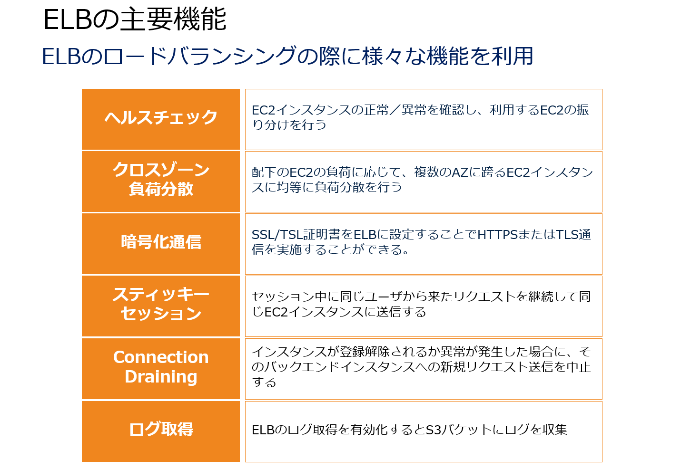

## ポイント
- AWS Global Accelerator
    世界中の顧客に提供するアプリケーションの可用性とパフォーマンスを改善するネットワークサービスです。
    AWS 上のアプリケーションに対して固定エントリポイントとなる静的 IP アドレスを提供することで様々な AWS リージョン、アベイラビリティーゾーンの特定の IP アドレスの管理における複雑さを排除しつつ、アプリケーションアクセスを効率化します。

- S3のIAMポリシーとバケットポリシー
    別のAWSアカウントに所有するS3バケットの利用を許可したい場合は、そのアカウントとユーザーに対してIAMポリシーとバケットポリシー両方の許可設定が必要となります。まずはIAMポリシーによってS3自体の捜査権限を付与します。次にバケットポリシーにおいて、そのIAMユーザーやAWSアカウント指定を利用可能なように設定することが可能です。どちらかを許可設定しても、どちらかのポリシーを許可していないと、アクセスは拒否されます。

- パブリックホストゾーン
    インターネット上に公開されたDNSドメインレコードを管理するコンテナのことです。
    ここにはexample.comなどのドメインのトラフィックをインターネットまたは特定のドメインに対してルーティングする情報を保持しています。

- ElastiCacheにおけるRedisの特徴
    + 複雑なデータ型を設定できる。
    + インメモリデータセットのソートまたはランク付けが可能である。
    + データをリードレプリカにレプリケートできる。
    + pub/sub機能を提供する。
    + 自動的なフェイルオーバーができる
    + キーストアの永続性が必要である。
    + バックアップと復元の機能がある。
    + 複数のデータベースをサポートしている

- AWS DataSync 
    オンプレミスストレージと Amazon EFS やFSxなどのファイルシステム間でデータを迅速かつ簡単に移動する際に利用するマネージド型のデータ転送サービスです。
    DataSync を使用すれば、オープンソースツールと比べて最大 10 倍の速度で、アクティブなデータセットを AWS Direct Connect またはインターネット経由で転送できます。

- EC2 Image Builder
    EC2 Image Builder は、AWS またはオンプレミスで使用するための仮想マシンとコンテナイメージの構築、テスト、およびデプロイを簡素化する展開用のツールです。
    Image Builder は、シンプルなグラフィカルインターフェイス、組み込みの自動化、および AWS が提供するセキュリティ設定により、イメージを最新でセキュアなものにするための労力を大幅に軽減します。
    Image Builder を使えば、イメージをアップデートするためのステップを手動で実施したり、独自の自動化パイプラインを構築したりする必要はなくなります。

- IAMでの証明書管理
    ACMでサポートされていないリージョンでは、HTTPS接続をサポートする必要がある場合は、IAMをSSL証明書マネージャーとして使用します。 
    IAMはすべてのリージョンでのSSL証明書のデプロイをサポートしていますが、AWSで使用するには外部プロバイダーからSSL証明書を取得する必要があります。

- AWS Application Discovery Service 
    オンプレミスデータセンター内のサーバーにエージェントをインストールすることで、データセンターの利用情報を収集することができるサービスです。
    これらの情報に基づいて、ユーザーの移行プロジェクト計画作成を支援します。

    

- Amazon ElastiCache
    インメモリデータストアを構築するウェブサービスです。
    このサービスは高速で管理されたメモリ内データストアによる高速なデータ処理によってパフォーマンスを向上させます。
    ElastiCacheをRDSと連携させることでデータ処理を一部キャッシュ処理として負荷改善を実現できます。

- Amazon QuickSight
    クラウド型のBIツールを提供する可視化ツールです。QuickSight はML Insights を含むインタラクティブなダッシュボードを簡単に作成して公開できます。ダッシュボードはあらゆるデバイスからアクセス可能で、アプリケーション、ポータル、ウェブサイトに埋め込むことができます。
    Amazon QuickSightは機械学習（ML）と自然言語機能を活用してデータからより深い洞察を得るのに役立つML Insights機能があります。これらのすぐに使える強力な機能により、誰もが隠れた傾向や外れ値を発見し、主要なビジネスドライバーを特定し、技術的な専門知識やMLの経験を必要とせずに強力なwhat-if分析と予測を実行できます。 

- SQS
    

- S3
    

- S3 Glacierのタイプ
    

- S3 Glacierのデータ取出し
    

- S3 Glacierの管理方法
    

- S3 の暗号化
    

- S3 Transfer Acceleration
    S3 Transfer Accelerationを使用すると、クライアントと S3 バケットの間で、長距離にわたるファイル転送を高速、簡単、安全に行えるようになります。これにより、各リージョンからS3へのデータ転送が容易に実行できるようになります。Transfer Acceleration では、Amazon CloudFront の世界中に分散したエッジロケーションを利用しています。エッジロケーションに到着したデータは、最適化されたネットワークパスで Amazon S3 にルーティングされます。

- S3での静的Webホスティング
    

- 拡張VPCルーティング
    

- EC2のタイプ
    

- EBSのタイプ
    

- Amazon S3 アクセスポイント
    S3 の共有データセットへの大規模なデータアクセスの管理を簡素化する機能です。
    アクセスポイントは、バケットにアタッチされた名前付きのネットワークエンドポイントで、S3 オブジェクトのオペレーション (GetObject や PutObject など) を実行するために使用できます。
    各アクセスポイントは基になるバケットにアタッチされたバケットポリシーと連動して機能するカスタマイズされたアクセスポイントポリシーを適用してアクセスを制御することが可能です。

    

- AutoScaling
    

- Auroraのリードレプリカ
    AuroraはプライマリーとなるDBクラスターが設置されているリージョンとは異なるリージョンにリードレプリカを作成することができます。
    この方法を採用すると、障害回復機能を向上させて、読み取り操作をユーザーに近いリージョンに拡張しつつ、元のリージョンから別のリージョンへの移行を容易にすることができます。

- Redshift
    大量データの保存や並列処理によるパフォーマンス向上が可能であり、要件を満たすことができます。
    Redshiftはクラウド内で完全に管理されたペタバイト規模のリレーショナルデータベース型のデータウェアハウスサービスです。
    Redshiftは数百ギガバイトのデータからペタバイト以上に拡張できます。 Redshift はテーブルの行をコンピューティングノードに分配するので、データを並列処理できます。
    Redshift は各テーブルに対して適切な分散キーを選択することにより、データの分配を最適化して、ワークロードを分散し、ノード間のデータの移動を最小限にできます。

- RDSのスケールアップ
    

- AWS Data Pipeline
    様々なAWSデータベースやストレージ間のデータの移動と変換を自動化するサービスです。
    AWS Data Pipeline はデータ駆動型のワークフローを定義して、タスクの正常な完了をトリガーにして、次のタスクを実行できます。
    AWS Data Pipeline はDynamoDBに設定することが可能であり、定期的なデータ取得タスクを設定させることができます。

- ELBの機能
    

- AWS SAM
    サーバーレスアプリケーション構築用のデプロイツールです。
    YAMLを使用して、サーバレスアプリケーションのLambda関数、API、データベース、イベントソースマッピングをモデリングします。
    AWS SAMはCloudFormationと連携してサーバレスアプリケーションを展開します。
    その際は、SAM が SAM 構文を AWS CloudFormation 構文に変換および拡張することで、サーバーレスアプリケーションの構築を高速化することができます。

## 基本問題の模擬試験①

8   ★
11
14
16  ★
20
22  ★
29  ※
41  ★
43  ★
48
50
52  ★
56
65  ※

## 高難易度の模擬試験②
3  ★
4  ★
6
13
17 ★
19 ※
20
22 ※
26
33
37 ★
39 ★
40
43
44
47 ★
50
53
56 ※
61 ★

## 高難易度の模擬試験③

8
9
14  ★
15  ★★
16
17  ★
18  ※
19  ★
23
24  ★
25  ★
27
28
31
33  ★
39  ★
40  ★
41  ★
42  ★
44  ★★
49
50  ★
54
55
56  ★
57
60  ★
62
64

## 高難易度の模擬試験④
6
7   ★
8   ★
10  ★
11
16  ★
17
18  ★
19  ★
20  ★
22  ★
23  ★
24  ★
25
29  ★
36  ★
37  ★
39  ★
40  ★
42
44
47
48  ★
49
50  ★
52  ★
53  ★
54  ★
56  ★
59  ★
60  ★
62

## 高難易度の模擬試験⑤

3   ★★
6   ★
9   ★
11
12  ★★
15  ★
17  ★
21  ★
24  ★
25  ★
26  ★
27  ★
29  ★
35  ★
36  ★
38  ★
39  ★
42  ★
43
45  ★
46
49  ★
52  ★★
53  ★
60  ★
62  
63  ★
64  ★
