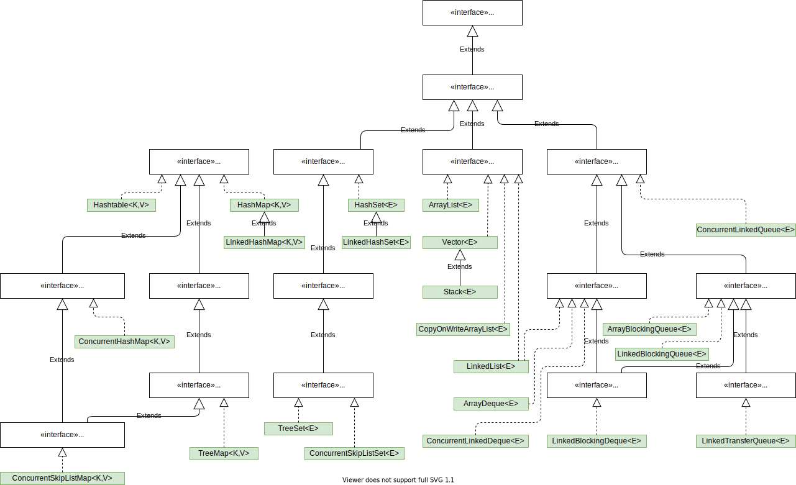

# Collection



## インタフェースの関係

- `Iterable<E>` - オブジェクトを「for-eachループ」文の対象にすることができます。
    - `Collection<E>` - コレクションの抽象的なインタフェース
        - `List<E>` - 順序付けられたコレクション
        - `Set<E>` - 重複要素のないコレクション
            - `SortedSet<E>` - その要素に対して全体順序付けを提供するSet
                - `NavigableSet<E>` - 指定の検索ターゲットにもっとも近い一致内容を報告するナビゲーション・メソッドで拡張されたSortedSetです。
        - `Queue<E>` - 処理の前に要素を保持するために設計されたコレクション
            - `BlockingQueue<E>` - 要素の取得時にキューが空でなくなるまで待機したり、要素の格納時にキュー内に空きが生じるまで待機する操作を追加でサポートしたりするQueue
                - `TransferQueue<E>` - コンシューマが要素を受け取るまでプロデューサが待機するBlockingQueue
            - `Deque<E>` - 両端で要素の挿入および削除をサポートする線形コレクション
                - `BlockingDeque<E>` - 要素の取得時に両端キューが空でなくなるまで待機したり、要素の格納時に両端キュー内に空きが生じるまで待機するブロック操作を追加でサポートしたりするDeque
- `Map<K,V>` - キーを値にマッピングするオブジェクト。同一のキーを複数登録できない。
    - `SortedMap<K,V>` - そのキーに対して全体順序付けを提供するMap
        - `NavigableMap<K,V>` - 指定の検索ターゲットにもっとも近い一致内容を返すナビゲーション・メソッドで拡張されたSortedMap
    - `ConcurrentMap<K,V>` - スレッドの安全性と原子性の保証を提供するMap
        - `ConcurrentNavigableMap<K,V>` - NavigableMapオペレーションをサポートするConcurrentMapです。そのナビゲート可能なサブマップに対しては再帰的です。

## インタフェースとクラス

- `Iterable<E>`
    - `Collection<E>`
        - `List<E>` - `ArrayList<E>`, `LinkedList<E>`, `Vector<E>`, `Stack<E>`, `CopyOnWriteArrayList<E>` 
        - `Set<E>` - `HashSet<E>`, `LinkedHashSet<E>`, `CopyOnWriteArraySet<E>`
            - `SortedSet<E>`
                - `NavigableSet<E>` - `TreeSet<E>`, `ConcurrentSkipListSet<E>`
        - `Queue<E>` - `ConcurrentLinkedQueue<E>`
            - `BlockingQueue<E>` - `ArrayBlockingQueue<E>`, `LinkedBlockingQueue<E>`, `DelayQueue<E extends Delayed>`
                - `TransferQueue<E>` - `LinkedTransferQueue<E>`
            - `Deque<E>` - `LinkedList<E>`, `ArrayDeque<E>`, `ConcurrentLinkedDeque<E>`
                - `BlockingDeque<E>` - `LinkedBlockingDeque<E>`

- `Map<K,V>` - `HashMap<K,V>`, `Hashtable<K,V>`, `IdentityHashMap<K,V>`, `LinkedHashMap<K,V>`, 
    - `SortedMap<K,V>`
        - `NavigableMap<K,V>` - `TreeMap<K,V>`
    - `ConcurrentMap<K,V>` - `ConcurrentHashMap<K,V>`
        - `ConcurrentNavigableMap<K,V>` - `ConcurrentSkipListMap<K,V>`


## `Iterable<E>`
[java.util.Iterable](https://docs.oracle.com/javase/jp/11/docs/api/java.base/java/lang/Iterable.html)

このインタフェースを実装すると、オブジェクトを「for-eachループ」文の対象にすることができます。
「for-eachループ」を参照してください

```java
// Iterableの各要素に対して指定されたアクションを、すべての要素が処理されるか、
// アクションが例外をスローするまで実行します。
default void forEach(Consumer<? super T> action);

// 型Tの要素のイテレータを返します。
Iterator<T> iterator();

// このIterableによって記述される要素に対するSpliteratorを作成します。
default Spliterator<T> spliterator();
```

## `Collection<E>`
[java.util.Collection](https://docs.oracle.com/javase/jp/11/docs/api/java.base/java/util/Collection.html)

コレクション階層のルート・インタフェースです。
コレクションは、その要素であるオブジェクトのグループを表します。
コレクションによっては要素の重複を許可しますが、許可しないコレクションもあります。
また、順序付けられているコレクションとそうでないコレクションがあります。
JDKは、このインタフェースの直接の実装を一切提供しません。
SetおよびListのような、より用途の特定されたサブインタフェースを提供します。
このインタフェースは、通常は、最大限の普遍性が求められる場面でコレクションを渡したり、そのコレクションを操作するために使用されます。


```java
// 指定された要素がこのコレクションに格納されていることを保証します(オプションの操作)。
// コレクションが変更された場合はtrueを返却して、変更されなかった場合はfalseを返却する。
boolean add(E e);

// 指定されたコレクションのすべての要素をこのコレクションに追加します(オプションの操作)。
// コレクションが変更された場合はtrueを返却して、変更されなかった場合はfalseを返却する。
boolean addAll(Collection<? extends E> c);

// このコレクションからすべての要素を削除します(オプションの操作)。
void clear();

// 指定された要素がコレクションに含まれている場合にtrueを返します。
boolean contains(Object o);

// 指定されたコレクションのすべての要素がこのコレクション内にある場合はtrueを返します。
boolean containsAll(Collection<?> c);

// 指定されたオブジェクトとこのコレクションが等しいかどうかを比較します。
boolean equals(Object o);

// コレクションのハッシュ・コード値を返します。
int hashCode();

// このコレクションに要素がない場合にtrueを返します。
boolean isEmpty();

// コレクションの要素のイテレータを返します。
Iterator<E> iterator();

// このコレクションをソースとして、潜在的に並列のStreamを返します。
default Stream<E> parallelStream();

// 指定された要素のインスタンスがこのコレクションにあれば、そのインスタンスをコレクションから1つ削除します(オプションの操作)。
// コレクションに指定した要素が含まれていた場合はtrueを返却して、含まれていなかった場合はfalseを返却する。
boolean remove(Object o);

// 指定されたコレクションにも格納されているこのコレクションのすべての要素を削除します(オプションの操作)。
// コレクションに指定した要素が含まれていた場合はtrueを返却して、含まれていなかった場合はfalseを返却する。
boolean removeAll(Collection<?> c);

// 指定された述語を満たすこのコレクションの要素をすべて削除します。
// コレクションが変更された場合はtrueを返却して、変更されなかった場合はfalseを返却する。
default boolean removeIf(Predicate<? super E> filter);

// このコレクションにおいて、指定されたコレクションに格納されている要素だけを保持します(オプションの操作)。
// コレクションが変更された場合はtrueを返却して、変更されなかった場合はfalseを返却する。
boolean retainAll(Collection<?> c);

// このコレクション中の要素の数を返します。
int size();

// このコレクション内の要素に対するSpliteratorを作成します。
default Spliterator<E> spliterator();

// このコレクションをソースとして使用して、逐次的なStreamを返します。
default Stream<E> stream();

// このコレクションの要素がすべて格納されている配列を返します。
Object[] toArray();

// このコレクション内のすべての要素を保持する配列を返します。
// 返される配列の実行時の型は、指定された配列の型です。
<T> T[] toArray(T[] a);
```

## `List<E>`

[java.util.List](https://docs.oracle.com/javase/jp/11/docs/api/java.base/java/util/List.html)

順序付けられたコレクションです。
シーケンスとも呼ばれます。
このインタフェースのユーザーは、リスト内のどこに各要素が挿入されるかを精密に制御できます。
ユーザーは整数値のインデックス(リスト内の位置)によって要素にアクセスしたり、リスト内の要素を検索したりできます。
セットとは異なり、通常、リストは重複する要素を許可します。
つまり、リストは通常、e1.equals(e2)となるようなe1とe2の要素のペアを許可します。
また、null要素を許可する場合には、通常は複数のnull要素を許可します。
ユーザーが重複する値を挿入しようとしたときに実行時の例外をスローすることにより、重複する値を禁止するリストを実装する場合もありますが、このように使われることはほとんどありません。

```java
// 指定された要素をこのリストの最後に追加します(オプションの操作)。
boolean add(E e);

// このリスト内の指定された位置に、指定された要素を挿入します(オプションの操作)。
void add(int index, E element);

// 指定されたコレクション内のすべての要素を、指定されたコレクションのイテレータによって返される順序で、このリストの最後に追加します(オプションの操作)。
boolean addAll(Collection<? extends E> c);

// 指定されたコレクション内のすべての要素を、このリストの指定された位置に挿入します(オプションの操作)。
boolean addAll(int index, Collection<? extends E> c);

// すべての要素をこのリストから削除します(オプションの操作)。
void clear();

// 指定の要素がこのリストに含まれている場合にtrueを返します。
boolean contains(Object o);

// 指定されたコレクションのすべての要素がこのリストに含まれている場合にtrueを返します。
boolean containsAll(Collection<?> c);

// 指定されたオブジェクトがこのリストと等しいかどうかを比較します。
boolean equals(Object o);

// このリスト内の指定された位置にある要素を返します。
E get(int index);

// このリストのハッシュ・コード値を返します。
int hashCode();

// 指定された要素がこのリスト内で最初に検出された位置のインデックスを返します。
// 指定された要素がこのリストにない場合は -1を返します。
int indexOf(Object o);

// このリストに要素がない場合にtrueを返します。
boolean isEmpty();

// このリスト内の要素を適切な順序で反復するイテレータを返します。
Iterator<E> iterator();

// 指定された要素がこのリスト内で最後に検出された位置のインデックスを返します。
// 指定された要素がこのリストにない場合は -1を返します。
int lastIndexOf(Object o);

// このリスト内の要素を(適切な順序で)反復するリスト・イテレータを返します。
ListIterator<E> listIterator();

// リスト内の指定された位置で始まる、リスト内の要素を(適切な順序で)反復するリスト・イテレータを返します。
ListIterator<E> listIterator(int index);

// このリスト内の指定された位置にある要素を削除します(オプションの操作)。
E remove(int index);

// 指定された要素がこのリストにあれば、その最初のものをリストから削除します(オプションの操作)。
boolean remove(Object o);

// このリストから、指定されたコレクションに含まれる要素をすべて削除します(オプションの操作)。
boolean removeAll(Collection<?> c);

// このリストの各要素を、その要素に演算子を適用した結果で置換します。
default void replaceAll(UnaryOperator<E> operator);

// このリスト内で、指定されたコレクションに含まれている要素だけを保持します(オプションの操作)。
boolean retainAll(Collection<?> c);

// このリスト内の指定された位置にある要素を、指定された要素に置き換えます(オプションの操作)。
E set(int index, E element);

// このリスト内にある要素の数を返します。
int size();

// 指定されたComparatorが示す順序に従って、このリストをソートします。
default void sort(Comparator<? super E> c);

// このリスト内の要素に対するSpliteratorを作成します。
default Spliterator<E> spliterator();

// このリストの、指定されたfromIndex (これを含む)からtoIndex (これを含まない)までの部分のビューを返します。
List<E> subList(int fromIndex, int toIndex);

// このリスト内のすべての要素を適切な順序で(最初の要素から最後の要素へ)含んでいる配列を返します。
Object[] toArray();

// このリスト内のすべての要素を適切な順序で(最初の要素から最後の要素へ)含んでいる配列を返します。
// 返される配列の実行時の型は、指定された配列の型になります。
<T> T[] toArray(T[] a);

// java11から: 変更不可能なListを作成する。
static <E> List<E> of(​E... elements);
```

## `Map<K,V>`

[java.util.Map](https://docs.oracle.com/javase/jp/11/docs/api/java.base/java/util/Map.html)

```java
// マップからマッピングをすべて削除します(オプションの操作)。
void clear();

// 指定されたキーと現在マップされている値に対するマッピングの計算を試みます(現在のマッピングが存在しない場合はnull)。
default V compute(K key, BiFunction<? super K,? super V,? extends V> remappingFunction);

// 指定されたキーがまだ値に関連付けられていない(またはnullにマップされている)場合、指定されたマッピング関数を使用してその値の計算を試行し、nullでない場合はそれをこのマップに入力します。
default V computeIfAbsent(K key, Function<? super K,? extends V> mappingFunction);

// 指定されたキーの値が存在していてnull以外の場合、キーと現在マップされている値から新しいマッピングの計算を試みます。
default V computeIfPresent(K key, BiFunction<? super K,? super V,? extends V> remappingFunction);

// 指定のキーのマッピングがこのマップに含まれている場合にtrueを返します。
boolean containsKey(Object key);

// マップが1つまたは複数のキーを指定された値にマッピングしている場合にtrueを返します。
boolean containsValue(Object value);

// このマップに含まれるマッピングのSetビューを返します。
Set<Map.Entry<K,V>> entrySet();

// 指定されたオブジェクトがこのマップと等しいかどうかを比較します。
boolean equals(Object o);

// このマップのすべてのエントリの処理が完了するかアクションから例外がスローされるまで、各エントリに対して指定されたアクションを実行します。
default void forEach(BiConsumer<? super K,? super V> action);

// 指定されたキーがマップされている値を返します。
// このマップにそのキーのマッピングが含まれていない場合はnullを返します。
V get(Object key);

// 指定されたキーがマップされている値を返します。
// このマップにそのキーのマッピングが含まれていない場合はdefaultValueを返します。
default V getOrDefault(Object key, V defaultValue);

// マップのハッシュ・コード値を返します。
int hashCode();

// このマップがキーと値のマッピングを保持しない場合にtrueを返します。
boolean isEmpty();

// このマップに含まれるキーのSetビューを返します。
Set<K> keySet();

// 指定されたキーがまだ値と関連付けられていないかnullと関連付けられている場合、指定されたnull以外の値に関連付けます。
default V merge(K key, V value, BiFunction<? super V,? super V,? extends V> remappingFunction);

// 指定された値と指定されたキーをこのマップで関連付けます(オプションの操作)。
V put(K key, V value);

// 指定されたマップのすべてのマッピングをこのマップにコピーします(オプションの操作)。
void putAll(Map<? extends K,? extends V> m);

// 指定されたキーがまだ値に関連付けられていない(または、nullにマップされている)場合は、それを指定された値に関連付けてnullを返します。
// それ以外の場合は、現在の値を返します。
default V putIfAbsent(K key, V value);

// このマップからキーのマッピング(ある場合)を削除します(オプションの操作)。
V remove(Object key);

// 指定された値に指定されたキーが現在マッピングされている場合にのみ、そのキーのエントリを削除します。
default boolean remove(Object key, Object value);

// 指定されたキーがなんらかの値に現在マッピングされている場合にのみ、そのキーのエントリを置換します。
default V replace(K key, V value);

// 指定されたキーが指定された値に現在マッピングされている場合にのみ、そのキーのエントリを置換します。
default boolean replace(K key, V oldValue, V newValue);

// すべてのエントリが処理されるか、または関数が例外をスローするまで、各エントリの値を、そのエントリで指定された関数を呼び出した結果で置換します。
default void replaceAll(BiFunction<? super K,? super V,? extends V> function);

// このマップ内のキー値マッピングの数を返します。
int size();

// このマップに含まれる値のCollectionビューを返します。
Collection<V> values();

// java11から：変更できないマップを作成する。
static <K,​V> Map<K,​V> of(K k1, V v1)
```


- `merge`

    ```java
    default V merge(K key, V value, BiFunction<? super V,? super V,? extends V> remappingFunction)
    ```

    これは、以下のコードと等価です。

    ```java
    V oldValue = map.get(key);
    V newValue = (oldValue == null) ? value : remappingFunction.apply(oldValue, value);
    if (newValue == null)
        map.remove(key);
    else
        map.put(key, newValue);
    ```

- `compute`

    ```java
    default V compute(K key, BiFunction<? super K,? super V,? extends V> remappingFunction)
    ```

    これは、以下のコードと等価です。

    ```java
    V oldValue = map.get(key);
    V newValue = remappingFunction.apply(key, oldValue);
    if (oldValue != null) {
       if (newValue != null)
           map.put(key, newValue);
       else
           map.remove(key);
    } else {
       if (newValue != null)
           map.put(key, newValue);
       else
           return null;
    }
    ```

- `computeIfPresent`

    ```java
    default V computeIfPresent(K key, BiFunction<? super K,? super V,? extends V> remappingFunction)
    ```

    これは、以下のコードと等価です。

    ```java
    if (map.get(key) != null) {
        V oldValue = map.get(key);
        V newValue = remappingFunction.apply(key, oldValue);
        if (newValue != null)
            map.put(key, newValue);
        else
            map.remove(key);
    }
    ```

- `computeIfAbsent`

    ```java
    default V computeIfAbsent(K key, Function<? super K,? extends V> mappingFunction)
    ```

    これは、以下のコードと等価です。

    ```java
    if (map.get(key) == null) {
        V newValue = mappingFunction.apply(key);
        if (newValue != null)
            map.put(key, newValue);
    }
    ```

## `Map.Entry<K, V>`
[Map.Entry<K, V>](https://docs.oracle.com/javase/jp/11/docs/api/java.base/java/util/Map.Entry.html)

`Map<K, V>`の`Set<Map.Entry<K,V>> entrySet()`で使用されるインタフェースです。
以下のメソッドは重要です。

```java
// このエントリに対応するキーを返します。
K getKey();

// このエントリに対応する値を返します。
// マッピングが(イテレータのremoveオペレーションによって)基になっているマップから削除されている場合は、
// この呼出しの結果は保証されません。
V getValue();

// キーの自然順序でMap.Entryを比較するコンパレータを返します。
static <K extends Comparable<? super K>, V> Comparator<Map.Entry<K, V>> comparingByKey();

// 指定されたComparatorを使用してキーでMap.Entryを比較するコンパレータを返します。
static <K, V> Comparator<Map.Entry<K, V>> comparingByKey(Comparator<? super K> cmp);

// 値の自然順序でMap.Entryを比較するコンパレータを返します。
static <K, V extends Comparable<? super V>> Comparator<Map.Entry<K, V>> comparingByValue();

// 指定されたComparatorを使用して値でMap.Entryを比較するコンパレータを返します。
static <K, V> Comparator<Map.Entry<K, V>> comparingByValue(Comparator<? super V> cmp);
```


## `Set<E>`

[java.util.Set](https://docs.oracle.com/javase/jp/11/docs/api/java.base/java/util/Set.html)

重複要素のないコレクションです。
すなわち、セットは、e1.equals(e2)であるe1とe2の要素ペアは持たず、null要素を最大1つしか持ちません。
その名前が示すように、このインタフェースは、数学で言う集合の抽象化をモデル化します。

```java
// 指定された要素がセット内になかった場合、セットに追加します(オプションの操作)。
boolean add(E e);

// 指定されたコレクションのすべての要素について、その要素がこのセット内にない場合、セットに追加します(オプションの操作)。
boolean addAll(Collection<? extends E> c);

// セットからすべての要素を削除します(オプションの操作)。
void clear();

// 指定された要素がセットに含まれている場合にtrueを返します。
boolean contains(Object o);

// 指定されたコレクションのすべての要素がこのセットに含まれている場合にtrueを返します。
boolean containsAll(Collection<?> c);

// 指定されたオブジェクトがセットと同じかどうかを比較します。
boolean equals(Object o);

// セットのハッシュ・コード値を返します。
int hashCode();

// このセットに要素が1つも含まれていない場合にtrueを返します。
boolean isEmpty();

// セット内の各要素についてのイテレータを返します。
Iterator<E> iterator();

// 指定された要素がセット内にあった場合、セットから削除します(オプションの操作)。
boolean remove(Object o);

// このセットから、指定されたコレクションに含まれる要素をすべて削除します(オプションの操作)。
boolean removeAll(Collection<?> c);

// セット内の要素のうち、指定されたコレクション内にある要素だけを保持します(オプションの操作)。
boolean retainAll(Collection<?> c);

// セット内の要素数(そのカーディナリティ)を返します。
int size();

// このセット内の要素に対するSpliteratorを作成します。
default Spliterator<E> spliterator();

// セット内のすべての要素が格納されている配列を返します。
Object[] toArray();

// セット内のすべての要素を格納している配列を返します。
// 返される配列の実行時の型は、指定された配列の型になります。
<T> T[] toArray(T[] a);

// java11から：変更できないSetを作成する
static <E> Set<E> of(E... elements);
```

## `SortedSet<E>`

[`SortedSet<E>`](https://docs.oracle.com/javase/jp/11/docs/api/java.base/java/util/SortedSet.html)

その要素に対して全体順序付けを提供するSetです。
要素の順序付けは、その自然順序付けに従って行われるか、セット構築時に通常提供されるComparatorを使って行われます。
セットのイテレータは、セットを要素の昇順でトラバースします。
その順序付けを利用するために、追加のオペレーションがいくつか提供されています。
(このインタフェースはセットで、SortedMapに類似しています。)


```java
// セット内に現在ある最初(下端)の要素を返します。
E first();

// セット内に現在ある最後(上端)の要素を返します。
E last();
```

## `NvigatableSet<E>`

[`java.util.NvigatableSet<E>`](https://docs.oracle.com/javase/jp/11/docs/api/java.base/java/util/NavigableSet.html)

指定の検索ターゲットにもっとも近い一致内容を報告するナビゲーション・メソッドで拡張されたSortedSetです。
メソッドlower(E)、floor(E)、ceiling(E)、およびhigher(E)は、要素がない場合は、nullを返して、指定された要素より小さい、小さい、等しい、大きいか等しい、および大きい要素を返します。

```java
// このセット内で、指定された要素よりも確実に小さい要素の中で最大のものを返します。そのような要素が存在しない場合はnullを返します。
E lower(E e);

// このセット内で、指定された要素と等しいかそれよりも小さい要素の中で最大のものを返します。そのような要素が存在しない場合はnullを返します。
E floor(E e);

// このセット内で、指定された要素と等しいかそれよりも大きい要素の中で最小のものを返します。そのような要素が存在しない場合はnullを返します。
E ceiling(E e);

// このセット内で、指定された要素よりも確実に大きい要素の中で最小のものを返します。そのような要素が存在しない場合はnullを返します。
E higher(E e);
```


```java
NavigableSet<String> gomi6 = new TreeSet<> ();
gomi6.add("123");
gomi6.add("abc");
gomi6.add("xyz");
gomi6.add("ABC");

// TreeSetはSortedSetをインプリメントしているため、ソートされる。
// ソート順は、数字、アルファベット大文字、アルファベット小文字の順である。
System.out.println(gomi6);                  // [123, ABC, abc, xyz]

// 小さい <<<-->>> 大きい
// [123, ABC, abc, xyz]
//                ^
//                ad

// adより小さいか同じ要素
System.out.println(gomi6.floor("ad"));      // abc

// adより大きいか同じ要素
System.out.println(gomi6.ceiling("ad"));    // xyz

// adより大きい要素
System.out.println(gomi6.higher("ad"));     // xyz

// adより小さい要素
System.out.println(gomi6.lower("ad"));      // abc

// 小さい <<<-->>> 大きい
// [123, ABC, abc, xyz]
//             ^
//            abc

// abcより小さいか同じ要素
System.out.println(gomi6.floor("abc"));       // abc

// abcより大きいか同じ要素
System.out.println(gomi6.ceiling("abc"));     // abc

// abcより大きい要素
System.out.println(gomi6.higher("abc"));      // xyz

// abcより小さい要素
System.out.println(gomi6.lower("abc"));       // ABC
```

`TreeSet`に`Comparable`インタフェースを実装していない要素を加えると、**実行時例外になる**。
コンパイルエラーではないので注意！


## `Queue<E>`

[java.util.Queue](https://docs.oracle.com/javase/jp/11/docs/api/java.base/java/util/Queue.html)

処理の前に要素を保持するために設計されたコレクション。
基本的なCollection操作に加えて、キューは追加の挿入、抽出および検査操作を提供します。
これらのメソッドにはそれぞれ、2つの形式があります。
1つは操作が失敗したときに例外(`IllegalStateException`)をスローし、もう1つは特殊な値(操作に応じてnullまたはfalseのいずれか)を返します。
後者の形式の挿入操作は、容量の制限されたQueue実装で使用するために設計されています。
ほとんどの実装で挿入操作は失敗できません。

||例外のスロー|特殊な値を返す|
|---|---|---|
|挿入|`add(e)`|`offer(e)`|
|削除|`remove()`|`poll()`|
|検査|`element()`|`peek()`|

```java
// 容量制限に違反することなく、指定された要素をこのキューにすぐに挿入できる場合はそうします。
// 成功した場合はtrueを返し、その時点で使用可能な空き領域が存在しない場合はIllegalStateExceptionをスローします。
boolean add(E e);

// キューの先頭を取得しますが、削除しません。
E element();

// 容量制限に違反せずにすぐ実行できる場合は、指定された要素をこのキューに挿入します。
boolean offer(E e);

// キューの先頭を取得しますが、削除しません。
// キューが空の場合はnullを返します。
E peek();

// キューの先頭を取得および削除します。
// キューが空の場合はnullを返します。
E poll();

// キューの先頭を取得および削除します。
E remove();
```

## `Deque<E>`

[java.util.Deque](https://docs.oracle.com/javase/jp/11/docs/api/java.base/java/util/Deque.html)

||最初の要素(先頭)||最後の要素(末尾)||
|---|---|---|---|---|
||例外のスロー|特殊な値|例外のスロー|特殊な値|
|挿入|`addFirst(e)`|`offerFirst(e)`|`addLast(e)`|`offerLast(e)`|
|削除|`removeFirst()`|`pollFirst()`|`removeLast()`|`pollLast()`|
|検査|`getFirst()`|`peekFirst()`|`getLast()`|`peekLast()`|


また、LIFOの`Stack`のメソッドとは、以下の様に対応しています。

|Stackメソッド|等価なDequeメソッド|
|---|---|
|`push(e)`|`addFirst(e)`|
|`pop()`|`removeFirst()`|
|`peek()`|`peekFirst()`|

```java
// 指定された要素を、この両端キューで表されるキュー(つまり、この両端キューの末尾)に、容量制限に違反することなしにすぐに挿入できる場合には、そうします。
// 成功した場合はtrueを返し、使用可能な空き領域がその時点で存在しない場合はIllegalStateExceptionをスローします。
boolean add(E e);

// 容量制限に違反することなく指定された要素をこの両端キューの先頭にすぐに挿入できる場合には、そうします。
// 使用可能な空き領域がその時点で存在しない場合はIllegalStateExceptionをスローします。
void addFirst(E e);

// 容量制限に違反することなく指定された要素をこの両端キューの末尾にすぐに挿入できる場合には、そうします。
// 使用可能な空き領域がその時点で存在しない場合はIllegalStateExceptionをスローします。
void addLast(E e);

// 指定された要素がこの両端キューに含まれている場合にtrueを返します。
boolean contains(Object o);

// この両端キュー内の要素を逆順で反復処理するイテレータを返します。
Iterator<E> descendingIterator();

// この両端キューによって表されるキューの先頭(つまり、この両端キューの最初の要素)を取得しますが、削除しません。
E element();

// この両端キューの最初の要素を取得しますが、削除はしません。
E getFirst();

// この両端キューの最後の要素を取得しますが、削除はしません。
E getLast();

// この両端キュー内の要素を適切な順序で反復処理するイテレータを返します。
Iterator<E> iterator();

// 指定された要素を、この両端キューで表されるキュー(つまり、この両端キューの末尾)に、容量制限に違反することなしにすぐに挿入できる場合には、そうします。
// 成功した場合はtrueを返し、使用可能な空き領域がその時点で存在しない場合はfalseを返します。
boolean offer(E e);

// 容量制限に違反しないかぎり、指定された要素をこの両端キューの先頭に挿入します。
boolean offerFirst(E e);

// 容量制限に違反しないかぎり、指定された要素をこの両端キューの末尾に挿入します。
boolean offerLast(E e);

// この両端キューによって表されるキューの先頭(つまり、この両端キューの最初の要素)を取得しますが、削除しません。
// 両端キューが空の場合は、nullを返します。
E peek();

// この両端キューの最初の要素を取得しますが、削除しません。
// 両端キューが空の場合はnullを返します。
E peekFirst();

// この両端キューの最後の要素を取得しますが、削除しません。
// 両端キューが空の場合はnullを返します。
E peekLast();

// この両端キューによって表されるキューの先頭(つまり、この両端キューの最初の要素)を取得および削除します。
// 両端キューが空の場合は、nullを返します。
E poll();

// この両端キューの最初の要素を取得および削除します。
// 両端キューが空の場合はnullを返します。
E pollFirst();

// この両端キューの最後の要素を取得および削除します。
// 両端キューが空の場合はnullを返します。
E pollLast();

// この両端キューで表されるスタックに要素をポップします。
E pop();

// 容量制限に違反することなしに要素をこの両端キューで表されるスタック(つまり、この両端キューの先頭)にすぐにプッシュできる場合は、そうします。
// 使用可能な空き領域がその時点で存在しない場合はIllegalStateExceptionをスローします。
void push(E e);

// この両端キューによって表されるキューの先頭(つまり、この両端キューの最初の要素)を取得して削除します。
E remove();

// 指定された要素のうち最初に出現したものを、この両端キューから削除します。
boolean remove(Object o);

// この両端キューの最初の要素を取得して削除します。
E removeFirst();

// 指定された要素のうち最初に出現したものを、この両端キューから削除します。
boolean removeFirstOccurrence(Object o);

// この両端キューの最後の要素を取得して削除します。
E removeLast();

// 指定された要素のうち最後に出現したものを、この両端キューから削除します。
boolean removeLastOccurrence(Object o);

// この両端キュー内の要素の数を返します。
int size();
```

## `BlockingQueue<E>`
[`java.util.concurrent.BlockingQueue`](https://docs.oracle.com/javase/jp/11/docs/api/java.base/java/util/concurrent/BlockingQueue.html)では、`java.util.Queue`のメソッドのほかに、キューへの追加や取り出しができるまで待機するメソッドが用意されています。

||例外のスロー|特殊な値|ブロック|タイム・アウト|
|---|---|---|---|---|
|挿入|add(e)|offer(e)|put(e)|offer(e, time, unit)|
|削除|remove()|poll()|take()|poll(time, unit)|
|検査|element()|peek()|適用外|適用外|

**なお、BlockingQueueはnull要素を受け入れません。**
nullのadd、put、またはofferが試みられると、実装によってNullPointerExceptionがスローされます。
nullは、pollオペレーションが失敗したことを示す標識値として使用されます。


```java
// 指定された要素をこのキューに挿入します。
// 必要に応じて、空きが生じるまで待機します。
void put(E e) throws InterruptedException;

// 指定された要素をこのキューに挿入します。
// 必要に応じて、指定された時間まで空きが生じるのを待機します。
boolean offer(E e, long timeout, TimeUnit unit) throws InterruptedException;

// このキューの先頭を取得して削除します。
// 必要に応じて、要素が利用可能になるまで待機します。
E take() throws InterruptedException;

// このキューの先頭を取得して削除します。
// 必要に応じて、指定された待機時間まで要素が利用可能になるのを待機します。
E poll(long timeout, TimeUnit unit) throws InterruptedException;
```


```java
class Producer implements Runnable {
  private final BlockingQueue queue;
  Producer(BlockingQueue q) { queue = q; }
  public void run() {
    try {
      // キューに要素が追加できるようになるまで待ってから追加する。
      while (true) {
        queue.put(produce());
      }
    } catch (InterruptedException ex) { ... handle ...}
  }
  Object produce() { ... }
}

class Consumer implements Runnable {
  private final BlockingQueue queue;
  Consumer(BlockingQueue q) { queue = q; }
  public void run() {
    try {
      // キューに要素が追加されるまで待機して、要素を取り出す。
      while (true) {
        consume(queue.take());
      }
    } catch (InterruptedException ex) { ... handle ...}
  }
  void consume(Object x) { ... }
}

class Setup {
  void main() {
    BlockingQueue q = new SomeQueueImplementation();
    Producer p = new Producer(q);
    Consumer c1 = new Consumer(q);
    Consumer c2 = new Consumer(q);
    new Thread(p).start();
    new Thread(c1).start();
    new Thread(c2).start();
  }
}
```

## `BlockingDequeue<E>`
[`java.util.concurrent.BlockingDequeue`](https://docs.oracle.com/javase/jp/11/docs/api/java.base/java/util/concurrent/BlockingDeque.html)では、`java.util.Dqueue`のメソッドのほかに、キューへの追加や取り出しができるまで待機するメソッドが用意されています。

- 最初の要素(先頭)

    ||例外のスロー|特殊な値|ブロック|タイム・アウト|
    |---|---|---|---|---|
    |挿入|addFirst(e)|offerFirst(e)|putFirst(e)|offerFirst(e, time, unit)|
    |削除|removeFirst()|pollFirst()|takeFirst()|pollFirst(time, unit)|
    |検査|getFirst()|peekFirst()|適用外|適用外|

- 最後の要素(末尾)

    ||例外のスロー|特殊な値|ブロック|タイム・アウト|
    |---|---|---|---|---|
    |挿入|addLast(e)|offerLast(e)|putLast(e)|offerLast(e, time, unit)|
    |削除|removeLast()|pollLast()|takeLast()|pollLast(time, unit)|
    |検査|getLast()|peekLast()|適用外|適用外|

```java
// 指定された要素をこの両端キューの先頭に挿入します。
// 必要に応じて、空きが生じるまで待機します。
void putFirst(E e) throws InterruptedException

// 指定された要素をこの両端キューの末尾に挿入します。
// 必要に応じて、空きが生じるまで待機します。
void putLast(E e) throws InterruptedException

// この両端キューの最初の要素を取得して削除します。
// 必要に応じて、要素が利用可能になるまで待機します。
E takeFirst() throws InterruptedException

// この両端キューの最後の要素を取得して削除します。
// 必要に応じて、要素が利用可能になるまで待機します。
E takeLast() throws InterruptedException

// この両端キューの最初の要素を取得して削除します。
// 必要に応じて、指定された待機時間まで要素が利用可能になるのを待機します。
E pollFirst(long timeout, TimeUnit unit) throws InterruptedException

// この両端キューの最後の要素を取得して削除します。
// 必要に応じて、指定された待機時間まで要素が利用可能になるのを待機します。
E pollLast(long timeout, TimeUnit unit) throws InterruptedException

// 指定された要素をこの両端キューの先頭に挿入します。
// 必要に応じて、指定された待機時間まで空きが生じるのを待機します。
boolean offerFirst(E e, long timeout, TimeUnit unit) throws InterruptedException

// 指定された要素をこの両端キューの末尾に挿入します。
// 必要に応じて、指定された待機時間まで空きが生じるのを待機します。
boolean offerLast(E e, long timeout, TimeUnit unit) throws InterruptedException
```

## `ArrayList<E>`

[java.util.ArrayList](https://docs.oracle.com/javase/jp/11/docs/api/java.base/java/util/ArrayList.html)

内部的に配列を利用してリスト構造を実装しているクラス。
各要素の対するランダムアクセスが高速である。
しかし、要素の追加や削除は、配列を作りなおす必要があるため、性能が悪い。

## `LinkedList<E>`

[java.util.LinkedList](https://docs.oracle.com/javase/jp/11/docs/api/java.base/java/util/LinkedList.html)

双方向リストを使ってリスト構造を実装しているクラス。
先頭または末尾からリンクをたどることになるので、各要素に対するランダムアクセスが遅い。
しかし、要素の追加や削除では、リンクの繋ぎ変えだけで済むので、高速にできる。

## `ArrayDeque<E>`

[java.util.ArrayDeque](https://docs.oracle.com/javase/jp/11/docs/api/java.base/java/util/ArrayDeque.html)

- FIFOのキューとしてアクセスする場合は、`LinkedList<E>`よりも高速である。
  ※配列の両端に対するアクセスだけの場合。
- キューの両端以外に対するアクセスの場合は、`LinkedList<E>`の方が高速である。
- FILOのスタックとしてアクセスする場合は、`Stack<E>`よりも高速である。


## `java.util.Arrays.asList()`

[java.util.Arrays.asList()](https://docs.oracle.com/javase/jp/11/docs/api/java.base/java/util/Arrays.html#asList(T...))

指定された配列に連動する固定サイズのリストを返します。
返されたリストへの変更は、そのまま配列に書き込まれます。
このメソッドは、Collection.toArray()と組み合わせることで、配列ベースのAPIとコレクションベースのAPIの橋渡し役として機能します。
また、返されるリストは直列化可能で、RandomAccessを実装します。

```java
List<String> stooges = Arrays.asList("Larry", "Moe", "Curly");
```

`Arrays.asList`は元の配列を参照するリストを返却する。

```java
// 配列を用意する。
Integer[] numbers = {1, 2, 3};

// 配列を参照するListインタフェースを作成する。
List<Integer> list = Arrays.asList(numbers);

// リストインタフェースを使って、配列の中身を書き換える。
list.set(0, 5);

// 元の配列の中身は、{5, 2, 3}となる。
System.out.println(Arrays.toString(numbers));
```

`Arrays.asList`で返却される`List<T>`インタフェースは一部のメソッドしか使えない。
例えば、`add`で要素を加えようとすると、例外がスローされる。

## Comparable<T>

[java.lang.Comparable](https://docs.oracle.com/javase/jp/11/docs/api/java.base/java/lang/Comparable.html)

このインタフェースを実装する各クラスのオブジェクトに全体順序付けを強制します。
この順序付けはクラスの自然順序付けと呼ばれ、このクラスのcompareToメソッドは自然比較メソッドと呼ばれます。
`SortedSet<T>`を継承している`TreeSet<T>`に要素`T`を追加する場合、`T`は`Comparable<T>`インタフェースを持っている必要がある。
このインタフェースを使ってソ―ト処理が行われる。  

`Comparable<T>`インタフェースのメソッド

```java
// このオブジェクトと指定されたオブジェクトの順序を比較します。
int compareTo(T o);
```


## Comparator<T>

[java.util.Comparator](https://docs.oracle.com/javase/jp/11/docs/api/java.base/java/util/Comparator.html)

オブジェクトのコレクションで全体順序付けを行う比較関数です。
コンパレータ(Comparator)をソート・メソッド(Collections.sortやArrays.sortなど)に渡すと、ソート順を正確に制御できます。
また、コンパレータを使用すると、sorted sets (ソート・セット)やsorted maps (ソート・マップ)などの特定のデータ構造の順序を制御したり、natural ordering (自然順序付け)を持たないオブジェクトのコレクションに順序付けを提供したりすることもできます。

`Comparator<T>`インタフェースのメソッド

```java
// 順序付けのために2つの引数を比較します。
int compare(T o1, T o2);

// 自然な順序でソートするための比較器を返却します。
static <T extends Comparable<? super T>> Comparator<T> naturalOrder();

// 自然な順序の逆順でソートするための比較器を返却します。
static <T extends Comparable<? super T>> Comparator<T> reverseOrder();

// このコンパレータの逆順を義務付けるコンパレータを返します。
default Comparator<T> reversed()

// Double型を比較する比較器を返却します。
static <T> Comparator<T> comparingDouble(ToDoubleFunction<? super T> keyExtractor);

// Int型を比較する比較器を返却します。
static <T> Comparator<T> comparingInt(ToIntFunction<? super T> keyExtractor);

// Int型を比較する比較器を返却します。
static <T> Comparator<T> comparingLong(ToLongFunction<? super T> keyExtractor);

```

上記のメソッドを以下の様に使用します。

```java
// Double型のリストを作成する
List<Double> list = new ArrayList<>();
list.add(1.0);
list.add(2.0);
list.add(3.0);

// 自然な順序でソートする
Collections.sort(list, Comparator.naturalOrder());

// Double型の比較器を使ってソートする
Collections.sort(list, Comparator.comparingDouble(value->value));
```


## Collections

[java.util.Collections](https://docs.oracle.com/javase/jp/11/docs/api/java.base/java/util/Collections.html)

このクラスは、コレクションに作用する、またはコレクションを返すstaticメソッドだけで構成されます。
このクラスには、指定されたコレクションに連動した新しいコレクションを返す「ラッパー」など、コレクションに対して作用するさまざまなアルゴリズムがあります。


```java
// 指定されたリストを、その要素の自然順序付けに従って昇順にソートします。
static <T extends Comparable<? super T>> void sort(List<T> list);

// 指定されたコンパレータが示す順序に従って、指定されたリストをソートします。
static <T> void sort(List<T> list, Comparator<? super T> c);

// デフォルトの乱数発生の元を使用して、指定されたリストの順序を無作為に入れ替えます。
static void shuffle(List<?> list);

// 指定されたリストの要素の順序を逆にします。
static void reverse(List<?> list);
```

## Arrays

[java.util.Arrays](https://docs.oracle.com/javase/jp/11/docs/api/java.base/java/util/Arrays.html)

このクラスには、ソートや検索など、配列を操作するためのさまざまなメソッドがあります。
また、配列をリストとして表示するためのstaticファクトリもあります。


```java
// 指定された配列に連動する固定サイズのリストを返します。
static <T> List<T> asList(T... a);

// 指定された配列をコピーし、そのコピーが指定された長さになるように、必要に応じて切り詰めるかnullでパディングします。
static <T> T[] copyOf(T[] original, int newLength);

// 指定された配列の指定された範囲を新しい配列にコピーします
static <T> T[] copyOfRange(T[] original, int from, int to);

// 指定された2つのObjectの配列が互いに同等である場合にtrueを返します。
static boolean equals(Object[] a, Object[] a2)

// 指定されたObjectの配列の各要素に、指定されたObject参照を代入します。
static void fill(Object[] a, Object val);

// 指定されたオブジェクト配列を、その要素の自然順序付けに従って昇順にソートします。
static void sort(Object[] a);

// 指定されたコンパレータが示す順序に従って、指定されたオブジェクトの配列をソートします。
static <T> void sort(T[] a, Comparator<? super T> c);

// 指定された配列をソースとして使用して、逐次的なStreamを返します。
static <T> Stream<T> stream(T[] array)

// 指定された配列の指定された範囲をソースとして使用して、逐次的なStreamを返します。
static <T> Stream<T> stream(T[] array, int startInclusive, int endExclusive)

// 指定された配列の指定された範囲をソースとして使用して、逐次的なIntStreamを返します。
static IntStream stream(int[] array, int startInclusive, int endExclusive)
```

