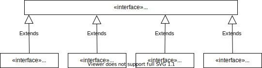

<style>
strong {
    background: linear-gradient(transparent 0%, #6f6 0%) !important;
}

strong * {
    background: linear-gradient(transparent 0%, #6f6 0%) !important;
}

</style>
# Stream

[java.util.stream.Stream](https://docs.oracle.com/javase/jp/11/docs/api/java.base/java/util/stream/Stream.html)
[java.util.stream.BaseStream](https://docs.oracle.com/javase/jp/11/docs/api/java.base/java/util/stream/BaseStream.html)

## Stream関連のインタフェース



- `IntStream`は`int`型(primitive型)のストリーム
- `LongStream`は`long`型(primitive型)のストリーム
- `DoubleStream`は`double`型(primitive型)のストリーム


`IntStream`と`Stream<Integer>`は異なることに注意！

## streamの生成

- `java.util.Collection<E>`の`stream()`メソッドを使う方法

    ```java
    // Listのstreamを使用する
    List<String> list = Arrays.asList("a", "b", "c");
    Stream<String> st = list.stream();

    // Mapから変換
    Map<Integer, String> map = new HashMap<>();
    map.put(1, "A");
    map.put(2, "B");
    map.put(3, "C");
    Stream<Map.Entry<Integer, String>> mapStream = map.entrySet().stream();

    // 文字列から変換
    String str = "ABCDE";
    IntStream strStream = str.chars();
    ```

- `Stream<T>`インタフェースの`empty`メソッドを使う方法
    ```java
    // 空のstreamを生成する
    Stream<String> st = Stream.empty();
    ```

- `Stream<T>`インタフェースの`of`メソッドを使う方法

    ```java
    // 指定した引数のstreamを作成する
    Stream<String> st1 = Stream.of("a", "b", "c");

    // IntStreamが返らないことに注意
    Stream<Integer> st2 = Stream.of(1, 2, 3);

    // LongStreamが返らないことに注意
    Stream<Long> st2 = Stream.of(100L, 200L, 300L);

    // DoubleStreamが返らないことに注意
    Stream<Double> st3 = Stream.of(0.1, 0.2, 0.3);
    ```

- `Stream<T>`インタフェースの`generate`メソッドを使う方法

    ```java
    // 中身が1で総量が3のstreamを作成する
    Stream<Integer> stream = Stream.generate(() -> 1).limit(3);
    ```

- `Stream<T>`インタフェースの`iterate`メソッドを使う方法

    ```java
    // [1, 2, 3, 4, 5]のstreamを作成する
    Stream<Integer> stream = Stream.iterate(1, x -> x + 1).limit(5);
    ```

    なお、以下の演算子の違いに注意が必要である。

    ```java
    // [1, 2, 3, 4, 5]のstreamを作成する
    Stream<Integer> stream = Stream.iterate(1, x -> ++ x).limit(5);

    // [1, 1, 1, 1, 1]のstreamを作成する
    Stream<Integer> stream = Stream.iterate(1, x -> x ++).limit(5);
    ```

    ```java
    // 以下のラムダ式は
    x -> x ++;

    // 以下のラムダ式と同じ
    (x) -> {
        // xを返却した後に、インクリメントする。
        return x ++;
    }
    ```

    java se11からは、C++のforと同様に記述できる。
    [static <T> Stream<T> iterate(T seed, Predicate<? super T> hasNext, UnaryOperator<T> next)](https://docs.oracle.com/en/java/javase/11/docs/api/java.base/java/util/stream/Stream.html#iterate(T,java.util.function.Predicate,java.util.function.UnaryOperator))
    この場合は、`limit`メソッドは不要である。

    ```java
    // [1, 2, 3, 4, 5]のstreamを作成する
    Stream<Integer> stream = Stream.iterate(1, x -> x < 6, x -> x + 1);
    ```

- `Stream<T>`インタフェースの`concat`メソッドを使う方法

    ```java
    // 2つのstreamを結合して1つのstreamを作成する
    Stream<String> stream1 = Stream.of("a", "b");
    Stream<String> stream2 = Stream.of("c", "d", "e");
    Stream<String> stream3 = Stream.concat(stream1,stream2);
    ```

- `Stream.Builder<T>`インターフェースを使用する方法

    ```java
    Stream.Builder<Integer> sb = Stream.builder();
    sb.add(10);
    sb.add(20);
    Stream<Integer> buildStream = sb.build();
    ```

- `IntStream`では、`range`と`rangeClosed`で、連続する整数のstreamを作成することができる。

    ```java
    // [1, 2, 3, 4]のストリームを作る。
    // ※5は含まれない。
    IntStream st = IntStream.range(1, 5);

    // [1, 2, 3, 4, 5]のストリームを作る。
    // ※5は含まれる。
    IntStream st = IntStream.rangeClosed(1, 5);
    ```


## streamの中間操作

- `<R> Stream<R> map(Function<? super T, ? extends R> mapper)`
    `stream`の要素を変換する

    ```java
    // [1, 2, 3, 4, 5]のstreamを[1, 4, 9, 16, 25]のStream<Integer>変換する。
    Stream<Integer> st = Stream.of(1, 2, 3, 4, 5).map(s -> s * s);
    ```

- `IntStream mapToInt(ToIntFunction<? super T> mapper)`
    `stream`を`IntStream`に変換する
    ※`Stream<Integer>`ではなく、`IntStream`に変換するのがミソ。

    ```java
    // ["1", "2", "3", "4", "5"]のstreamを[1, 2, 3, 4, 5]のIntStreamに変換する。
    IntStream st = Stream.of("1", "2", "3", "4", "5").mapToInt(s -> Integer.parseInt(s));
    ```

- `<U> Stream<U> mapToObj(IntFunction<? extends U> mapper)`
    `IntStream`を`Stream`に変換する
    ※`IntStream.map`は出力の型を変換できない。

    ```java
    // [1, 2, 3, 4, 5]のIntStreamを["1", "2", "3", "4", "5"]のStream<String>に変換する。
    Stream<String> st = IntStream.of(1, 2, 3, 4, 5).mapToObj(num -> String.valueOf(num));
    ```

- `LongStream asLongStream()`
    `IntStream`を`LongStream`に変換する
    ※`IntStream.mapToLong`でも`LongStream`に変換することができるが、よりシンプルに記述できる。
    
    ```java
    // mapToLongでLongStreamに変換することができる。
    LongStream st = IntStream.of(1, 2, 3).mapToLong(v -> v);

    // asLongStreamを使うとよりシンプルにかける。
    LongStream st = IntStream.of(1, 2, 3).asLongStream();
    ```

    同様のメソッドとして、以下のメソッドがある。
    - `IntStream.asDoubleStream`    - `IntStream`を`DoubleStream`に変換する
    - `LongStream.asDoubleStream`  - `LongStream`を`DoubleStream`に変換する

    ※LongStreamをIntStreamに変換するなど、桁あふれが発生する変換メソッドはない。


- `Stream<Integer> boxed()`
    `IntStream`を`Stream<Integer>`に変換する

    ```java
    Stream<Integer> st = IntStream.of(1, 2, 3, 4, 5).boxed();
    ```

- `<R> Stream<R> flatMap(Function<? super T, ? extends Stream<? extends R>> mapper)`
    各要素を引数にして作成されるstreamをconcatさせた`stream`を作成する

    ```java
    // ["a", "b", "c"], ["0", "1", "2"], ["x", "y", "z"]からなるstreamを作成する
    Stream.Builder<List<String>> builder = Stream.builder();
    builder.add(Arrays.asList("a", "b", "c"));
    builder.add(Arrays.asList("0", "1", "2"));
    builder.add(Arrays.asList("x", "y", "z"));
    Stream<List<String>> st = builder.build();

    // ["a", "b", "c", "0", "1", "2", "x", "y", "z"]のstreamに変換する
    Stream<String> st2 = st.flatMap(e -> e.stream());
    ```

- `Stream<T> filter(Predicate<? super T> predicate)`
    要素を絞り込む

    ```java
    // [1, 2, 3, 4, 5]から[2, 4]を作成する
    IntStream even = IntStream.of(1, 2, 3, 4, 5).filter(x -> x % 2 == 0);
    ```

- `Stream<T> skip(long n)`
    要素を飛ばす

    ```java
    // [1, 2, 3, 4, 5]から[3, 4, 5]を作成する
    IntStream st3 = IntStream.of(1, 2, 3, 4, 5).skip(2);
    ```

- `Stream<T> limit(long maxSize)`
    要素の個数を先頭から絞る

    ```java
    // [1, 2, 3, 4, 5]から[1, 2, 3]を作成する
    IntStream st4 = IntStream.of(1, 2, 3, 4, 5).limit(3);
    ```

- `Stream<T> distinct()`
    要素の重複を取り除く

    ```java
    // [1, 2, 2, 4, 1]から[1, 2, 4]を作成する
    IntStream st5 = IntStream.of(1, 2, 2, 4, 1).distinct();
    ```

    ※要素の同一性チェックには、Object.equalsが使用される。

- `Stream<T> sorted(Comparator<? super T> comparator)`
    要素の順序を変更する
    ※引数なしの`Stream<T> sorted()`Streamもある。

    ```java
    // [13, 52, 34, 6, 28]のstreamを昇順にならべて[6, 13, 28, 34, 52]のstreamにする
    Stream<Integer> st6 = Stream.of(13, 52, 34, 6, 28).sorted((s1, s2) -> s1 - s2);
    ```

    `sorted`の引数として指定する比較関数として、`Comparator.comparingXX`を使用することができる。
    ```java
    // [13, 52, 34, 6, 28]のstreamを昇順にならべて[6, 13, 28, 34, 52]のstreamにする
    Stream<Integer> st7 = Stream.of(13, 52, 34, 6, 28).sorted(Comparator.comparingInt(x -> x));
    ```

- `Stream<T> peek(Consumer<? super T> action)`
    デバッグ用のメソッド
    `peek`はstreamの要素を一切変更しない。

    ```java
    List<String> numbers =  Stream.of("one", "two", "three", "four")
                        .filter(e -> e.length() > 3)
                        .peek(e -> System.out.println("Filtered value: " + e))
                        .map(String::toUpperCase)
                        .peek(e -> System.out.println("Mapped value: " + e))
                        .collect(Collectors.toList());

    // ★コンソール出力
    // Filtered value: three
    // Mapped value: THREE
    // Filtered value: four
    // Mapped value: FOUR
    ```


## streamの終端操作

終端操作は一度しかできない。
終端操作を行ったstreamは操作することができない。


- `void forEach(Consumer<? super T> action)`
    streamの各要素を引数に処理を行う。

    ```java
    // [10, 20, 30, 40, 50]のstreamの各様のに対してラムダ式で指定した処理を行う。
    Stream.of(10, 20, 30, 40 ,50).forEach(s -> {
        int intResult = s / 10;
        System.out.println(intResult);
    });
    ```

- `void forEachOrdered(Consumer<? super T> action)`
    並列処理を行う際に、順序通りに要素を取り出す。

    `parallelStream`メソッドは、マルチスレッドで処理されるstreamを変化する。
    このため、stream内の要素に対する処理の順番はランダムになる。
    この場合でも、最初の要素の順序通りに処理するために、`forEachOrdered`を使用する。

    ```java
    list.parallelStream().filter(s -> s > 1).forEachOrdered(System.out::println);
    ```

- `<R,A> R collect(Collector<? super T, A, R> collector)`
- `<R> R collect(Supplier<R> supplier, BiConsumer<R, ? super T> accumulator, BiConsumer<R, R> combiner)`
    結果を取り出す

    `collect`は集計処理などを行う。
    `collect`に指定する関数インタフェースは、[java.util.stream.Collectors](https://docs.oracle.com/javase/jp/11/docs/api/java.base/java/util/stream/Collectors.html)クラスのstaticメソッドが使用できる。

    `collect`メソッドは、引数が１つのタイプと、引数が３つのタイプがある。
    `IntStream`、`LongStream`、`DoubleStream`は、引数が３つのタイプのメソッドしかない点に注意！

    ```java
    // 引数が三つのタイプ
    <R> R collect(Supplier<R> supplier, BiConsumer<R, ? super T> accumulator, BiConsumer<R, R> combiner);

    // 上は以下と同じです。
    // combinerはpallarelStreamで各スレッドで集約されたRをまとめるためのメソッドです。
    R result = supplier.get();
    for (T element : this stream)
        accumulator.accept(result, element);
    return result;

    // 引数が１つのタイプ
    <R, A> R collect(Collector<? super T, ​A, R> collector);
    ```

    + `Collectors.toList`でstreamからListへの変換。

        ```java
        // ["A", "B", "C", "D", "E"]のstreamをList型に変換する
        List<String> list = Stream.of("A", "B", "C", "D", "E").collect(Collectors.toList());
        ```

    + `Collectors.joining`でstreamからStringに変換。

        ```java
        // ["A", "B", "C", "D", "E"]のstreamを"ABCDE"に変換する
        String join1 = Stream.of("A", "B", "C", "D", "E").collect(Collectors.joining());
        ```

        ```java
        // ["A", "B", "C", "D", "E"]のstreamを"A,B,C,D,E"に変換する
        String join2 = Stream.of("A", "B", "C", "D", "E").collect(Collectors.joining(","));
        ```

    + `Collectors.groupingBy`でstreamからMapに変換。

        ```java
        // Personオブジェクトのstreamを作成する。
        Stream<Person> personStream = Arrays.asList(a, b, c, d, e, f).stream();

        // Personクラスのリストから作成したstreamを、getCityで取得する値をキーとして、Mapに変換する。
        Map<String, List<Person>> peopleByCity = personStream.collect(Collectors.groupingBy(Person::getCity));
        ```


- `<A> A[] toArray(IntFunction<A[]> generator)`
    配列に変換する

    `Object[]`でなく、特定のクラスの配列を取得するためには、`toArray`の引数に取得するクラス配列のコンストラクタを指定する。
    `toArray`を引数なしで使用すると、`Object[]`が取得される。

    ```java
    // ["a", "b", "c", "d", "e"]の配列に変換する
    String[] toArray = Stream.of("a", "b", "c", "d", "e").toArray(String[]::new);
    ```

- `T reduce(T identity, BinaryOperator<T> accumulator)`

    `javascript`での`reduce`と同じです。
    注意したいのは、第一引数の初期値の型は、第二引数のBinaryOperatorの型引数と同じです。
    つまり、Streamの型変数とreduceの結果型は同じです。

    ```java
    T reduce(T identity, BinaryOperator<T> accumulator);
    ```

    ```java
    // a, bはInteger
    Integer total = Stream.of(1, 2, 3, 4, 5).reduce(0, (a, b) -> a + b);
    System.out.println(total);
    ```

    もう一つの`reduce`として、`Optional<T>`クラスを返却するタイプがあります。
    こちらは、初期値を指定しないタイプになります。

    ```java
    Optional<String> result = Stream.of("a", "b", "c").reduce((a, v) -> a + "-" + v);
    System.out.println(result.orElse(""));
    ```

    `Optional`クラスは、型パラメータの値を保持するか、nullを保持します。
    `Optional`クラスのメソッドを以下に示します。

    ```java
    // 空のOptionalインスタンスを返します。
    static <T> Optional<T> empty();

    // このOptionalに値が存在する場合は値を返し、それ以外の場合はNoSuchElementExceptionをスローします。
    T get();

    // 存在する値がない場合はtrueを返し、それ以外の場合はfalseを返します。
    boolean isEmpty();

    // 存在する値がある場合はtrueを返し、それ以外の場合はfalseを返します。
    boolean isPresent();

    // 存在する場合は値を返し、それ以外の場合はotherを返します。
    T orElse(T other);

    // 値が存在する場合はその値を返し、そうでない場合はotherを呼び出し、その呼び出しの結果を返します。
    T orElseGet(Supplier<? extends T> other);

    // 値が存在する場合は、その含まれている値を返し、それ以外の場合は、指定されたサプライヤによって作成された例外をスローします。
    <X extends Throwable> T orElseThrow(Supplier<? extends X> exceptionSupplier);

    // 値が存在する場合は、その値で指定されたアクションを実行し、そうでない場合は何もしません。
    void ifPresent(Consumer<? super T> action);
    ```

- `Optional<T> findAny()`

    `findAny`が返す要素はどの要素になるか分かりません。

    ```java
    // ["A", "B", "C", "D", "E"]から任意の要素を見つける
    Optional<String> findAny = Stream.of("A", "B", "C", "D", "E").findAny();
    System.out.println(findAny.orElse("null"));
    ```

- `Optional<T> findFirst()`

    最初の要素を返却しますが、`Optional`型で返却されるので注意。
    なお、`parallelStream`であっても、先頭の要素が返却されます。

    ```java
    // ["A", "B", "C", "D", "E"]から先頭の要素を見つける
    Optional<String> findFirst = Stream.of("A", "B", "C", "D", "E").findFirst();
    System.out.println(findFirst.orElse("null"));
    ```

- `Optional<T> max(Comparator<? super T> comparator)`

    `stream`の要素が数値とは限らないので、比較器を指定する。
    `Comparator.naturalOrder()`は`Comparator`インタフェースのstaticメソッドで、昇順比較の比較関数の参照を返却する。
    ほかにも、`Comparator.reverseOrder()`などがある。

    ```java
    // [1, 2, 3, 4, 5]から最大値を求めます。
    Optional<Integer> max = Stream.of(1, 2, 3, 4, 5).max(Comparator.naturalOrder());
    System.out.println(max.orElse(0));
    ```

    **`IntStream`、`LongStream`、`DoubleStream`の`max`メソッドは引数なし。**

- `Optional<T> min(Comparator<? super T> comparator)`

    ```java
    Optional<Integer> min = Stream.of(1, 2, 3, 4, 5).min(Comparator.naturalOrder());
    System.out.println(min.orElse(0));
    ```

    **`IntStream`、`LongStream`、`DoubleStream`の`min`メソッドは引数なし。**

- `int sum()`
- `long sum()`
- `double sum()`

    `IntStream`、`LongStream`、`DoubleStream`が持つメソッドで、streamを構成する要素の総和を求める。
    ※sumの返却値は、Optionalではなくプリミティブ型になる。

    ```java
    int sum = IntStream.of(1, 2, 3, 4, 5).sum();
    System.out.println(sum);
    ```

- `OptionalDouble average()`

    `IntStream`、`LongStream`、`DoubleStream`が持つメソッドで、streamを構成する要素の平均を求める。

    ```java
    OptionalDoble average = IntStream.of(1, 2, 3, 4, 5).average();
    System.out.println(average.getAsDouble());
    ```

- `long count()`

    `stream`を構成する要素の数を求める。
    intではなく、**long**が返却される点に注意！

    ```java
    Long count = Stream.of(1, 2, 3, 4, 5).count();
    System.out.println(count);
    ```

- `boolean anyMatch(Predicate<? super T> predicate)`

    `stream`を構成する一つ以上の要素が条件を満たしているかどうかを判定する。

    ```java
    // [1, 2, 3, 4, 5]のstreamの少なくとも一つの要素が、2より大きいかどうかを判定する。
    // ----> true
    Boolean anyMatch1 = Stream.of(1, 2, 3, 4, 5).anyMatch(s -> s > 2);
    ```

- `boolean allMatch(Predicate<? super T> predicate)`

    `stream`を構成するすべての要素が条件を満たしているかどうかを判定する。

    ```java
    // ["one", "two", "three", "four"]のstreamの全要素の文字列長が5以下であるかどうかを判定する。
    // ----> true
    Boolean allMatch1 = Stream.of("one", "two", "three", "four").allMatch(s -> s.length() <= 5);
    ```

- `boolean noneMatch(Predicate<? super T> predicate)`

    `stream`を構成するすべての要素が条件を満たしていないことを判定する。
    ```java
    // ["one", "two", "three", "four"]のstreamの全要素の文字列長が2以下で無い事を判定する。
    // ----> true
    Boolean noneMatch1 = Stream.of("one", "two", "three", "four").noneMatch(s -> s.length() <= 2);
    ```

## java.util.stream.Collector<T, A, R>インターフェース
[java.util.stream.Collector<T, A, R>](https://docs.oracle.com/javase/jp/11/docs/api/java.base/java/util/stream/Collector.html)

- `Supplier<A> supplier()`
    結果を蓄積する時に利用するコンテナを作成する

- `BiConsumer<A, T> accumulator()`
    コンテナに結果を蓄積する

- `Function<A, R> finisher()`
    最後にコンテナに対して処理を行う。
    R型に変換する

    ```java
    A container = collector.supplier().get();
    for (T t : data)
        collector.accumulator().accept(container, t);
    R result =  collector.finisher().apply(container);
    return result;
    ```

## java.util.stream.Collectorsのメソッド

[java.util.stream.Collectors](https://docs.oracle.com/javase/jp/11/docs/api/java.base/java/util/stream/Collectors.html)のメソッドは、[java.util.stream.Collector](https://docs.oracle.com/javase/jp/11/docs/api/java.base/java/util/stream/Collector.html)インタフェースを取得するための便利なメソッドを提供している。

### List, Set, Mapへの変換

- `static <T> Collector<T, ?, List<T>> toList()`
    入力要素をListに蓄積する`Collector`を返却する。

    ```java
    Stream<String> stream = Stream.of("a", "b", "c");
    List<String> result = stream.collect(Collectors.toList());
    System.out.println(result); // --> [a, b, c]
    ```

- `static <T> Collector<T, ?, Set<T>> toSet()`
    入力要素をSetに蓄積する`Collector`を返却する。
    ※以下の例では、重複も排除してくれる。

    ```java
    Stream<String> stream = Stream.of("a", "b", "c", "a");
    Set<String> result = stream.collect(Collectors.toSet());
    System.out.println(result); // --> [a, b, c]
    ```

- `static <T, K, U> Collector<T, ?, Map<K, U>> toMap(Function<? super T, ? extends K> keyMapper, Function<? super T, ? extends U> valueMapper)`
    入力要素をMapに蓄積する`Collector`を返却する。
    第一引数のキー名を取得するためのメソッドを、第二引数に値を取得するためのメソッドを指定する。

    ```java
    Stream<String> stream = Stream.of("a", "b", "c");
    Map<String, Integer> result = stream.collect(Collectors.toMap(v -> v, v -> v.length()));
    System.out.println(result); // --> {a=1, b=1, c=1}
    ```

    `toMap`で重複したキーを処理した場合、ランタイム例外(`IllegalStateException`)になります。

- `public static <T, K, U> Collector<T, ?, Map<K, U>> toMap(Function<? super T, ? extends K> keyMapper, Function<? super T, ? extends U> valueMapper, BinaryOperator<U> mergeFunction)`
    入力要素をMapに蓄積する`Collector`を返却する。
    第一引数のキー名を取得するためのメソッドを、第二引数に値を取得するためのメソッドを、第三引数にキーが重複した場合のマージ用メソッドを指定する。

    ```java
    Stream<String> stream = Stream.of("Ken", "Taro", "Hanako", "Mike");
    Map<Integer, String> result = stream.collect(
        Collectors.toMap(v -> v.length(), v -> v, (v1, v2)-> v1 + ":" + v2));
    System.out.println(result); // --> {3=Ken, 4=Taro:Mike, 6=Hanako}
    ```

    このメソッドの場合、重複したキーが出現しても、指定したマージ用メソッドでマージ処理を行うために、実行時例外にならない。

- `public static <T, K, U, M extends Map<K, U>> Collector<T, ?, M> toMap(Function<? super T, ? extends K> keyMapper, Function<? super T, ? extends U> valueMapper, BinaryOperator<U> mergeFunction, Supplier<M> mapFactory)`
    入力要素をMapに蓄積する`Collector`を返却する。
    第一引数のキー名を取得するためのメソッドを、第二引数に値を取得するためのメソッドを、第三引数にキーが重複した場合のマージ用メソッドを、第四引数にマップのコンストラクタを指定する。

    この例では、StreamをTreeMapに変換する。

    ```java
    Stream<String> stream = Stream.of("Ken", "Taro", "Hanako", "Mike");
    Map<Integer, String> result = stream.collect(Collectors.toMap(v -> v.length(), v -> v, (v1, v2)-> v1 + ":" + v2, TreeMap::new));
    System.out.println(result); // --> {3=Ken, 4=Taro:Mike, 6=Hanako}
    ```

- `public static <T,K,U> Collector<T, ?, ConcurrentMap<K, U>> toConcurrentMap(Function<? super T, ? extends K> keyMapper, Function<? super T, ? extends U> valueMapper, BinaryOperator<U> mergeFunction)`
    ConcurrentMap内に要素を累積する並行Collectorを返します(指定されたマッピング関数を入力要素に適用した結果が、マップのキーと値になる)。

    ```java
    Stream<String> stream = Stream.of("Ken", "Taro", "Hanako", "Mike");
    Map<Integer, String> result = stream.parallel().collect(Collectors.toConcurrentMap(v -> v.length(), v -> v, (v1, v2)-> v1 + ":" + v2));
    System.out.println(result); // --> {3=Ken, 4=Taro:Mike, 6=Hanako}
    ```

### 文字列の結合

- `static Collector<CharSequence, ?, String> joining()`
    文字列を結合して1つの文字列にする`Collector`を返却する。

    ```java
    Stream<String> stream = Stream.of("a", "b", "c");
    String result = stream.collect(Collectors.joining());
    System.out.println(result); // --> abc
    ```

- `static Collector<CharSequence, ?, Sttring> joining(CharSequence delimiter)`
    指定した文字列をデリミタとし、文字列を結合して１つの文字列にする`Collector`を返却します。

    ```java
    Stream<String> stream = Stream.of("a", "b", "c");
    String result = stream.collect(Collectors.joining("-"));
    System.out.println(result); // a-b-c
    ```

### 総和、平均の算出

- `static <T> Collector<T, ?, Integer> summingInt(ToIntFunction<? super T> mapper)`
    Integerの和を算出する`Collector`を返却します。

    ```java
    Stream<String> stream = Stream.of("ken", "taro", "hanako");
    Integer result = stream.collect(Collectors.summingInt(val->val.length()));
    System.out.println(result);     // 13
    ```

- `public static <T> Collector<T, ?, Double> averagingInt(ToIntFunction<? super T> mapper)`
    要素をint型に変換して平均を算出するた`Collector`を返却します。

    ```java
    Stream<Integer> stream = Stream.of(1, 2, 3, 4, 5, 6);
    Double average = stream.collect(Collectors.averagingInt(v -> v));
    System.out.println(average); // 3.5
    ```

    `averagingLong`は、引数に要素をlong型に変換するCollectorを指定します。
    `averagingDouble`は、引数に要素をdouble型に変換するCollectorを指定します。
    いずれも、平均値は`Double`型で取得します。

### グループ化

- `public static <T, K> Collector<T, ?, Map<K, List<T>>> groupingBy (Function<? super T, ? extends K> classifier)`
    第一引数にグルーピンのためのキーを返却するメソッドを指定する。
    以下の例では、数値を偶数と奇数に分類している。

    ```java
    Stream<Integer> stream = Stream.of(1, 2, 3, 4, 5, 6, 7, 8, 9);
    Map<String, List<Integer>> group = stream.collect(Collectors.groupingBy(v -> v % 2 == 0 ? "odd" : "even"));
    System.out.println(group); // --> {even=[1, 3, 5, 7, 9], odd=[2, 4, 6, 8]}
    ```


- `public static <T, K, A, D> Collector<T, ?, Map<K, D>> groupingBy (Function<? super T,​? extends K> classifier, Collector<? super T, A, D> downstream)`
    第一引数にグルーピンのためのキーを返却するメソッドを指定する。
    第二引数にグルーピング化したリストに対して、さらにcollectを適用する際のCollectorインタフェースを指定する。
    下の例では、数値を偶数と奇数にグルーピングした後、それぞれで平均を算出しています。

    ```java
    Stream<Integer> stream = Stream.of(1, 2, 3, 4, 5, 6, 7, 8, 9);
    Map<String, Double> group = stream.collect(
        Collectors.groupingBy(
            v -> v % 2 == 0 ? "odd" : "even", 
            Collectors.averagingInt(v -> v)));
    System.out.println(group); // --> {even=5.0, odd=5.0}
    ```

- `public static <T, K, D, A, M extends Map<K, D>> Collector<T, ?, M> groupingBy (Function<? super T,​? extends K> classifier, Supplier<M> mapFactory, Collector<? super T, A, D> downstream)`
    第一引数にグルーピンのためのキーを返却するメソッドを指定する。
    第ニ引数にマッピングするためのファクトリーメソッドを指定する。
    第三引数にグルーピング化したリストに対して、さらにcollectを適用する際のCollectorインタフェースを指定する。
    下の例では、数値を偶数と奇数にグルーピングした後、それぞれで平均を算出して、結果をTreeMapで取得しています。

    ```java
    Stream<Integer> stream = Stream.of(1, 2, 3, 4, 5, 6, 7, 8, 9);
    Map<String, Double> group = stream.collect(
        Collectors.groupingBy(
            v -> v % 2 == 0 ? "odd" : "even", 
            TreeMap::new,
            Collectors.averagingInt(v -> v)));
    System.out.println(group); // --> {even=5.0, odd=5.0}
    ```

- `public static <T, K> Collector<T, ?, ConcurrentMap<K, List<T>>> groupingByConcurrent(Function<? super T, ? extends K> classifier)`
    分類関数に従って要素をグループ化する、T型の入力要素に対する「グループ化」操作を実装した並行Collectorを返します。

    ```java
    Stream<Integer> stream = Stream.of(1, 2, 3, 4, 5, 6, 7, 8, 9);
    ConcurrentMap<String, List<Integer>> group = stream.parallel().collect(Collectors.groupingByConcurrent(v -> v % 2 == 0 ? "odd" : "even"));
    System.out.println(group); // --> {even=[7, 5, 1, 9, 3], odd=[6, 4, 8, 2]}
    ```

- `public static <T, K, A, D> Collector<T, ?, ConcurrentMap<K, D>> groupingByConcurrent(Function<? super T, ? extends K> classifier,Collector<? super T, A, D> downstream)
    分類関数に従って要素をグループ化した後、指定された下流Collectorを使って特定のキーに関連付けられた値のリダクション操作を実行する、T型の入力要素に対するカスケード「グループ化」操作を実装した並行Collectorを返します。

    ```java
    Stream<Integer> stream = Stream.of(1, 2, 3, 4, 5, 6, 7, 8, 9);
    ConcurrentMap<String, Double> group = stream.parallel().collect(
        Collectors.groupingByConcurrent(
            v -> v % 2 == 0 ? "odd" : "even", 
            Collectors.averagingInt(v -> v)));
    System.out.println(group); // --> {even=5.0, odd=5.0}
    ```

- `public static <T, K, A, D, M extends ConcurrentMap<K, D>> Collector<T, ?, M> groupingByConcurrent(Function<? super T, ? extends K> classifier, Supplier<M> mapFactory, Collector<? super T, A, D> downstream)`
    分類関数に従って要素をグループ化した後、指定された下流Collectorを使って特定のキーに関連付けられた値のリダクション操作を実行する、T型の入力要素に対するカスケード「グループ化」操作を実装した並行Collectorを返します。
    このCollectorで生成されるConcurrentMapは、指定されたファクトリ関数によって作成されます。

    ```java
    Stream<Integer> stream = Stream.of(1, 2, 3, 4, 5, 6, 7, 8, 9);
    ConcurrentMap<String, Double> group = stream.parallel().collect(
        Collectors.groupingByConcurrent(
            v -> v % 2 == 0 ? "odd" : "even", 
            ConcurrentHashMap<String, Double>::new,
            Collectors.averagingInt(v -> v)));
    System.out.println(group); // --> {even=5.0, odd=5.0}
    ```

- `public static <T> Collector<T, ?, Map<Boolean, List<T>>> partitioningBy (Predicate<? super T> predicate)`
    `groupBy`は複数のグループに分割するのに対して、`partitioningBy`は2つのグループに分割します。
    第一引数のpredicateの判断に従って分割を行います。
    以下の例は、偶数と奇数の2つのグループに分割しています。

    ```java
    Stream<Integer> stream = Stream.of(1, 2, 3, 4, 5, 6, 7, 8, 9);
    Map<Boolean, List<Integer>> result = stream.collect(Collectors.partitioningBy(v -> v % 2 == 0));
    System.out.println(result);     // {false=[1, 3, 5, 7, 9], true=[2, 4, 6, 8]}
    ```

- `static <T, D, A> Collector<T, ?, Map<Boolean, D>> partitioningBy (Predicate<? super T> predicate, Collector<? super T, A, D> downstream)`
    第一引数のpredicateの判断に従って分割を行います。
    第二引数にグルーピング化したリストに対して、さらにcollectを適用する際のCollectorインタフェースを指定する。
    下の例では、数値を偶数と奇数にグルーピングした後、それぞれで平均を算出しています。

    ```java
    Stream<Integer> stream = Stream.of(1, 2, 3, 4, 5, 6, 7, 8, 9);
    Map<Boolean, Double> result = stream.collect(Collectors.partitioningBy(v -> v % 2 == 0, Collectors.averagingInt(v -> v)));
    System.out.println(result);     // {false=5.0, true=5.0}
    ```

- `public static <T, U, A, R> Collector<T, ?, R> mapping(Function<? super T,​? extends U> mapper, Collector<? super U, A, R> downstream)`
    第一引数のmapperでマッピング処理を行った後、第二引数のdownstreamでコレクト処理を行います。

    以下のmapメソッドによる実装は、

    ```java
    Stream<Integer> stream = Stream.of(1, 2, 3, 4, 5, 6, 7, 8, 9);
    String result = stream.map(v -> String.valueOf(v)).collect(Collectors.joining(":"));
    System.out.println(result);    // 1:2:3:4:5:6:7:8:9
    ```

    以下のmappingメソッドによる実装と等価です。

    ```java
    Stream<Integer> stream = Stream.of(1, 2, 3, 4, 5, 6, 7, 8, 9);
    String result = stream.collect(Collectors.mapping(v -> String.valueOf(v), Collectors.joining(":")));
    System.out.println(result);    // 1:2:3:4:5:6:7:8:9
    ```

- `static <T> Collector<T, ?, Optional<T>> maxBy(Comparator<? super T> comparator)`
    最大値を求めます。
    第一引数に比較器を指定します。

    ```java
    Stream<Integer> stream = Stream.of(1, 2, 3, 4, 5, 6, 7, 8, 9);
    Optional<Integer> result = stream.collect(Collectors.maxBy(Comparator.naturalOrder()));
    System.out.println(result.orElse(0));   // 9
    ```


- `public static <T> Collector<T, ?, Optional<T>> minBy (Comparator<? super T> comparator)`
    最小値を求めます。
    第一引数に比較器を指定します。

    ```java
        Stream<Integer> stream = Stream.of(1, 2, 3, 4, 5, 6, 7, 8, 9);
        Optional<Integer> result = stream.collect(Collectors.minBy(Comparator.naturalOrder()));
        System.out.println(result.orElse(0));   // 1
    ```


### 注意点

- `Optional<Double>`か`OptionalDouble`か注意すること。
- `Optional<Double>`から値をとる場合は`get`、`OptionalDouble`から値をとる場合は`getAsDouble`
- `IntStrem.reduce`の引数は`IntBinaryOperator`、`Stream<Integer>.reduce`の引数は`BinaryOperator<Integer>`


