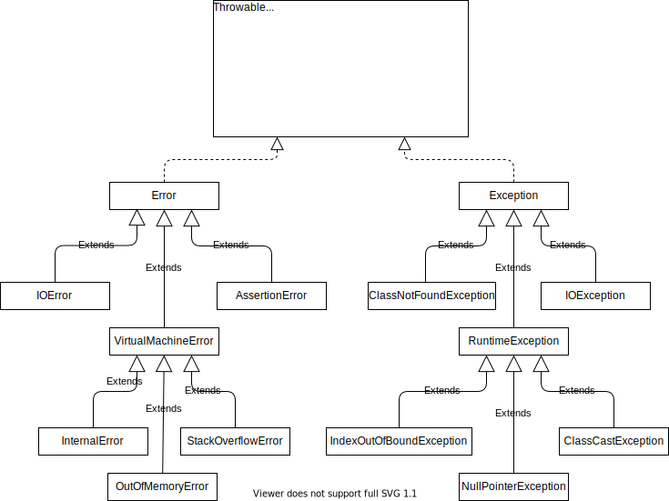

# Exception

[java.lang.Throwable](https://docs.oracle.com/javase/jp/8/docs/api/java/lang/Throwable.html)
[java.lang.Exception](https://docs.oracle.com/javase/jp/8/docs/api/java/lang/Exception.html)
[java.lang.Error](https://docs.oracle.com/javase/jp/8/docs/api/java/lang/Error.html)

## Exception関連のクラス



## checked例外とunchecked例外

- `checked`例外
    コンパイル時にチェックされる例外
    必ずtry-catchでキャッチする必要がある
    `Error`と`RuntimeException`以外

- `unchecked`例外
    コンパイル時にチェックされない例外
    try-catchでキャッチする必要が無い
    `Error`と`RuntimeException`

## try-catch

複数のcatchで継承関係ある例外をcatchする場合は、先にサブクラスからcatchする必要がある。
下の例は、RuntimeExceptionとExceptionをcatchしているが、RuntimeExceptionはExceptionのサブクラスであるため、先にcatchする必要がある。

```java
try {
} catch (RuntimeException e) {
} catch (Exception e) {
}
```

tryには一つ以上のcatchまたはfinallyが必要である。

```java
// コンパイル成功
try {
} finally {
}
```


## multi-catch

java 7から複数の`exception`をまとめてcatchできるようになった。

```java
try {
    // なにか処理
} catch (NullPointerException | ClassCastException e) {
}
```


ただし、継承関係にある`execption`はまとめることはできない。
したがって、以下のコンパイルエラーになる。

```java
try {
    // なにか処理
} catch (IOException | Exception e) {
}
```

また、multi-catchでcatchした`exception`は暗黙的に`final`であり、変更することはできない。
したがって、以下はコンパイルエラーになる。

```java
try {
    // なにか処理
} catch (IOException | Exception e) {
    // multi-catchでキャッチした例外は変更できない。
    e = new Exception("Some exception occured.");
    throw e;
}
```

なお、multi-catchで無い場合は、catchした`exception`を変更することができる。

## throws

catchしないでthrowする例外は、明示的にthrowsで記述する必要がある。  
ただし、
- unchecked 例外は記述する必要はない。
- 実際にthrowする例外のスーパークラスをthrowsで指定しても良い。


```java
// FileNotFoundExceptionのスーパークラスであるIOExceptionをスローすると定義する
void test2() throws IOException {
    throw new FileNotFoundException();
}
```

## throwsが指定されているメソッドのオーバーライド

以下のクラスが定義されている場合

```java
class Super {
    void method() throws IOException {}
}
```

以下はコンパイル成功する。

```java
class SubA extends Super {
    // 例外をスローしないように変更する
    @Override
    void method() {}
}

class SubB extends Super {
    // サブクラスの例外をスローするように変更する。
    @Override
    void method() throws FileNotFoundException {}
}

class SubC extends Super {
    // RuntimeExceptionをスローするように変更する。
    @Override
    void method() throws RuntimeException {}
}
```

しかし、以下はコンパイルエラーになる。

```java
class SubX extends Super {
    // スーパークラスの例外をスローするように変更する。
    @Override
    void method() throws Exception {}
}

class SubY extends Super {
    // 継承関係にない例外をスローするように変更する。
    @Override
    void method() throws SQLException {}
}

```

メソッドオーバーライドのルール
- オーバーライドとは、メソッド名と引数リストが全く同じものをサブクラスで定義すること。
- 戻り値は、スーパークラスのメソッドの戻り値の型か、そのサブクラスを指定すること。
- アクセス修飾子は、スーパークラスと同じものか、より公開範囲を広くすること。
- throwsには、スーパークラスのメソッドがスローする例外か、そのサブクラスを指定すること。
- RuntimeExceptionとそのサブクラスは、制約なしにthrowsに記述することができる。
- スーパークラスのメソッドがthrowsする例外を、オーバーライドするメソッドでスローしなくても良い。


## try-with-resources

オープンしたリソースを自動的にクローズする仕組み
クローズする対象のリソースは、`java.jang.AutoCloseable`か`java.io.Closeable`インタフェースを実装する必要がある。
これらのインタフェースを実装していない場合は、コンパイルエラーになる。


以下の様に`AutoCloseable`インタフェースを実装したクラスがあるとする。

```java
class MyResource implements AutoCloseable {
    @override
    public void close() {
        System.out,println("close");
    }
}
```

try-with-resources文で以下の様にこのリソースを使用することができる。

```java
try (MyResouce resource = new MyResource()) {
    // 何か処理
}
```

try-with-resources文では、`catch`も`finally`も記述する必要はない。
一方、通常のtry文では、`catch`か`finally`を一つ以上記述する必要がある。

try-with-resources文では、複数のリソースをオープンすることができる。
以下に例を示す。

```java
try (FileReader in = new FileReader("in.txt"),
    FileWriter out = new FileWriter("out.txt")) {
    // 何か処理
}
```

複数のリソースをtry-with-resourcesでオープンした場合、クローズされる順番はオープンした順の逆になる。  
上の例では、`out`、`in`の順でクローズされる。
また、try句で例外が発生した場合、catchよりも先にクローズ処理が行われる。

tryで指定したリソースは、暗黙的に`final`となるため、変更するとコンパイルエラーになる。
つまり、以下はコンパイルエラーになる。

```java
try (FileReader in = new FileReader("test.txt")) {
    // inはfinalであるため変更できない。
    in = null;
}
```

## 抑制された例外
try-with-resouces構文では、try句内での例外発生時に、catchよりも先にリソースのcloseメソッドが呼び出されます。
リソースのcloseメソッド内でさらに例外が発生した場合は、これらの例外はcatchすることができないため、抑制されます。
抑制された例外は、`getSuppressed()`メソッドで取り出すことができます。

以下のクラスが定義されている場合

```java
class MyResource implements AutoCloseable {
    public void method1() throws FileNotFoundException {
        System.out.println("method1");
        throw new FileNotFoundException("in method1");
    }
    public void close() throws FileNotFoundException {
        System.out.println("close");
        throw new FileNotFoundException("in closeing.");
    }
}
```

以下のコードを実行する。

```java
try (MyResource res = new MyResource()) {
    res.method1();
} catch (FileNotFoundException ex) {
    System.out.println("exception:");
    System.out.println(ex.getMessage());
    System.out.println("SuppressedExceptions:");
    Throwable [] suppressed  = ex.getSuppressed();
    for (var e : suppressed) {
        System.out.println(e.getMessage());
    }
    System.out.println();
} finally {
    System.out.println("finally");
}
```

以下の出力が得られる

```bash
method1                 // ここで例外が発生する
close                   // catchよりも先にcloseが呼ばれるが、ここでも例外が発生する
exception:              // catchが実行される
in method1              // method1でスローされた例外
SuppressedExceptions:
in closeing.            // closeでスローされた抑止された例外
finally                 // finally句が実行される
```


## Assert文

`Assert`文は、式を評価して`false`の場合に、`java.lang.AssertionException`をthrowする。
`Assert`文は、以下の様に記述する。


```java
// xが1で無い場合に、Assert例外が発生する。
assert x == 1;

// 上と同じ
assert(x == 1);

// 上と同じ
assert (x == 1);

// さらにメッセージをつける
assert x == 1 : "xが1でない！";

// 上と同じ
assert(x == 1) : "xが1でない！";
```


Assertionを有効にするためには、実行時にオプション`-ea`を指定する。

```bash
-ea: クラス名|パッケージ名
```

```bash
java -ea Test
```

