<style>
strong {
    background: linear-gradient(transparent 0%, #6f6 0%) !important;
}

strong * {
    background: linear-gradient(transparent 0%, #6f6 0%) !important;
}

</style>
# 並列性

## パッケージ
並列処理ユーティリティは、以下のパッケージで提供されている。

- `java.util.concurrent`
    - `java.util.concurrent.atomic`
    - `java.util.concurrent.locks`

## 機能

- スレッド・プール
    スレッド・プールとはアプリケーションで必要となるスレッドをあらかじめ生成し、プールしておくための仕組みです。スレッド・プールを利用することでスレッド生成におけるオーバーヘッドを軽減し、アプリケーションで必要なスレッドの管理性を向上させることができます。並列処理ユーティリティにおいては「**Executorフレームワーク**」と呼ばれるフレームワークがスレッド・プールの機能を提供しています。

- 並列コレクション
    従来の同期化コレクションは、状態へのアクセスを直列化することでスレッド・セーフを実現する設計になっていますが、同時にこの設計はパフォーマンスを劣化させる要因となる可能性があります。
    並列処理フレームワークにおいて提供される「**並列コレクション（Concurrent Collection）**」では、パフォーマンスを最適化し、複数のスレッドからの並列アクセスを前提に、高いスループットを実現できるように設計され提案す。


- アトミック変数
    「**アトミック（Atomic）＝ 原子性**」とは、２つ以上の処理によって構成される一連の処理群において、それぞれの処理が不可分であることを表す概念です。
    並列フレームワークの一部であるjava.util.concurrent.atomicパッケージによって提供される一連のクラス群は、ステートに対する処理がアトミックになることを保証します。

- カウンティング・セマフォ
    セマフォ（Semaphore）とは「信号装置」という意味であり、有限にリソースに対して並列的にアクセスするプロセスやスレッド間における同期や割り込み制御に用いられる仕組みのことです。
    java.util.concurrent.Semaphoreクラスによって、有限リソースに対する並列アクセス可能なスレッド数を自由に設定できるカウンティング・セマフォの仕組みを提供します。


## アトミック変数

[java.util.concurrent.atomic](https://docs.oracle.com/javase/jp/11/docs/api/java.base/java/util/concurrent/atomic/package-summary.html)パッケージが提供するクラス

- `AtomicBoolean`
- `AtomicInteger`
- `AtomicLong`
- `AtomicReference`

`AtomicIntegre`クラスのメソッド
- `int addAndGet(int delta)`
- `int decrementAndGet()`
- `int incrementAndGet()`
- `int getAndAdd(int delta)`
- `int getAndDecrement()`
- `int getAndIncrement()`
- `int getAndSet(int newValue)`
- `int get()`
- `void set(int newValue)`

## スレッド・セーフなクラスとスレッド・セーフでないクラス

java.utilパッケージのクラスは、スレッド・セーフなものとスレッド・セーフでないものがあります。
また、スレッド・セーフでさらに高度な並列実装を行っているクラスもあります。

|種類|非スレッド・セーフ|スレッド・セーフ|高度な並列実装|
|---|---|---|---|
|List|ArrayList|Vector|CopyOnWriteArrayList|
|Set|HashSet<br>LinkedHashSet<br>TreeSet|&nbsp;|ConcurrentSkipListSet<br>CopyOnWriteArraySet|
|Map|HashMap|Hashtable|ConcurrentHashMap<br>ConcurrentSkipListMap<br>ConcurrentNavigableMap|
|Queue|&nbsp;|ArrayBlockingQueue<br>LinkedBlockingQeque<br>TransferQueue|ConcurrentLinkedQueue|
|Deque|ArrayDeque<br>LinkedList|LinkedBlockingDeque|ConcurrentLinkedDeque|

## ConcurrentMapインタフェースのメソッド

[java.util.concurrent.ConcurrentLinkedDeque<E>](https://docs.oracle.com/javase/jp/11/docs/api/java.base/java/util/concurrent/ConcurrentLinkedDeque.html)
[java.util.concurrent.ConcurrentLinkedQueue<E>](https://docs.oracle.com/javase/jp/11/docs/api/java.base/java/util/concurrent/ConcurrentLinkedQueue.html)
[java.util.concurrent.ConcurrentSkipListSet<E>](https://docs.oracle.com/javase/jp/11/docs/api/java.base/java/util/concurrent/ConcurrentSkipListSet.html)
[java.util.concurrent.ConcurrentHashMap<K,V>](https://docs.oracle.com/javase/jp/11/docs/api/java.base/java/util/concurrent/ConcurrentHashMap.html)
[java.util.concurrent.ConcurrentNavigableMap<K,V>](https://docs.oracle.com/javase/jp/11/docs/api/java.base/java/util/concurrent/ConcurrentNavigableMap.html)
[java.util.concurrent.ConcurrentSkipListMap<K,V>](https://docs.oracle.com/javase/jp/11/docs/api/java.base/java/util/concurrent/ConcurrentSkipListMap.html)

ConcurrentXXX系のインタフェースは、対象全体をロックするのではなく、**ロック・ストライピング**と呼ばれる細粒度のロック方式を用いて、並列処理における実行性能を最適化を行っている。
パフォーマンスのトレードオフとして、`size`や`isEmpty`メソッドは厳密ではなくなる。
まあ、ConcurrentMapが返すiteratorの設計方針は「fail-fast」ではなく、「**Weakly Consistent（弱い整合性）**」である。


- `default V getOrDefault(Object key, V defaultValue)`
    指定されたキーがマップされている値を返します。
    このマップにそのキーのマッピングが含まれていない場合はdefaultValueを返します。

- `V putIfAbsent(K key, V value)`
    指定されたキーがまだ値と関連付けられていない場合は、指定された値に関連付けます。

- `boolean remove(Object key, Object value)`
    指定された値にキーが現在マッピングされている場合にのみ、そのキーのエントリを削除します。

- `V replace(K key, V value)`
    キーが値に現在マッピングされている場合にのみ、そのキーのエントリを置換します。

- `boolean replace(K key, V oldValue, V newValue)`
    指定された値にキーが現在マッピングされている場合にのみ、そのキーのエントリを置換します。

- `default void replaceAll(BiFunction<? super K,? super V,? extends V> function)`
    すべてのエントリが処理されるか、または関数が例外をスローするまで、各エントリの値を、そのエントリで指定された関数を呼び出した結果で置換します。


## java.util.concurrent.CopyOnWriteArrayList

[`java.util.concurrent.CopyOnWriteArrayList`](https://docs.oracle.com/javase/jp/11/docs/api/java.base/java/util/concurrent/CopyOnWriteArrayList.html)

- リストの要素に変更を加えるようなメソッド（add, set, remove, etc.）が呼び出されるたびに、内部で保持している配列のコピーを作成し、そのコピーに対して操作を行う。
- 他のスレッドの操作と同時に操作を行っても、java.util.ConcurrentModificationExceptionをスローすることはない。
- ただし、リストのサイズが大きくなるとコピー処理のオーバーヘッドが大きくなる。


## java.util.concurrent.CyclicBarrier
[`java.util.concurrent.CyclicBarrier`](https://docs.oracle.com/javase/jp/11/docs/api/java.base/java/util/concurrent/CyclicBarrier.html)
[https://qiita.com/nogitsune413/items/ec0132c306e1f15c6f87](https://qiita.com/nogitsune413/items/ec0132c306e1f15c6f87)

スレッド・セットのそれぞれが共通のバリアー・ポイントに達するまで待機することを可能にする同期化支援機能です。CyclicBarrierは、相互に待機することが必要になることがある、固定サイズのスレッド・パーティが関係するプログラムで有用です。バリアーは、待機中のスレッドが解放されたあとに再利用できるため、cyclic (循環式)と呼ばれます。

バリアに到達したスレッドは他のスレッドがバリアに到達するまで待機する。
他のすべてのスレッドがバリアに到達するとバリアは解除されて、待機していたスレッドは実行を再開する。この動作を「**トリップ（バリアの通過）**」と呼ぶ。


```java
class Solver {
    final int N;
    final float[][] data;
    final CyclicBarrier barrier;

    class Worker implements Runnable {
        int myRow;
        Worker(int row) { myRow = row; }
        public void run() {
            while (!done()) {
                processRow(myRow);

                try {
                    // ここで他のスレッドを待つ
                    barrier.await();
                } catch (InterruptedException ex) {
                    return;
                } catch (BrokenBarrierException ex) {
                    return;
                }
            }
        }
    }

    public Solver(float[][] matrix) {
        data = matrix;
        N = matrix.length;

        // トリップ時の処理を作成する。
        Runnable barrierAction = new Runnable() {
            public void run() {
                mergeRows(...);
            }
        };

        // スレッド数とトリップ時のアクションを指定して、バリアを作成する。
        barrier = new CyclicBarrier(N, barrierAction);

        // 処理スレッドを作成する。
        List<Thread> threads = new ArrayList<Thread>(N);
        for (int i = 0; i < N; i ++) {
            Thread thread = new Thread(new Worker(i));
            threads.add(thread);
            // スレッドを実行する。
            thread.start();
        }

        // 各スレッドの終了を待機して、全スレッドの終了を待つ。
        // joinはスレッドの終了を待機する
        for (Thread thread : threads)
            thread.join();
    }
}
```

`CyclicBarrier`のメソッド

- `CyclicBarrier(int parties)`
    スレッドの数だけを指定したバリアのコンストラクタ

- `CyclicBarrier(int parties, Runnable barrierAction)`
    スレッドの数とトリップ時のアクションを指定したバリアのコンストラクタ

- `int await()`
    すべてのパーティがこのバリアーでawaitを呼び出すまで待機します。

- `int await(long timeout, TimeUnit unit)`
    すべてのパーティがこのバリアーでawaitを呼び出すか、指定された待機時間が経過するまで待機します。

- `int getNumberWaiting()`
    バリアーで現在待機しているパーティの数を返します。

- `int getParties()`
    このバリアーのトリップに必要なパーティの数を返します。

- `boolean isBroken()`
    このバリアーが故障状態にあるかどうかを問い合わせます。

- `void reset()`
    バリアーを初期状態にリセットします。


## Executorフレームワーク
[https://qiita.com/mmmm/items/f33b757119fc4dbd6aa1](https://qiita.com/mmmm/items/f33b757119fc4dbd6aa1)




- [`Executor`](https://docs.oracle.com/javase/jp/11/docs/api/java.base/java/util/concurrent/Executor.html) インタフェース
    送信されたRunnableタスクを実行するオブジェクトです。
    このインタフェースは、タスク送信を各タスクの実行方式(スレッドの使用やスケジューリングの詳細などを含む)から分離する方法を提供します。
    通常、Executorは、明示的にスレッドを作成するかわりに使用されます。

- [`ExecutorService`](https://docs.oracle.com/javase/jp/11/docs/api/java.base/java/util/concurrent/ExecutorService.html)インタフェース
    終了を管理するメソッド、および1つ以上の非同期タスクの進行状況を追跡するFutureを生成できるメソッドを提供するExecutorです。
    ExecutorServiceはシャットダウンすることができ、それにより、新しいタスクを拒否するようになります。

- [`ScheduledExecutorService`](https://docs.oracle.com/javase/jp/11/docs/api/java.base/java/util/concurrent/ScheduledExecutorService.html)インタフェース
    指定された遅延時間後または定期的にコマンドを実行するようにスケジュールできるExecutorServiceです。


以下のクラスがあるとする。

```java
public class MyTask implements Runnable {
    public void run() {
        System.out.println("OK");
    }
}
```

従来のスレッドを使った実行方法の場合は、

```java
Runnable task = new MyTask();       // タスクを生成
Thread thrad = new Thread(task);    // スレッドを生成
thread.start();                    // スレッドを実行
```

`Executor`を使う場合は、以下の様になる。
つまり、Executorを変更することで、実行の方法を変更することができる。

```java
Runnable task = new MyTask();       // タスクを生成
Executor executor = /* 具体的なexecutorの生成コード */
executor.execute(task);             // タスクの実行
```

独自の`Executor`を作成する場合、ユーティリティクラスである[`java.util.concurrent.Executors`](https://docs.oracle.com/javase/jp/11/docs/api/java.base/java/util/concurrent/Executors.html)クラスを利用することができる。

- `static ExecutorService newCachedThreadPool()`
    必要に応じ、新規スレッドを作成するスレッド・プールを作成しますが、利用可能な場合には以前に構築されたスレッドを再利用します。

- `static ExecutorService newFixedThreadPool(int nThreads)`
    共有アンバウンド形式のキューなしで動作する、固定数のスレッドを再利用するスレッド・プールを作成します。

- `static ScheduledExecutorService newScheduledThreadPool(int corePoolSize)`
    指定された遅延時間後、または周期的にコマンドの実行をスケジュールできる、スレッド・プールを作成します。

- `static ExecutorService newSingleThreadExecutor()`
    アンバウンド形式のキューなしで動作する、単一のワーカー・スレッドを使用するexecutorを作成します。

- `static ScheduledExecutorService newSingleThreadScheduledExecutor()`
    指定された遅延時間後、または周期的にコマンドの実行をスケジュールできる、単一スレッドのexecutorを作成します。

- `static ExecutorService   newWorkStealingPool()`
    すべての使用可能なプロセッサをターゲット並列性レベルとして使用して、work-stealingスレッド・プールを作成します。


## CallableインターフェースとFutureインタフェース

Executorフレームワークで実行されるタスクは、[`Runnable`](https://docs.oracle.com/javase/jp/11/docs/api/java.base/java/lang/Runnable.html)インタフェースか[`Callable`](https://docs.oracle.com/javase/jp/11/docs/api/java.base/java/util/concurrent/Callable.html)インタフェースを実装します。

- [`java.lang.Runnable`](https://docs.oracle.com/javase/jp/11/docs/api/java.base/java/lang/Runnable.html)インタフェース
    返却値を返さないタスクで、チェック例外を返却できない。
    `Runnable`インタフェースの`run`メソッドを実装する必要がある。
    `run`メソッドは引数をとることができない。

    ```java
    // オブジェクトが実装するインタフェースRunnableを使ってスレッドを作成し、そのスレッドを開始すると、
    // 独立して実行されるスレッド内で、オブジェクトのrunメソッドが呼び出されます。
    void run();
    ```

- [`java.util.concurrent.Callable<V>`](https://docs.oracle.com/javase/jp/11/docs/api/java.base/java/util/concurrent/Callable.html)インタフェース
    任意の非primitive型の返却値を返すためのインタフェースで、チェック例外を返却する。
    `Callable`インタフェースのcallメソッドを実装する必要がある。
    `Callable`インタフェースを実装したタスクはキャンセルすることができる。
    `call`メソッドは引数をとることができない。

    ```java
    // 結果を計算するか、計算できない場合は例外をスローします。
    V call();
    ```

- [`java.util.concurrent.Future`](https://docs.oracle.com/javase/jp/11/docs/api/java.base/java/util/concurrent/Future.html)インタフェース
    `Callable`インタフェースを実装しているタスクは、`ExecutorService`の`Submit`メソッドで実行される。
    `Submit`メソッドは即座に`Future`インタフェースを返却して、呼び出し側は`Future`インタフェースを使って処理の完了を待ち、結果を取得することができる。


`Future`インタフェースのメソッド

- `boolean cancel(boolean mayInterruptIfRunning)`
    このタスクの実行の取消しを試みます。

- `V get()`
    必要に応じて計算が完了するまで待機し、その後、計算結果を取得します。

- `V get(long timeout, TimeUnit unit)`
    必要に応じて、最大で指定された時間、計算が完了するまで待機し、その後、計算結果が利用可能な場合は結果を取得します。

- `boolean isCancelled()`
    このタスクが正常に完了する前に取り消された場合はtrueを返します。

- `boolean isDone()`
    このタスクが完了した場合はtrueを返します。


## ExecutorService インタフェース

Executorインタフェースのサブインタフェースである`ExecutorService`インタフェースでは、Executorの終了に関する機能を提供します。
**executorは必ずシャットダウンする必要があります。**
**シャットダウンしないとプログラムが終了しません。**

- `boolean awaitTermination(long timeout, TimeUnit unit)`
    シャットダウン要求後にすべてのタスクが実行を完了していたか、タイム・アウトが発生するか、現在のスレッドで割込みが発生するか、そのいずれかが最初に発生するまでブロックします。

- `<T> List<Future<T>> invokeAll(Collection<? extends Callable<T>> tasks)`
    指定されたタスクを実行し、すべてが完了するまで待機して、ステータスと結果を含むFutureのリストを返します。

- `<T> List<Future<T>> invokeAll(Collection<? extends Callable<T>> tasks, long timeout, TimeUnit unit)`
    指定されたタスクを実行し、すべてが完了するか時間切れになるか、そのいずれかが最初に発生した時点で、ステータスと結果を含むFutureのリストを返します。

- `<T> T invokeAny(Collection<? extends Callable<T>> tasks)`
    指定されたタスクを実行し、例外をスローせずに正常に完了したタスクが存在する場合は、その結果を返します。

- `<T> T invokeAny(Collection<? extends Callable<T>> tasks, long timeout, TimeUnit unit)`
    指定されたタスクを実行し、タイム・アウトが経過する前に例外をスローせずに正常に完了したタスクが存在する場合は、その結果を返します。

- `boolean isShutdown()` **重要**
    このexecutorがシャットダウンしていた場合、trueを返します。
    **つまり、shutdown()またはshutdownNow()が呼び出されている場合は、trueが返却されます。**

- `boolean isTerminated()`
    シャットダウンに続いてすべてのタスクが完了していた場合に、trueを返します。
    **つまり、shutdown()またはshutdownNow()が呼び出された後、すべてのタスクが終了した場合に、trueが返却されます。**

- `void shutdown()` **重要**
    順序正しくシャットダウンを開始します。
    以前に送信されたタスクが実行されますが、新規タスクは受け入れられません。

- `List<Runnable> shutdownNow()` **重要**
    実行中のアクティブなタスクすべての停止を試み、待機中のタスクの処理を停止し、実行を待機していたタスクのリストを返します。

- `<T> Future<T> submit(Callable<T> task)` **重要**
    値を返す実行用タスクを送信して、保留状態のタスク結果を表すFutureを返します。

- `Future<?> submit(Runnable task)` **重要**
    実行用のRunnableタスクを送信し、そのタスクを表すFutureを返します。
    返却値がない`Runnable`を引数とするが、タスク終了時には返却される`Future`オブジェクトから`null`を受け取ることになる。

- `<T> Future<T> submit(Runnable task, T result)`
    実行用のRunnableタスクを送信し、そのタスクを表すFutureを返します。


## ScheduledExecutorServiceインターフェース
[`ScheduledExecutorService`](https://docs.oracle.com/javase/jp/11/docs/api/java.base/java/util/concurrent/ScheduledExecutorService.html)

- `ScheduledFuture<?> schedule(Runnable command, long delay, TimeUnit unit)`
    指定された遅延後に有効になるワン・ショット・タスクを送信します。


- `<V> ScheduledFuture<V> schedule(Callable<V> callable, long delay, TimeUnit unit)`
    指定した遅延の後に有効になる、値を返すワン・ショット・タスクを送信します。

- `ScheduledFuture<?> scheduleAtFixedRate(Runnable command, long initialDelay, long period, TimeUnit unit)`
    指定された初期遅延の後に最初に有効になり、続いて指定された期間で有効になる定期的なアクションを送信します。
    つまり、実行はinitialDelay、initialDelay + period、initialDelay + 2 * periodなどの後に開始されます。
    タスク実行のシーケンスは、次の例外的な完了が発生するまで無期限に続きます:

    + タスクは返された未来を介して「明示的に取消された」です。
    + エグゼキュータが終了し、タスクの取消も発生します。
    + タスクの実行によって例外がスローされます。
        この場合、返された未来のgetを呼び出すと例外がその原因としてExecutionExceptionがスローされます。
        その後の実行は抑制されます。
        返された将来のisDone()へのその後の呼び出しは、trueを返します。

- `ScheduledFuture<?> scheduleWithFixedDelay(Runnable command, long initialDelay, long delay, TimeUnit unit)`
    指定された初期遅延の後に最初に有効になる定期的なアクションを送信し、その後、1つの実行の終了と次の実行の開始の間の所定の遅延で送信します。


## Fork/Joinフレームワーク

Fork/Joinフレームワークは、大きなタスクを小さなタスクに分割し、分割したタスクを複数スレッドで同時並行に実行することで処理パフォーマンスを向上させる仕組みです。
「**Work-stealing**」と呼ばれるアルゴリズムが採用されており、特にマルチコアＣＰＵを効率的に利用することを最大の目的としています。
「**Work-stealing**」アルゴリズムは、各スレッドで両端キューを持ち、分割したタスクをキューに入れて管理して、自スレッドはキューからタスクを取り出し処理を行い、処理の終わった他スレッドがキューの他端からタスクを取り出して(steal)実行する仕組みである。


[`java.util.cocurrent.ForkJoinPool`](https://docs.oracle.com/javase/jp/11/docs/api/java.base/java/util/concurrent/ForkJoinPool.html)クラスは、[`java.util.ForkJoinTask<V>`](https://docs.oracle.com/javase/jp/11/docs/api/java.base/java/util/concurrent/ForkJoinTask.html)クラスで表されるクラスを実行する。

`java.util.cocurrent.ForkJoinPool`クラスのメソッドを以下にあげる。

- `void execute(ForkJoinTask<?> task)`
    指定されたタスクを(非同期)実行で実行する。結果を受け取らない。

- `<T> T invoke(ForkJoinTask<T> task)`
    指定されたタスクを実行し、完了を待機して、その結果を受け取ります。

- `<T> ForkJoinTask<T> submit(ForkJoinTask<T> task)`
    非同期でタスクを実行して、処理結果をタスクから受け取る。


[`java.util.ForkJoinTask<V>`](https://docs.oracle.com/javase/jp/11/docs/api/java.base/java/util/concurrent/ForkJoinTask.html)クラスを継承してタスクを作成することはできるが、[`java.util.concurrent.RecursiveAction`](https://docs.oracle.com/javase/jp/11/docs/api/java.base/java/util/concurrent/RecursiveAction.html)抽象クラスと[`java.util.concurrent.RecursiveTask`](https://docs.oracle.com/javase/jp/11/docs/api/java.base/java/util/concurrent/RecursiveTask.html)抽象クラスを継承することで、必要最小限のコードでタスクを実装することができる。

- `java.util.concurrent.RecursiveAction`
    処理結果としての戻り値が必要ない場合のクラス

- `java.util.concurrent.RecursiveTask`
    処理結果としての戻り値が必要な場合のクラス

上記両クラスのprotectedなメソッド`compute`を、サブクラスで実装することで、Executorである`ForkJoinPool`オブジェクトから、`execute`、`invoke`、`submit`のいずれかのメソッドが呼び出されて、最終的に`compute`メソッドが呼び出される。

`java.util.concurrent.RecursiveAction`を継承したタスクは以下の様に実装できます。

```java
public class MyAction extends RecursiveAction {
    @Override
    protected void compute() {
        try {
            Thread.sleep(2000);
        } catch (InterruptedException e) {
            e.printStackTrace();
        }
    }
}
```

このタスクを実行するコードは、以下の様になります。

```java
ForkJoinPool executor = new ForkJoinPool();
executor.execute(new MyAction());   // タスクの非同期実行
//executor.invoke(new MyAction());    // タスクの同期実行
```

また、`java.util.concurrent.RecursiveTask`を継承したタスクは以下の様に実装できます。

```java
public class MyTask extends RecursiveTask<Integer> {
    @Override
    protected Integer compute() {
        try {
            Thread.sleep(2000);
        } catch (InterruptedException e) {
            e.printStackTrace();
        }
        return 1;
    }
}
```

このタスクを実行するコードは、以下の様になります。

```java
ForkJoinPool executor = new ForkJoinPool();
Interger result = executor.invoke(new MyAction());    // タスクの同期実行
ForkJointTask<Interger> task = executor.submit(new MyAction());    // タスクの非同期実行
    ：
Integer result2 = task.get();   //タスクの終了を待って、結果を取り出す。
```


## Stream APIでの並列性

ストリームAPIでの処理は順次処理（Sequential）もしくは並列処理（Parallel）のいずれかで実行することができる。
この実行モードは、ストリームオブジェクトを生成時に、`java.util.collection`インタフェースの`stream()`メソッドを使用して作成したか、`parallelStream()`メソッドを使用して作成したかで決定する。
しかし、ストリームオブジェクト生成後でも、実行モードを変更することはできる。
順次処理から並列処理に変更するためには、`parallel()`メソッドを使用する。
並列処理から順次処理に変更するためには、`sequential()`メソッドを使用する。

- `boolean isParallel()`
    終端操作が実行された場合にこのストリームが並列実行されるかどうかを返します。

- `S parallel()`
    同等の並列ストリームを返します。

- `S sequential()`
    同等の順次ストリームを返します。


なお、並列処理モードの方がパフォーマンスに優れているわけではない。


## Thread
スレッドを実行するためには、[`java.lang.Thread`](https://docs.oracle.com/javase/jp/11/docs/api/java.base/java/lang/Thread.html)クラスを継承したクラスを実装するか、[`java.lang.Runnable`](https://docs.oracle.com/javase/jp/11/docs/api/java.base/java/lang/Runnable.html)インタフェースをThreadクラスに渡して実行します。

### Threadクラスで実装する

```java
public static void main(String[] args) {
    Thread threadA = new ThreadA();
    Thread threadB = new ThreadB();
    threadA.start();
    threadB.start();
}

public class ThreadA extends Thread {
    @Override
    public void run() {
        IntStream.range(0,  1000).forEach((i)->{
            System.out.println(String.format("ThreadA: %d", i));
        });
    };
}

public class ThreadB extends Thread {
    @Override
    public void run() {
        IntStream.range(0,  1000).forEach((i)->{
            System.out.println(String.format("ThreadB: %d", i));
        });
    };
}
```

### Runnableインタフェースで実装する

RunnableインタフェースはFunctionalInterfaceなので、匿名クラスで実装することも、Lambda型で実装することもできます。

```java
// 匿名クラスで実装する例
Thread threadC = new Thread(new Runnable() {
    @Override
    public void run() {
        IntStream.range(0,  1000).forEach((i)->{
            System.out.println(String.format("ThreadC: %d", i));
        });
    }
});
threadC.start();

// Lambda型で実装する例
new Thread(() -> {
    IntStream.range(0,  1000).forEach((i)->{
        System.out.println(String.format("ThreadD: %d", i));
    });
}).start();
```

### Threadのメソッド

[`java.lang.Thread`](https://docs.oracle.com/javase/jp/11/docs/api/java.base/java/lang/Thread.html)クラスには、以下のメソッドがある。

- `public final int getPriority()`
    このスレッドの優先順位を返します。

- `public final String getName()`
    このスレッドの名前を返します。

- `public final void setPriority(int newPriority)`
    このスレッドの優先順位を変更します。

- `public final int getPriority()`
    このスレッドの優先順位を返します。

- `public static void sleep(long millis) throws InterruptedException`
    システム・タイマーとスケジューラが正確であることを前提として、現在実行中のスレッドを、指定されたミリ秒数の間、スリープ(一時的に実行を停止)させます。
    スレッドはモニターの所有権を失いません。

- `public final void join() throws InterruptedException`
    このスレッドが終了するのを待機します。

- `public static void yield()`
    現在のスレッドが現在のプロセッサ使用量を譲る用意があることを示す、スケジューラへのヒントです

- `public void interrupt()`
    このスレッドに割り込みます。

### synchronizedによる排他

`synchronized`キーワードをメソッドにつけることで、メソッドが同時に一つしか実行されなくなります。
当該メソッドを実行するスレッドは、排他待ちとなります。

```java
static synchronized int add(int a) {
    return ++ a;
}
```

あるいは、`synchronized`キーワードで排他対象のオブジェクトを指定することで、当該ブロックを同時に一つしか実行できなくします。

```java
public static List<String> list = new ArrayList();
public staic void main(String [] args) {
    // listオブジェクトを排他的にアクセスする。
    // このブロックが同時に１つしか実行されなくなる。
    synchronized(list) {
        list.add("a");
    }
}
```

### wait, notify, notifyAll

- `public final void wait() throws InterruptedException`
    別のスレッドがこのオブジェクトのnotify()メソッドまたはnotifyAll()メソッドを呼び出すまで、現在のスレッドを待機させます。

- `public final void wait(long timeout) throws InterruptedException`
    別のスレッドがこのオブジェクトのnotify()メソッドまたはnotifyAll()メソッドを呼び出すか、指定された時間が経過するまで、現在のスレッドを待機させます。

- `public final void notify()`
    このオブジェクトのモニターで待機中のスレッドを1つ再開します。
    このオブジェクトで複数のスレッドが待機中の場合は、そのうちの1つを再開します。


上記メソッドを呼び出すのは、このオブジェクトのモニターを所有するスレッドだけでなければいけません。
スレッドがオブジェクトのモニターのオーナーになる方法は、次の3通りがあります。

- オブジェクトのsynchronizedインスタンス・メソッドを実行する。
- オブジェクトを同期化するsynchronized文の本体を実行する。
- Class型のオブジェクトの場合は、そのクラスのsynchronized staticメソッドを実行する。

オブジェクトのモニターを所有できるスレッドは1回に1つだけです。

```java
public static void main(String[] args) {
    try {
        App app = new App();
        Thread x1 = new Thread(()->{
            IntStream.range(0, 100).forEach((i)-> {
                app.waitEnque();
            });
        });
        Thread x2 = new Thread(()->{
            IntStream.range(0, 100).forEach((i)-> {
                app.enque(String.valueOf(i));
            });
        });
        x1.start();
        x2.start();
        x1.join();
        x2.join();
    } catch (InterruptedException ex) {
        System.out.println("interrupted!!!!");
    }
}

static List<String> list = new ArrayList<String>();

synchronized void waitEnque() {
    while(list.isEmpty()) {
        try {
            // thisを待つ
            wait();
            System.out.println("quit waiting");
        } catch (InterruptedException ex) {
            System.out.println("interrupted!!!!");
        }
    }
    while(!list.isEmpty()) {
        String value = list.remove(0);
        System.out.println("value = " + value);
    }
    // thisを待つスレッドを解放する
    notify();
}

synchronized void enque(String x) {
    while(!list.isEmpty()) {
        try {
            // thisを待つ
            wait();
        } catch (InterruptedException ex) {
            System.out.println("interrupted!!!!");
        }
    }
    list.add(x);
    // thisを待つスレッドを解放する
    notify();
    System.out.println("notify");
}
```


