# jdbc

## クラス図




## 概要

- RDBMS を利用するためのテクノロジーで、以下から構成される。
    - JDBC API
    - JDBC ドライバ
- java.sql パッケージおよび javax.sql パッケージ
- JDBC ドライバはデータベースの開発元によって提供
    - DB 製品に応じて個別に入手する


## データベースへの接続

[`java.sql.DriverManager.getConnection`](https://docs.oracle.com/javase/jp/11/docs/api/java.sql/java/sql/DriverManager.html#getConnection-java.lang.String-)メソッドを使用する。
このメソッドに渡すURL文字列は以下のフォーマットになっている。

```java
jdbc:XXXX://host[:port]/dbname[?option]
```

```java
// postgresqlへの接続の場合
Connection conn = DriverManager.getConnection("jdbc:postgresql://localhost/test_db");

// db2への接続の場合
Connection conn = DriverManager.getConnection("jdbc:db2://localhost/test_db");

// mysqlの接続の場合
Connection conn = DriverManager.getConnection("jdbc:mysql://localhost/test_db");

// oracleの接続の場合
Connection conn = DriverManager.getConnection("jdbc:oracle.thin://localhost/test_db");

// sqlserverの接続の場合
Connection conn = DriverManager.getConnection("jdbc:sqlserver://localhost/test_db");
```

ユーザ名とパスワードを指定するバージョンもある。

```java
// postgresqlへの接続の場合
Connection conn = DriverManager.getConnection("jdbc:postgresql://localhost/test_db", "root", "r00T!");
```

## データベースの切断

必ず[`java.sql.Connection`](https://docs.oracle.com/javase/jp/11/docs/api/java.sql/java/sql/Connection.html)インタフェースの`close`メソッドを呼び出します。
try-with-resource句を使って自動的にcloseすることが推奨されます。

```java
// 明示的なクローズ
conn.close();


// または、try-with-resourceによる自動クローズ
try (Connection con = getConnection("jdbc:sqlserver://localhost/test_db")) {
    // いろいろな処理
} catch (SQLException e) {
    e.printStackTrace();
}
```

## ステートメントの作成

### Statement
[`java.sql.Statement`](https://docs.oracle.com/javase/jp/11/docs/api/java.sql/java/sql/Statement.html)
SQL文を実行するためには、`Statement`インタフェースを持つオブジェクトを作成します。
１つの`Statement`に対して、同時に１つ`ResultSet`オブジェクトをオープンすることができます。

```java
try (Connection con = DriverManager.getConnection("jdbc:sqlserver://localhost/test_db");
    Statement statement = con.createStatement()) {
    statement.execute("delete * from some_table");
} catch (SQLException e) {
    e.printStackTrace();
}
```

### PreparedStatement
[`java.sql.PreparedStatement`](https://docs.oracle.com/javase/jp/11/docs/api/java.sql/java/sql/PreparedStatement.html)を使う方法がある。
`PreparedStatement`は、プリコンパイルされたSQLステートメントを保持します。
プリコンパイルされたSQLは何度でも実行することができます。
プリコンパイルされたSQLはいくつかの入力引数を持つ事ができます。
`PreparedStatement`の各入力引数は、全て設定しないと実行時に`SQLException`が発生します。
`PreparedStatement`は[`java.sql.Connection.prepareStatement()`](https://docs.oracle.com/javase/jp/11/docs/api/java.sql/java/sql/Connection.html#prepareStatement(java.lang.String))メソッドで取得することができます。

```java
try (Connection con = DriverManager.getConnection("jdbc:sqlserver://localhost/test_db");
    PreparedStatement statement = con.prepareStatement("UPDATE EMPLOYEES SET SALARY = ? WHERE ID = ?")) {

    // 入力パラメータを埋め込みます。
    statement.setBigDecimal(1, 153833.00)
    statement.setInt(2, 110592)

    // SQL文を実行する
    statement.execute();
} catch (SQLException e) {
    e.printStackTrace();
}
```

- `void setInt(int parameterIndex, int x)`
    指定されたパラメータを指定されたJavaのint値に設定します。
    データベースに送るときに、ドライバはこれをSQL INTEGER値に変換します。

- `void setLong(int parameterIndex, long x)`
    指定されたパラメータを指定されたJavaのlong値に設定します。
    データベースに送るときに、ドライバはこれをSQL BIGINT値に変換します。

- `void setFloat(int parameterIndex, float x)`
    指定されたパラメータを指定されたJavaのfloat値に設定します。
    データベースに送るときに、ドライバはこれをSQL REAL値に変換します。

- `void setDouble(int parameterIndex, double x)`
    指定されたパラメータを指定されたJavaのdouble値に設定します。
    データベースに送るときに、ドライバはこれをSQL DOUBLE値に変換します。

- `void setString(int parameterIndex, String x)`
    指定されたパラメータを指定されたJavaのString値に設定します。
    データベースに送るときに、ドライバはこれをSQL VARCHARまたはLONGVARCHAR値(ドライバのVARCHAR値の制限に対する引数のサイズに依存)に変換します。

- `void setDate(int parameterIndex, Date x)`
    アプリケーションを実行している仮想マシンのデフォルトのタイムゾーンを使用して、指定されたパラメータを指定されたjava.sql.Date値に設定します。
    データベースに送るときに、ドライバはこれをSQL DATE値に変換します。

- `void setTime(int parameterIndex, Time x)`
    指定されたパラメータを、指定されたjava.sql.Time値に設定します。
    データベースに送るときに、ドライバはこれをSQL TIME値に変換します。

- `void setTimestamp(int parameterIndex, Timestamp x)`
    指定されたパラメータを、指定されたjava.sql.Timestamp値に設定します。
    データベースに送るときに、ドライバはこれをSQL TIMESTAMP値に変換します。

- `void setObject(int parameterIndex, Object x, int targetSqlType)`
    指定されたパラメータの値を、指定されたオブジェクトで設定します。

    ```java
    statement.setObjcet(1, "Taro", java.sql.Types.VARCHAR);
    ```

- `void setNull(int parameterIndex, int sqlType)`
    指定されたパラメータをSQL NULLに設定します。

    ```java
    statement.setNull(2, java.sql.Types.NULL);
    ```

### CallableStatement

[`java.sql.CallabaleStatement`](https://docs.oracle.com/javase/jp/11/docs/api/java.sql/java/sql/CallableStatement.html)は、SQLストアド・プロシージャを実行するのに使用されるインタフェースです。
JDBC APIは、ストアド・プロシージャSQLエスケープ構文を提供します。
これにより、すべてのRDBMSに対し標準の方法でストアド・プロシージャを呼び出せます。
`CallableStatement`は[`java.sql.Connection.prepareCall()`](https://docs.oracle.com/javase/jp/11/docs/api/java.sql/java/sql/Connection.html#prepareCall(java.lang.String))メソッドで取得することができます。

```java
// ストアードプロシージャ呼び出しは、{call XXXXX}の形式で記述する
String csql = "{call myprocedure(?, ?)}";

try (Connection con = DriverManager.getConnection("jdbc:sqlserver://localhost/test_db");
    CallableStatement statement = con.prepareCall(csql)) {

    // 入力パラメータを埋め込みます。
    statement.setInt(1, 2000);
    // 出力パラメータを登録する
    statement.registerOutParameter(2, java.sql.Types.BIGINT);
    // SQL文を実行する
    statement.execute();

    // ストアードプロシージャ実行結果を得る
    int result = statement.getInt(2);
} catch (SQLException e) {
    e.printStackTrace();
}
```

## SQLの実行

SQLを実行するには、[`java.sql.Statement`](https://docs.oracle.com/javase/jp/11/docs/api/java.sql/java/sql/Statement.html)インタフェースの以下のメソッドを呼び出します。

- `executeQuery`
    SQLのSELECTを実行する。
    実行結果としてResultSetオブジェクトが返却される。

- `executeUpdate`
    SQLのINSERT, UPDATE, DELETEを実行する。
    実行結果として、更新した行数が返却される。

- `execute`
    SELECT, INSERT, UPDATE, DELETEを実行する。
    SELECT文を実行した場合は、戻り値は`true`（ResultSetがある）になる。
    INSERT, UPDATE, DELETEを実行した場合は、戻り値は`false`（ResultSetが無い）になる。

    - `true`が返却された場合  
        `getResultSet`メソッドでResultSetを取り出します。

        ```java
        try (Connection conn = DriverManager.getConnection("jdbc:postgresql://localhost:5432/test_db", "postgres", "postgres");
            PreparedStatement statement = conn.prepareStatement("SELECT * FROM member WHERE age > ?")) {

            statement.setInt(1, 20);
            boolean ret =  statement.execute();
            if (ret) {
                ResultSet res = statement.getResultSet();
                while (res.next()) {
                    System.out.format("name=%s, age=%d, birthday=%s\n", res.getString(1), res.getInt(2), res.getDate(3).toLocalDate());
                }
            }
        } catch (SQLException e) {
            System.out.println(e);
        }
        ```

    - `false`が返却された場合  
        `getResultSet`メソッドでResultSetを取り出します。

        ```java
        try (Connection conn = DriverManager.getConnection("jdbc:postgresql://localhost:5432/test_db", "postgres", "postgres");
            PreparedStatement statement = conn.prepareStatement("UPDATE member SET age=? WHERE name=?")) {

            statement.setInt(1, 19);
            statement.setString(2, "山田 太郎");
            boolean ret =  statement.execute();
            if (!ret) {
                int count = statement.getUpdateCount();
                System.out.format("%d レコード更新しました", count);
            }
        } catch (SQLException e) {
            System.out.println(e);
        }
        ```

また、[`java.sql.PreparedStatement`](https://docs.oracle.com/javase/jp/11/docs/api/java.sql/java/sql/PreparedStatement.html)の場合は、引数なしの以下のメソッドを使うことができます。
※`java.sql.Statement`を継承しているので、上の引数ありのメソッドももちろん使うことができます。

- `boolean execute() throws SQLException`
    このPreparedStatementオブジェクトの、あらゆる種類のSQL文を実行します。
    プリペアド文オブジェクトで用意された文には複数の結果を返すものがあります。

- `ResultSet executeQuery() throws SQLException`
    このPreparedStatementオブジェクトのSQLクエリーを実行し、そのクエリーによって生成されたResultSetオブジェクトを返します。

- `int executeUpdate() throws SQLException`
    このPreparedStatementオブジェクトのSQL文を実行します。
    それはSQLデータ操作言語(DML)文(INSERT文、UPDATE文、DELETE文など)であるか、DDL文のような何も返さないSQL文でなければなりません。


## レコードセットからの結果取得

[`java.sql.ResultSet`](https://docs.oracle.com/javase/jp/11/docs/api/java.sql/java/sql/ResultSet.html)

`executeQuery`の結果行を表すクラス
初期状態では、結果行の一つ上の行（存在しない行）をカーソルが指している。

以下のメソッドで、行のデータを取り出す。

- `String getString(int columnIndex)`
    指定した番号の列の文字列を取得する。
    ※番号は **１**から始まる点に注意！！

- `String getString(String columnName)`
    指定した名前の列の文字列を取得する。

- `Date getDate(int columnIndex)`
    指定した番号の列の値をDate型で取り出す。
    ※このDate型は、java.util.Date型を継承した`java.sql`パッケージのDate型になる。

- `Time getTime(int columnIndex)`
    指定した番号の列の値をTime型で取り出す。
    ※このTime型は、java.util.Date型を継承した`java.sql`パッケージのTime型になる。

- `Timestamp getTimestamp(int columnIndex)`
    指定した番号の列の値をTimestamp型で取り出す。
    ※このTimestamp型は、java.util.Date型を継承した`java.sql`パッケージのTimestamp型になる。

- `Object getObject(int columnIndex)`
    このResultSetオブジェクトの現在行にある指定された列の値を、Javaプログラミング言語のObjectとして取り出します。

- `<T> T getObject(int columnIndex, Class<T> type)`
    このResultSetオブジェクトの現在の行の指定された列の値を取得し、変換がサポートされている場合には、その列のSQL型を要求されたJavaデータ型に変換します。


上記のほかにも、getXXXXでint型、double型、boolean型等を取得するためのメソッドが用意されている。

★注意する点
- `ResultSet`オブジェクトは、取得元となる`Statement`オブジェクトや`Connection`が`close`された場合は、利用できなくなる。
- また、プログラムで明示的に`close`していなくても、元となる`Statement`オブジェクトから **別の`ResultSet`を取得した** 場合や、別のSQLを実行した場合は、最初に取得した`ResultSet`オブジェクトは`close`されます。

## レコードセットでのカーソルの移動

デフォルトのResultSetでは、カーソルは順方向に一つずつしか移動しない。
Statement作成時の第一引数に以下を指定することで、カーソルを自由に移動（スクロール可能）させることができるようになる。
ただし、JDBCドライバがサポートしていない場合は、指定は無視される（例外は発生しない）。

- `ResultSet.TYPE_FORWARD_ONLY`
    カーソルが順方向にだけ移動するResultSetオブジェクトの型を示す定数です。
    この指定はデフォルトです。

- `ResultSet.TYPE_SCROLL_INSENSITIVE`
    スクロール可能だが、通常はResultSetの基になっているデータに対する変更を反映しないResultSetオブジェクトの型を示す定数です。

- `ResultSet.TYPE_SCROLL_SENSITIVE`
    スクロール可能で、通常はResultSetの基になっているデータに対する変更を反映するResultSetオブジェクトの型を示す定数です。


Statement作成時の第二引数には、`ResultSet`でレコードが更新可能かどうかを指定する。
※CONCURとは、concurrencyの意味。

- `ResultSet.CONCUR_READ_ONLY`
    更新できないResultSetオブジェクトの並行処理モードを示す定数です。

- `ResultSet.CONCUR_UPDATABLE`
    更新できるResultSetオブジェクトの並行処理モードを示す定数です。


つまり、スクロール可能なResultSetが必要な場合は、以下のコードになる。

```java
try (Connection conn = getConnection("jdbc:sqlserver://localhost/test_db");
    Statement statement = conn.createStatement(ResultSet.TYPE_SCROLL_INSENSITIVE, ResultSet.CONCUR_READ_ONLY);
    ResultSet rs = statement.executeQuery("select * from some_table")) {

    // 行を一つずつ順方向に進める。
    while (rs.next()) {
        System.out.println(rs.getString("name"));
    }

    // 絶対位置で５番目の行に移動する。
    rs.absolute(5);

    // 相対位置で前方向に２戻る。
    rs.relative(-2);

    // 絶対位置で最終行の一つ前の行に移動する。
    rs.absolute(-2);

    // 先頭行に移動する。
    rs.first();

    // 最終行に移動する。
    rs.last();

    // 一つ前の行に移動する。
    rs.previous();

} catch (SQLException e) {
    e.printStackTrace();
}

```

カーソル移動のためのメソッドを以下に示す。

- `int getRow()`
    現在の行の番号を取得します。

- `void beforeFirst()`
    カーソルをこのResultSetオブジェクトの先端、つまり先頭行の直前に移動します。
    結果セットに行がない場合、このメソッドは無効(例外にはなりません)です。

- `void afterLast()`
    カーソルをこのResultSetオブジェクトの終端、つまり最終行の直後に移動します。
    結果セットに行がない場合、このメソッドは無効(例外にはなりません)です。

- `boolean first()`
    カーソルをこのResultSetオブジェクト内の先頭行に移動します。
    カーソルが有効な行にある場合はtrue、結果セットに行がない場合はfalseが返却されます。

- `boolean last()`
    カーソルをこのResultSetオブジェクト内の最終行に移動します。
    カーソルが有効な行にある場合はtrue、結果セットに行がない場合はfalseが返却されます。

- `boolean next()`
    カーソルを現在の位置から順方向に1行移動します。
    ResultSetオブジェクトにそれ以上行がない場合にfalseを返します。

- `boolean previous()`
    カーソルをこのResultSetオブジェクト内の前の行に移動します。
    previousメソッドの呼出しでfalseが返されると、カーソルは最初の行の前に位置します。

- `boolean absolute(int row)`
    カーソルをこのResultSetオブジェクト内の指定された行番号に移動します。
    指定された行番号が正の値の場合は、カーソルは結果セットの先頭を基準にして指定された行番号に移動します。
    最初の行が行1、2番目が行2、などとします。
    指定された行番号が負の値の場合は、カーソルは結果セットの終端に対する絶対行位置に移動します。
    たとえば、absolute(-1)メソッドを呼び出すと、カーソルは最終行に移動し、メソッドabsolute(-2)を呼び出すと、カーソルは最終行の次の行に移動します。
    指定された行番号がゼロの場合、カーソルは最初の行の前に移動します。
    移動できない行番号が指定されたばあは、`SQLException`が返却されます。

- `boolean relative(int rows)`
    カーソルを正または負の相対行数だけ移動します。
    結果セット内の先頭行または最終行を越える位置にカーソルを移動しようとすると、カーソルは先頭行の前または最終行の後ろに置かれます。
    relative(0)の呼出しは有効ですが、カーソル位置は変更されません。
    移動できない行番号が指定されたばあは、`SQLException`が返却されます。


## レコードセットで行の更新(UPDATE)

Statement作成時の第二引数に`ResultSet.CONCUR_UPDATABLE`を指定したStatementから取り出したスクロール可能なResultSetに対して、以下の操作を行うことで行の更新ができます。

```java
try (Connection conn = getConnection("jdbc:sqlserver://localhost/test_db");
    Statement statement = conn.createStatement(ResultSet.TYPE_SCROLL_INSENSITIVE, ResultSet.CONCUR_UPDATABLE);
    ResultSet rs = statement.executeQuery("select * from some_table")) {

    // 絶対位置で２番目の行に移動する。
    rs.absolute(2);

    // name列の内容をJohnに変更する。
    rs.updateString("name", "John");

    // 行を更新する。
    rs.updateRow()

} catch (SQLException e) {
    e.printStackTrace();
}
```

ResultSetの各行の内容は、`updateXXXX(String columnName, ? value)`メソッドで変更することができる。
変更を反映するには、`updateRow()`メソッドを呼び出す必要がある。
※`updateRow()`メソッドを呼び出さないと、一切更新されない。


## リサルトセットの行の追加（INSERT）

リサルトセットで行を追加するには以下のコードを実行します。

```java
try (Connection conn = getConnection("jdbc:sqlserver://localhost/test_db");
    Statement statement = conn.createStatement(ResultSet.TYPE_SCROLL_INSENSITIVE, ResultSet.CONCUR_UPDATABLE);
    ResultSet rs = statement.executeQuery("select * from some_table")) {

    // カーソルを挿入する行に移動する。
    rs.moveToInsertRow();

    // 行の内容を設定する。
    rs.updateString("name", "Taro");
    rs.updateInt("age", 100);

    // 行を挿入する。
    rs.insertRow();
} catch (SQLException e) {
    e.printStackTrace();
}

```

つまり、`moveToInsertRow`メソッドで行を挿入する特殊なカーソル位置に移動して、各列の内容を設定したあと、`insertRow`メソッドを呼び出すことで行を追加します。
`insertRow`メソッドを呼び出さないと、行の追加は行われません。


## リサルトセットの行の削除（DELETE）

リサルトセットで行を削除するするには以下のコードを実行します。

```java
try (Connection conn = getConnection("jdbc:sqlserver://localhost/test_db");
    Statement statement = conn.createStatement(ResultSet.TYPE_SCROLL_INSENSITIVE, ResultSet.CONCUR_UPDATABLE);
    ResultSet rs = statement.executeQuery("select * from some_table")) {

    // カーソルを最終行に移動する。
    rs.last();

    // 行を削除する。
    rs.deleteRow();
} catch (SQLException e) {
    e.printStackTrace();
}

```

## SQLException

- `int getErrorCode()`
    このSQLExceptionオブジェクトのベンダー固有の **例外コード** を取得します。

- `SQLException getNextException()`
    setNextException(SQLException ex)によってこのSQLExceptionオブジェクトにチェーンされた例外を取得します。

- `String getSQLState()`
    このSQLExceptionオブジェクトのSQLStateを取得します。

- `Iterator<Throwable> iterator()`
    チェーンされたSQLExceptionについてのイテレータを返します。

- `void setNextException(SQLException ex)`
    チェーンの最後にSQLExceptionオブジェクトを追加します。

