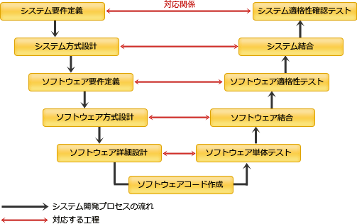

#　ネットワークスペシャリストAM

## M/M/1の待ち行列モデル

平均待ち時間＝{利用率／(1－利用率)}×平均サービス時間 ＝ (使用している時間／使用していない時間)x平均サービス時間
平均応答時間＝平均待ち時間＋平均サービス時間

## ウィルス対策ソフトの種類
- ビヘイビア法
    ウイルスの実際の感染・発病動作を監視して検出する手法です。
    感染・発病動作として「書込み動作」「複製動作」「破壊動作」等の動作そのものの異常を検知する場合だけでなく、感染・発病動作によって起こる環境の様々な変化を検知することによる場合もこの手法に分類されます。
    例えば、「例外ポート通信・不完パケット・通信量の異常増加・エラー量の異常増加」「送信時データと受信時データの量的変化・質的変化」等がそれにあたります。
- コンペア法
    ウイルスの感染が疑わしい対象(検査対象)と安全な場所に保管してあるその対象の原本を比較し、異なっていれば感染を検出する手法。
- パターンマッチング法
    「パターンデータ」「ウイルスパターン」「パターンファイル」「ウイルス定義ファイル」等を用いて、何らかの特徴的なコードをパターンとしてウイルス検査対象と比較することで検出する手法。
- チェックサム法/インテグリティチェック法
    検査対象に対して別途ウイルスではないことを保証する「チェックサム」「ディジタル署名」等の情報を付加し、保証がないか無効であることで検出する手法。
- ヒューリスティック法
    ウイルスのとるであろう動作を事前に登録しておき、検査対象コードに含まれる一連の動作と比較して検出する手法。

## ペネトレーションテスト
コンピュータやネットワークのセキュリティ上の弱点を発見するテスト手法の一つであり，システムを実際に攻撃して侵入を試みる。

## ソーシャルエンジニアリング
ネットワーク管理者や利用者などから，巧みな話術や盗み聞き，盗み見などの手段によって，パスワードなどのセキュリティ上重要な情報を入手する。

## ステガノグラフィ
画像や音楽などのディジタルコンテンツに著作権者などの情報を埋め込む。

## ディジタルフォレンジックス
不正アクセスや情報漏えいなどのセキュリティインシデントの発生時に、原因究明や法的証拠を保全するための対象となる電子的記録を収集・解析することです。
フォレンジックス(forensics)には、「科学捜査」や「法医学の～」という意味があるため、直訳すれば「電子科学捜査」となります。
またディジタルフォレンジックスは、収集・解析を行う対象によってコンピュータフォレンジックスや、ネットワークフォレンジックスなどに分類されます。

## DNSSEC
DNS Security Extensionsの略で、DNSにおける応答の正当性を保証するための拡張仕様です。
DNSSECではドメイン応答に電子署名を付加することで、正当な管理者によって生成された応答レコードであること、および応答レコードが改ざんされていないことの検証が可能となっています。

## Automatic MDI/MDI-X
機器のポート同士を接続する際にストレート／クロスのどちらのケーブルを使用しても、通信相手のイーサネットポートの種類(MDI／MDI-X)を自動判別して適切な方法で接続できる機能です。

## OFDM(Orthogonal Frequency Division Multiplexing)
日本語では「直交周波数分割多重」と訳され、無線LANの規格 IEEE802.11a/g/n/ac で採用されている変調方式です。
FDMは、搬送波を低速で狭帯域の信号に変換し、周波数帯が重ならないように配置し並列送信することで多重化を行う方式ですが、OFDMは、各搬送波の中心を隣りの搬送波の谷間に重なるように配置することで、さらに多数の搬送波を同時に送信できるようにしたものです。

## SAML(Security Assertion Markup Language)
インターネット上でユーザIDやパスワードなどの認証情報を安全に交換するために策定されたXMLベースのマークアップ言語です。
クッキー方式やリバースプロキシ方式でシングルサインオンを実現した場合、その認証が有効であるのは認証を受けたドメイン内に限られます。
しかしSAMLを使用して他のドメインとの間で認証情報を交換することで、同一ドメインに留まらない大規模なサイトにおいてもシングルサインオンの仕組みやセキュアな認証情報管理を実現できます。

## IEEE802.1X
LANにおけるユーザ認証の方式を定めたIEEE規格で、正当な端末以外がLANに参加することを防ぐ技術です。
当初は有線LAN向けとして策定されていましたが、その後にEAP(Extensible Authentication Protocol)として実装され、現在では無線LAN環境における標準の認証機構として利用されています。

## TKIP(Temporal Key Integrity Protocol)
アクセスポイントが認証局と連携し，パスワードをセッションごとに生成する仕組み

## NTPを使った増幅型のDDoS攻撃の対策
NTPサーバの状態確認機能(monlist)を無効にする。

NTPを使用したDDoS攻撃は、以下の手順で特定のサイトに対して大量のトラフィックを発生させます。
1. 送信元IPアドレスを詐称したリクエストパケットを公開NTPサーバに対して大量に送り付ける。
    リクエストパケットにはNTPサーバが過去にやり取りした最大600件のアドレスを返す"monlist"コマンドを指定する。
1. 公開NTPサーバは大量のアドレスが記述されたレスポンスパケットを、詐称された送信元IPアドレス宛に送信する。
    大量のレスポンスパケットが送信されたサイトではトラフィックが大幅に増加しサービス不能に陥る。
1. 攻撃の流れとしてはDNS amp攻撃などと同様ですが、NTPの"monlist"の仕様上、リクエストが200バイト程度に対してレスポンスがその100倍以上にもなることもあるためパケットの増幅率が高いのが特徴です。

## テンペスト技術
ディスプレイやキーボード，ネットワークケーブルなどから放射されている微弱な電磁波を傍受し解析することで元の情報の再現を試みる技術です。
一般に知られている実験では、ブラウン管ディスプレイやケーブルから発生する電磁波を3m離れた地点で傍受して、表示されている画像を再現した例があります。

## V字開発

## IGMP(Internet Group Management Protocol)
IPマルチキャストにおいて参加するホストのグループを制御するためのプロトコルです。
「グループへの参加」「グループの問い合わせ」「グループの維持」「グループからの離脱」という4つの機能を持っています。

## RAID
RAID(Redundant Arrays of Inexpensive Disks，レイド)は、複数のディスクを組み合わせ、1つの仮想的なディスクとして扱うことで信頼性や性能を向上させる技術です。RAIDには、次のような6つのレベルがあります。
- RAID 0(ストライピング)
    複数のディスクに分散してデータを書き込むことで、アクセス性能を向上させる。
- RAID 1(ミラーリング)
    同じデータを2台のディスクに書き込むことで、信頼性を向上させる。実質記憶容量は50%となるので記憶効率は悪い。
- RAID 2
    データにエラー訂正用のハミング符号を付加したものをストライピングで書き込む。
- RAID 3
    ビット／バイト単位でストライピングを行う。データのエラー訂正用にパリティビットを使用し、一つのディスクをエラー訂正符号の書き込み専用とする。
- RAID 4
    RAID 3とほぼ同じ。RAID3でビット／バイト単位だったストライピングをブロック単位で行う。
- RAID 5
    情報データとともにパリティビットも各ディスクに分散して書き込む方式。信頼性，アクセス性能が共に高まる。
    RAID3，4，5の違いは、ストライピイングの単位と冗長ディスクの構成です。

## ICMPv6(Internet Control Message Protocol for IPv6)
IPプロトコルの補完する役割をもつICMPをIPv6環境に対応させたプロトコルです。
IPv4におけるARPの機能(アドレスの解決、IPアドレスの重複検出)は、IPv6ではICMPv6の「近隣要請メッセージ」と「近隣告知メッセージ」で提供されます。またIPアドレスの自動設定の手段としてもICMPv6が使用されます。

## RSVP(Resource Reservation Protocol)
IPネットワークにおける特定の通信に対して優先制御を行い通信品質を確保するためのプロトコルです。
RSVPでは、受信ホストから送信ホストに制御パケットを送信することで、品質確保の対象とする通信が経由する全てのルータに対して制御設定を行います。この制御設定をもとにルータがその通信のパケットを識別して処理できる仕組みになっています。

通信品質の確保は、特に音声や動画などのリアルタイム性が重要視される通信サービスで求められています。

## POP before SMTP
電子メールをSMTPサーバへ送信するのに先立ってPOP3による認証を行い、認証が成功したクライアントのIPアドレスに対して電子メールの送信を一定時間許可する仕組みです。
SMTP-AUTHが実装されていない旧バージョンのメールサーバソフトにおいて、メール送信の際のユーザ認証を実現するために使用されていました。

## MDA(Model Driven Architecture)
モデル駆動型アーキテクチャと訳され、設計モデルと実装技術を完全に分離し、ベンダやプラットフォームに依存しない開発を可能とする技術です。UMLやCORBAなどの規格化団体として有名なOMG(Object-oriented Mnagement Group)によって策定されました。

## IPアドレスクラス

|クラス|上位ビット|アドレス範囲|ネットワーク部のビット数|最大ホスト数|
|---|---|---|---|---|
|クラスA|0|0.0.0.0～127.255.255.255|8|16,777,214|
|クラスB|10|128.0.0.0～191.255.255.255|16|65,534|
|クラスC|110|192.0.0.0～223.255.255.255|24|254|
|クラスD|1110|224.0.0.0～239.255.255.255|32|IPマルチキャスト用|
|クラスE|1111|240.0.0.0～255.255.255.255|-|実験用|

## プライベートアドレスの範囲
10.0.0.0 ～10.255.255.255（10.0.0.0/8）
172.16.0.0 ～172.31.255.255 （172.16.0.0/12）
192.168.0.0 ～192.168.255.255 （192.168.0.0/16）

## IPマルチキャスト
クラスDのアドレスを使って複数の宛先に送信する。
下位プロトコルはUDPとなる。
IGMPを使ってマルチキャストのグループの管理を行う。

## wifiの規格

## wifiプライバシーセパレータ
プライバシーセパレータは、同一の無線LANに接続されたデバイス同士の通信を抑制する機能です。
店舗内Wi-fiや公衆無線LANサービスのように見知らぬ他人同士が同じ無線LANに接続する場面で、利用者のセキュリティ保護のために設定されます。

## SMTPのコマンド
クライアントが、SMTPサーバにSMTPセッションの開始要求をするコマンドには"HELO"と"EHLO"があります。
このうち応答として拡張機能の一覧を返すのはEHLOに対してのみです。
HELOコマンドはEHLOをサポートしない古い機種との互換性のために存在します。

## FTPのシーケンス
FTPには「アクティブ」と「パッシブ」という2つの動作モードがあります。制御用コネクションは常にクライアントからサーバに対して確立されますが、データ転送のコネクションの確立方法が両者では異なります。

- アクティブ
    クライアントは通信開始時に接続を待つIPアドレスをサーバに通知し、データ転送のコネクションはサーバからクライアントに対して確立する。

    

- パッシブ
    クライアントは通信開始時にサーバから接続を待つポート番号を取得し、データ転送のコネクションはクライアントからサーバに対して確立する。

    

[https://www.nw-siken.com/kakomon/01_aki/am2_13.html](https://www.nw-siken.com/kakomon/01_aki/am2_13.html)
[https://www.nw-siken.com/kakomon/01_aki/am2_15.html](https://www.nw-siken.com/kakomon/01_aki/am2_15.html)
[https://www.nw-siken.com/kakomon/01_aki/am2_25.html](https://www.nw-siken.com/kakomon/01_aki/am2_25.html)

[https://www.nw-siken.com/kakomon/30_aki/am2_12.html](https://www.nw-siken.com/kakomon/30_aki/am2_12.html)
[https://www.nw-siken.com/kakomon/30_aki/am2_17.html](https://www.nw-siken.com/kakomon/30_aki/am2_17.html)
[https://www.nw-siken.com/kakomon/30_aki/am2_19.html](https://www.nw-siken.com/kakomon/30_aki/am2_19.html)

[https://www.nw-siken.com/kakomon/29_aki/am2_9.html](https://www.nw-siken.com/kakomon/29_aki/am2_9.html)
[https://www.nw-siken.com/kakomon/29_aki/am2_14.html](https://www.nw-siken.com/kakomon/29_aki/am2_14.html)

[https://www.nw-siken.com/kakomon/28_aki/am2_16.html](https://www.nw-siken.com/kakomon/28_aki/am2_16.html)
[https://www.nw-siken.com/kakomon/28_aki/am2_21.html](https://www.nw-siken.com/kakomon/28_aki/am2_21.html)

[https://www.nw-siken.com/kakomon/27_aki/am2_9.html](https://www.nw-siken.com/kakomon/27_aki/am2_9.html)
[https://www.nw-siken.com/kakomon/27_aki/am2_10.html](https://www.nw-siken.com/kakomon/27_aki/am2_10.html)
[https://www.nw-siken.com/kakomon/27_aki/am2_17.html](https://www.nw-siken.com/kakomon/27_aki/am2_17.html)
[https://www.nw-siken.com/kakomon/27_aki/am2_19.html](https://www.nw-siken.com/kakomon/27_aki/am2_19.html)

[https://www.nw-siken.com/kakomon/26_aki/am2_1.html](https://www.nw-siken.com/kakomon/26_aki/am2_1.html)
[https://www.nw-siken.com/kakomon/26_aki/am2_9.html](https://www.nw-siken.com/kakomon/26_aki/am2_9.html)
[https://www.nw-siken.com/kakomon/26_aki/am2_11.html](https://www.nw-siken.com/kakomon/26_aki/am2_11.html)
[https://www.nw-siken.com/kakomon/26_aki/am2_12.html](https://www.nw-siken.com/kakomon/26_aki/am2_12.html)
[https://www.nw-siken.com/kakomon/26_aki/am2_15.html](https://www.nw-siken.com/kakomon/26_aki/am2_15.html)
[https://www.nw-siken.com/kakomon/26_aki/am2_19.html](https://www.nw-siken.com/kakomon/26_aki/am2_19.html)

[https://www.nw-siken.com/kakomon/25_aki/am2_3.html](https://www.nw-siken.com/kakomon/25_aki/am2_3.html)
[https://www.nw-siken.com/kakomon/25_aki/am2_7.html](https://www.nw-siken.com/kakomon/25_aki/am2_7.html)
[https://www.nw-siken.com/kakomon/25_aki/am2_9.html](https://www.nw-siken.com/kakomon/25_aki/am2_9.html)
★[https://www.nw-siken.com/kakomon/25_aki/am2_11.html](https://www.nw-siken.com/kakomon/25_aki/am2_11.html)
[https://www.nw-siken.com/kakomon/25_aki/am2_16.html](https://www.nw-siken.com/kakomon/25_aki/am2_16.html)

[https://www.nw-siken.com/kakomon/24_aki/am2_5.html](https://www.nw-siken.com/kakomon/24_aki/am2_5.html)
★[https://www.nw-siken.com/kakomon/24_aki/am2_7.html](https://www.nw-siken.com/kakomon/24_aki/am2_7.html)
[https://www.nw-siken.com/kakomon/24_aki/am2_19.html](https://www.nw-siken.com/kakomon/24_aki/am2_19.html)
[https://www.nw-siken.com/kakomon/24_aki/am2_21.html](https://www.nw-siken.com/kakomon/24_aki/am2_21.html)
[https://www.nw-siken.com/kakomon/24_aki/am2_22.html](https://www.nw-siken.com/kakomon/24_aki/am2_22.html)
[https://www.nw-siken.com/kakomon/24_aki/am2_25.html](https://www.nw-siken.com/kakomon/24_aki/am2_25.html)

[https://www.nw-siken.com/kakomon/23_aki/am2_2.html](https://www.nw-siken.com/kakomon/23_aki/am2_2.html)
★[https://www.nw-siken.com/kakomon/23_aki/am2_10.html](https://www.nw-siken.com/kakomon/23_aki/am2_10.html)
[https://www.nw-siken.com/kakomon/23_aki/am2_12.html](https://www.nw-siken.com/kakomon/23_aki/am2_12.html)
[https://www.nw-siken.com/kakomon/23_aki/am2_14.html](https://www.nw-siken.com/kakomon/23_aki/am2_14.html)
★[https://www.nw-siken.com/kakomon/23_aki/am2_15.html](https://www.nw-siken.com/kakomon/23_aki/am2_15.html)
[https://www.nw-siken.com/kakomon/23_aki/am2_21.html](https://www.nw-siken.com/kakomon/23_aki/am2_21.html)

[https://www.nw-siken.com/kakomon/22_aki/am2_6.html](https://www.nw-siken.com/kakomon/22_aki/am2_6.html)
@[https://www.nw-siken.com/kakomon/22_aki/am2_11.html](https://www.nw-siken.com/kakomon/22_aki/am2_11.html)
@[https://www.nw-siken.com/kakomon/22_aki/am2_13.html](https://www.nw-siken.com/kakomon/22_aki/am2_13.html)
★[https://www.nw-siken.com/kakomon/22_aki/am2_16.html](https://www.nw-siken.com/kakomon/22_aki/am2_16.html)
[https://www.nw-siken.com/kakomon/22_aki/am2_20.html](https://www.nw-siken.com/kakomon/22_aki/am2_20.html)

[https://www.nw-siken.com/kakomon/21_aki/am2_19.html](https://www.nw-siken.com/kakomon/21_aki/am2_19.html)
[https://www.nw-siken.com/kakomon/21_aki/am2_21.html](https://www.nw-siken.com/kakomon/21_aki/am2_21.html)

***平成22年秋期まで完了***
=============================

# 漢字
## 輻輳
## 宛先
## 迂回
## 権威
## 改竄
## 傍受
## 踏み台
## 脆弱性
## 偽装
## 鍵交換
## 遮断
## 帯域
## 廃棄
## 監視
## 検知

