# ネットワークスペシャリスト

## 参考サイト
[https://beginners-network.com/](https://beginners-network.com/)
[https://nw.seeeko.com/](https://nw.seeeko.com/)  
[http://www.runsurunet.com/category/ネットワーク技術を覚える/tcpip](http://www.runsurunet.com/category/ネットワーク技術を覚える/tcpip)  

- リンクアグリゲーション  
[https://milestone-of-se.nesuke.com/nw-basic/link-aggregation/802-1ax/](https://milestone-of-se.nesuke.com/nw-basic/link-aggregation/802-1ax/)  

- ネットワーク冗長化  
[https://create-it-myself.com/certification/network-redundancy/](https://create-it-myself.com/certification/network-redundancy/) 

- ロードバランサ  
[https://www.infraexpert.com/study/loadbalancer12.html](https://www.infraexpert.com/study/loadbalancer12.html)  

- DHCPスヌーピング  
[https://www.n-study.com/security-fundamentals/dhcp-snooping/](https://www.n-study.com/security-fundamentals/dhcp-snooping/)  

- ARPスプーフィング  
[https://www.infraexpert.com/study/dhcpz6.html](https://www.infraexpert.com/study/dhcpz6.html)  

- OSPF  
[https://www.infraexpert.com/study/ospfz2.html](https://www.infraexpert.com/study/ospfz2.html)

- SSL VPN  
[https://www.infraexpert.com/study/security8.html](https://www.infraexpert.com/study/security8.html)

- IPSec VPN  
[https://www.kagoya.jp/howto/network/ipsec-vpn/](https://www.kagoya.jp/howto/network/ipsec-vpn/)

- VLAN  
[https://www.infraexpert.com/study/vlanz2.html](https://www.infraexpert.com/study/vlanz2.html)  
[https://www.itbook.info/network/vlan2.html](https://www.itbook.info/network/vlan2.html)  
[https://www.n-study.com/vlan-detail/trunkport/](https://www.n-study.com/vlan-detail/trunkport/)  


- IPsec  
[https://www.infraexpert.com/study/ipsec5.html](https://www.infraexpert.com/study/ipsec5.html)  
[https://www.infraexpert.com/study/ipsec6.html](https://www.infraexpert.com/study/ipsec6.html)  
[https://www.infraexpert.com/study/ipsec7.html](https://www.infraexpert.com/study/ipsec7.html)  
[https://www.infraexpert.com/study/ipsec8.html](https://www.infraexpert.com/study/ipsec8.html)  
[https://www.infraexpert.com/study/ipsec9.html](https://www.infraexpert.com/study/ipsec9.html)  


## 3つの通信形態

- ユニキャスト - １対１の通信
- ブロードキャスト - １対全員の通信
- マルチキャスト - １対グループ宛の通信

## 無線LAN

|規格|速度|周波数帯域|
|---|---|---|
|IEEE802.11b|11Mbps|2.4GHz|
|IEEE802.11a|54Mbps|5GHz|
|IEEE802.11g|54Mbps|2.4GHz|
|IEEE802.11n|600Mbps|2.4GHz/5GHz|
|IEEE802.11ac|6.93Gbps|5GHz|

※Bluetoothも2.4GHz

- MIMO(multiple-input and multiple-output、マイモ)
    無線通信において、送信機と受信機の双方で複数のアンテナを使い、通信品質を向上させることをいう。
    <br/>

- ビーム フォーミング
    無線LANの電波は、一般的には四方八方へ散らばって飛んでいきます。この電波をある特定の方向へ絞り、ビームのように集中させる技術です。電波強度を高められるため通信品質が向上し、不要な方向へは電波を飛ばさずに済むため、電波干渉を低減できます。
    <br/>

- チャネルボンディング
    チャネルボンディングとは、複数のチャネルを束ねて一つの通信に使うことで、スループットを向上させる技術です。IEEE 802.11a/gでは、一つの通信に約20MHz幅を使用していましたが、IEEEE 802.11nではこれを二つ束ねて40MHz幅で利用できるようになり、IEEE 802.11acではさらに80MHz、160MHz幅も利用できるようになりました(図5)。束ねた数だけスループットが向上しますが、多くのチャネルを占有することになります。帯域幅が広がると干渉も増えるため、かえって安定しなくなることがあります。5GHz帯においては、レーダーの電波を検出しやすくなり、利用可能なチャネルが著しく減少します。一部の製品では、電波状況に応じて動的に帯域幅を調整する機能を持っているものもあります。

## イーサネット
|規格|速度|ケーブル|距離|
|---|---|---|---|
|100BASE-TX|100Mbps|UTP|100m|
|1000BASE-T|^|UTP|100m|
|1000BASE-SX|1Gbps|光ケーブル（マルチモード）|550m|
|1000BASE-LX|^|光ケーブル<br>（マルチモード、シングルモード）|マルチモード（550m）<br/>シングルモード（5km以上）|

## OSI参照モデル
- アプリケーション層 - アプリケーション
- プレゼンテーション層 - 文字コード、ファイルフォーマット等
- セッション層 - 各プロトコルのやり取り（メーラとメールサーバ）
- トランスポート層 - UDP/TCP
- ネットワーク層 - IP/VLAN/ICMP/PPoE
- データリンク層 - MACアドレス/ARP/PPP
- 物理層 - イーサネット、光ファイバー等の物理的な伝送路や信号

## TCP/IPプロトコルスタック
- アプリケーション層
- トランスポート層
- インターネット層
- リンク層（ネットワークインタフェース層)

## OSI参照モデルとTCP/IPプロトコルスタック

|OSI参照モデル|TCP/IPプロトコルスタック|例|
|---|---|---|
|アプリケーション層|アプリケーション層|&nbsp;|
|プレゼンテーション層|^|&nbsp;|
|セッション層|^|&nbsp;|
|トランスポート層|トランスポート層|TCP、UDP、OSPF|
|ネットワーク層|インターネット層|IP、ICMP、IPSec|
|データリンク層|リンク層<br/>ネットワークインタフェース層)|ARP、PPP、PPTP|
|物理層|^|光ファイバ、イーサネット、無線|

## MAC

|(8)|(6)|(6)|(2)|(46-1500)|(4)|
|---|---|---|---|---|--|
|プリアンブル|宛先MAC|送信元MAC|タイプ|データ|FCS|
|&nbsp;|&nbsp;|&nbsp;|&nbsp;|<---- MTU ---->|&nbsp;|


- プリアンブル  
    16進数で、`AA-AA-AA-AA-AA-AA-AA-AB`  
    2進数で、`101010101010101010101010101010101010101010101010101010101010101010101011`
- MACアドレス  
    `FF-FF-FF-FF-FF-FF`はブロードキャストアドレス  
    同一ブロードキャストドメイン内の全ホストに送信するときに使う。
- タイプ  
    + IPv4
    + IPv6
    + ARP
    + RARP
    + VLAN

## ARP
IPアドレスから通信したい相手のMACアドレスを調べてくれるプロトコル。  

|(14)|(28)|(18)|(4)|
|---|---|---|---|
|MACヘッダ|ARPフレーム|パディング|FCS|

ARPフレーム  

|(2)|(2)|(1)|(1)|(2)|(6)|(4)|(6)|(4)|
|---|---|---|---|---|---|---|---|---|
|H/W識別<br/>[ｲｰｻネット]|プロトコル<br/>識別[IP]|H/W<br/>アドレス長<br/>[6]|プロトコル<br/>アドレス長<br/>[=4]|コード<br/>要求:1<br/>応答:2|送信元H/W<br/>アドレス|送信元<br/>プロトコル<br/>アドレス|目標H/W<br/>アドレス|目標<br/>プロトコル<br/>アドレス|

同一ブロードキャストドメインのホストに対して、`FF-FF-FF-FF-FF-FF`はブロードキャストアドレスで問い合わせる。  
目標プロトコルアドレスのホストは、自分のMACアドレスをユニキャストで応答する。
ARPテーブルを書き換える端末は、ARP要求を送信した端末と、ARP応答を送信した端末になる。
ARP応答を送信した端末も、要求パケットから要求元のIPとMACをテーブルに追加する。

- [Gratuitous ARP](https://www.infraexpert.com/study/tcpip3.5.html)
    目的プロトコルアドレスに自ホストのIPアドレスをセットしたARP。
    ネットワークに重複したIPを持ったホストがないことを確認するために、ホストの起動時に送信する。
    また、Gratuitous ARPの応答を受信した全ホストは、ARPテーブルを更新することになっているため、フェールオーバークラスタ構成でサーバを切り替える際に、このARPを送信して、ブロードキャストドメインの全ホストのARPテーブルを新しいサーバのエントリーで更新する。

- Proxy ARP - MACアドレスから自身のIPアドレスを得るためのプロトコル

- [ARPスプーフィング](https://www.infraexpert.com/study/dhcpz6.html)
    ARP応答のなりすまして、第三者の機器が通信を傍受できるようにする行為
    また、不正な端末の仕様を抑止する目的で、ネットワーク監視で使用することもできる。


##  [VLAN](https://www.infraexpert.com/study/vlanz2.html)
IEEE 802.1Qタグ付きのイーサネット通信とも呼ぶ。

- ポートベースVLAN
    L2SWのポート毎にVLAN IDを割り当てる。
    ポートVLANが設定されたポートを**アクセスポート**と呼ぶ。
    - スタティックVLAN　　
    スタティックVLANは、スイッチポートに管理者が手動でVLANを割り当てる方法です。
    アクセスポートといえばこのスタティックVLANで設定することが一般的です。
    設定が簡単であるというメリットがあります。

    - ダイナミックVLAN
    ダイナミックVLANは、接続するデバイスによってポートが動的に所属するVLANを変更できるVLANです。
    接続するデバイスのMACアドレスにより決定するMACベースVLAN、IPアドレスにより決定するサブネットベースVLAN、ユーザ名などの情報に基づいて決定するユーザベースVLANなど、大きく3種類があります。


- タグVLAN（IEEE802.1Q）
    複数のSWをまたいでVLANを構成する。  
    SW間を1つのタグポートで結合する。
    タグVLANが設定されたポートを**トランクポート**と呼ぶ。

|(8)|(6)|(6)|(2)|(2)|(2)|(46-1500)|(4)|
|---|---|---|---|---|---|---|---|
|プリアンブル|宛先MAC|送信元MAC|タイプ<br/>[=0x8100]|**VLANタグ**|タイプ|データ|FCS|

VLANタグ  

|(2)| | |
|---|---|---|
|タグ制御識別子|
|優先度<br/>[3bit]|CFI<br/>[1bit]|VLAN ID<br/>[**12bit**]|

優先度は、0（最低）から7（最高）の値をとる。

## IP
コネクションレス。  
送ったパケットが壊れてしまっても回復する機能はない。  
IPパケットがネットワーク機器のMTUを超える場合、**ネットワーク機器でパケットが分割(フラグメンテーション)される**。
※これは効率が悪いので、あまり使われていない。
OSはICMPを使って目標のホストまでIPフラグメンテーションが発生しない最大のMTUを求めてキャッシュしている。

|IPv4|IPv6|
|---|---|
|バージョン|バージョン|
|ヘッダ長|なし|
|**サービスタイプ(ToS)**|トラフィッククラス|
|なし|フローラベル|
|パケット長|ペイロード長|
|識別子|なし|
|フラグ|なし|
|フラグメントオフセット|なし|
|生存期間(TTL)|ホップリミット|
|プロトコル|ネクストヘッダ|
|ヘッダチェックサム|なし|
|送信元IPv4アドレス|送信元IPv6アドレス|
|宛先IPv4アドレス|宛先IPv6アドレス|
||拡張ヘッダ|
|オプション（可変長)|なし|
|パディング|なし|
|データ|データ|

## [IPv4ヘッダ](https://milestone-of-se.nesuke.com/nw-basic/ip/ip-format/)

|&emsp;&emsp;4&emsp;&emsp;|&emsp;&emsp;8&emsp;&emsp;|&emsp;&emsp;12&emsp;&emsp;|&emsp;&emsp;16&emsp;&emsp;|&emsp;&emsp;20&emsp;&emsp;|&emsp;&emsp;24&emsp;&emsp;|&emsp;&emsp;28&emsp;&emsp;|&emsp;&emsp;32&emsp;&emsp;|
|:---:|:---:|:---:|:---:|:---:|:---:|:---:|:---:|
|バージョン|ヘッダ長|サービスタイプ||パケット長||||
|識別子||||フラグ|フラグメントオフセット|||
|生存時間||プロトコル番号||ヘッダチェックサム||||
|送信元IPアドレス||||||||
|宛先IPアドレス||||||||
|オプション||||||パディング||

※通常はオプションやパディングはなく、20バイトである。

## IPv6

- グローバルアドレス
    |&emsp;&emsp;&emsp;&emsp;&emsp;&emsp;1～48&emsp;&emsp;&emsp;&emsp;&emsp;&emsp;|&emsp;&emsp;49～64&emsp;&emsp;|&emsp;&emsp;&emsp;&emsp;&emsp;&emsp;&emsp;65～128&emsp;&emsp;&emsp;&emsp;&emsp;&emsp;&emsp;|
    |---|---|---|
    |グローバルルーティング<br/>プレフィックス|サブネットID|インターフェースID|
    <br/>

- ユニークローカルアドレス
    |&emsp;1～7&emsp;|&emsp;&emsp;&emsp;8～48&emsp;&emsp;&emsp;|&emsp;&emsp;49～64&emsp;&emsp;|&emsp;&emsp;&emsp;&emsp;&emsp;&emsp;&emsp;65～128&emsp;&emsp;&emsp;&emsp;&emsp;&emsp;&emsp;|
    |---|---|---|---|
    |FC00::/7|Global ID|サブネットID|インターフェースID|
    <br/>

- リンクローカルアドレス
    |&emsp;&emsp;1～10&emsp;&emsp;|&emsp;&emsp;&emsp;&emsp;&emsp;&emsp;&emsp;11～64&emsp;&emsp;&emsp;&emsp;&emsp;|&emsp;&emsp;&emsp;&emsp;&emsp;&emsp;&emsp;65～128&emsp;&emsp;&emsp;&emsp;&emsp;&emsp;&emsp;|
    |---|---|---|
    |FE80::/10|全て0|サブネットID|インターフェースID|
    <br/>

- グローバルルーティングプレフィックス
    プロバイダから割り当てられるユニークなID。
    現在は先頭が`001`から始まる。
    <br/>

- インタフェースID
    同一サブネット内でインタフェースを識別するID。
    MACアドレスから生成する方法と、ランダム値から生成する方法が規定されている。
    <br/>

- IPv4射影アドレス
    IPv4射影アドレスは、IPv6機器がIPv4機器と通信する際に使用するアドレスで、上位80ビットに"0"、81～96ビットに"1"、残りの32ビットにIPv4アドレスを埋め込んだものです。
    <br/>

    

***TODO:IPv6をもっと確認すること。***

## [ICMP](https://www.infraexpert.com/study/tcpip4.html)
pingやtracertで使われる。

|(20-60)|(8)|(8)|(16)|(xx)|
|---|---|---|---|---|
|IPヘッダ|タイプ|コード|チェックサム|ICMPデータ|

- タイプ - 15のタイプが定義されている。

    |タイプ番号|タイプ|
    |---|---|
    |0|**Echo Reply**|
    |3|**Destination Unreachable**|
    |5|Redirect|
    |8|**Echo Request**|
    |11|Time Exceeded|

- コード  
ICMPのヘッダーにあるコードはタイプの内容によって変わります。
よく見かけるコードはタイプが3のdestination unreachableの時で以下の通りです。

    |コード|意味|説明|
    |---|---|---|
    |0|network unreachable|相手ルーターがダウンしてarp解決出来ない等|
    |1|**host unreachable**|サーバーがダウンしてarp解決出来ない等|
    |3|**port unreachable**|サーバーまでたどり着いたが、ポートが解放されていない|
    |4|fragmentation needed and DF set|フラグメントが必要だがフラグメント不可ビットが有効|
    |6|destination network unknown|宛先ネットワークがルーティングテーブルに載っていない|
    |13|communication administratively prohibited by filtering|管理上遮断されている|

- [ICMPリダイレクト](https://www.infraexpert.com/study/fhrpz12.html)
ICMPリダイレクトとは、L3デバイスがパケットの送信元ホストに、特定の宛先ネットワークに対する適切なゲートウェイを通知する機能のことです。


## [UDP](https://www.infraexpert.com/study/tcpip12.html)
UDPはコネクションレスのプロトコルである。

- UDPヘッダ

    |&emsp;&emsp;4&emsp;&emsp;|&emsp;&emsp;8&emsp;&emsp;|&emsp;&emsp;12&emsp;&emsp;|&emsp;&emsp;16&emsp;&emsp;|&emsp;&emsp;20&emsp;&emsp;|&emsp;&emsp;24&emsp;&emsp;|&emsp;&emsp;28&emsp;&emsp;|&emsp;&emsp;32&emsp;&emsp;|
    |---|---|---|---|---|---|---|---|
    |送信元ポート番号||||宛先ポート番号||||
    |パケット長||||チェックサム||||

パケット長＝「UDPヘッダ」の長さ ＋ 「UDPデータ」の長さ

## [TCP](https://www.infraexpert.com/study/tcpip7.html)
MTUを超えるパケットは**ホスト端末**で分割(フラグメンテーション)と結合が行われる。  
TCPでのフラグメンテーションが正しく行われる場合は、IPでのフラグメンテーションは発生しない。  

- TCPヘッダ

    |&emsp;&emsp;4&emsp;&emsp;|&emsp;&emsp;8&emsp;&emsp;|&emsp;&emsp;12&emsp;&emsp;|&emsp;&emsp;16&emsp;&emsp;|&emsp;&emsp;20&emsp;&emsp;|&emsp;&emsp;24&emsp;&emsp;|&emsp;&emsp;28&emsp;&emsp;|&emsp;&emsp;32&emsp;&emsp;|
    |---|---|---|---|---|---|---|---|
    |送信元ポート番号||||宛先ポート番号||||
    |**シーケンス番号**||||||||
    |**確認応答番号**||||||||
    |ヘッダ長<br/>(4bit)|予約済み<br/>(6bit)|コードビット<br/>(6bit)||ウィンドウサイズ||||
    |チェックサム||||緊急ポインタ||||
    |オプション|

    ※通常はオプション部分はなく、20バイトである。

- 3Way hand shake
SIN, SIN/ACK, ACKの3フェーズでコネクションを確立する。  
3Way hand shakeでウィンドウサイズを交換しあう。
最初のSINで送信されるシーケンス番号(SN)はランダムな値になる。  
次のSIN/ACKで送信されるシーケンス番号(SN)もランダムな値になる。  

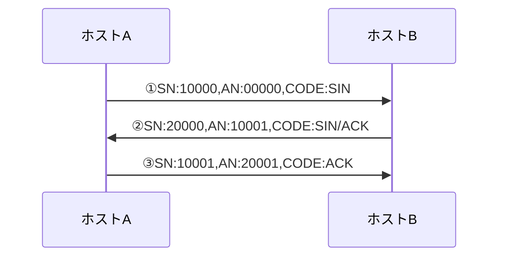

- データ通信（データ分割無しの場合）
受信したパケットのシーケンス番号に、デーた長を足した値を、確認応答番号にセットしてACKを返信する。

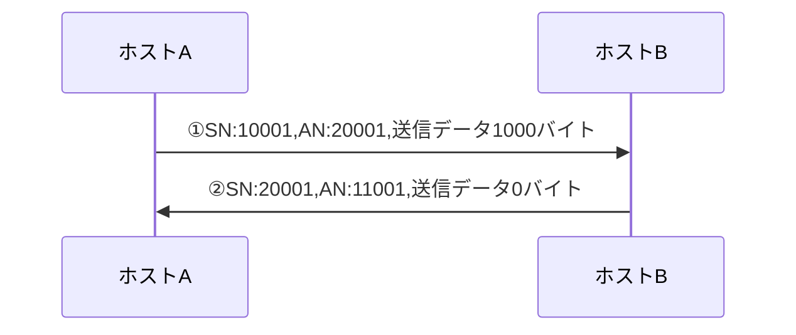

- データ通信（データ分割ありの場合）
3Way hand shakeでコネクションが確立した後のシーケンス。  
`MSS`(`Maximum Segment Size`)に収まる様にデータが分割されて送信される。  
`MSS`は、IPヘッダとTCPヘッダをのぞいた純粋なデータ部分のサイズを指します。

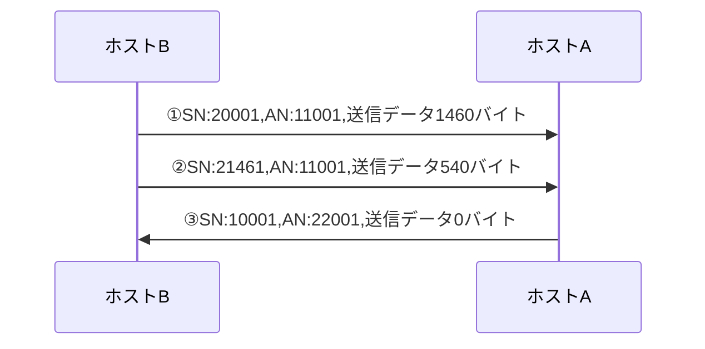

- 再送（再送タイムアウトによる方法）
送信したパケットに対するACKが返ってこなかった場合に、受信側で問題が発生していると推測して、送信側で一定期間待ってからパケットを再送する。
再送するまでの時間をRTO(Retransmission Time Out)と呼ぶ。
再送してもACKが返ってこない場合は、再送の度にRTOを二倍にして、最大で64秒待つことになる。  
<br/>

- 再送（高速再転送による方法）
連続転送している状態で、特定のパケットだけを受け取れなかった場合に、受け取れなかったパケットの再送を依頼する方式。これには、3度同じACKを送信する。

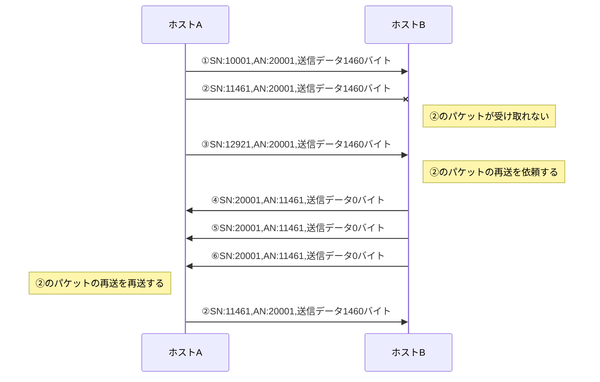

<br/>

- コネクション切断

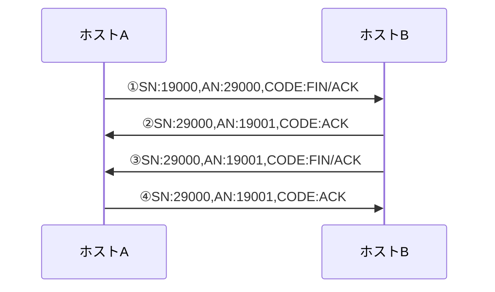

<br/>

- コネクションリセット
3Way Hand Shakeを行おうとした時に、宛先ポートに対応したアプリケーションがない場合（Connection Refuse）は、リセットされる。

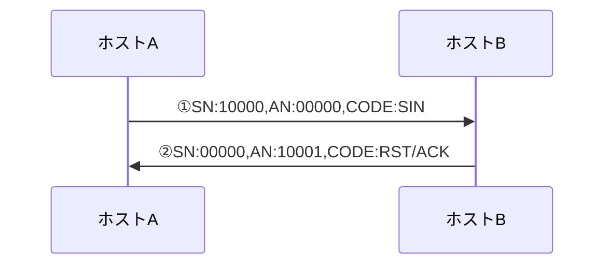

<br/>

- ウィンドウサイズ
ウィンドウサイズとは、受信確認を待たずに送信できるデータサイズの最大値であり、簡単には「受信バッファの空き容量」と言える。通常は、MSSを整数倍した値が設定されているが、通信中の受信状態に応じて変動する。
ウィンドウサイズを動的に変更することでフロー制御を行っている。
<br/>

- スライディングウィンドウ方式
送信先からのACKを待たずに、ウィンドウサイズ分まで送信を連続して行う方式。
<br/>

- [輻輳制御](https://milestone-of-se.nesuke.com/nw-basic/tcp-udp/flow-and-convergence-control/)
輻輳を回避するための制御として、**輻輳ウィンドウ**という変数を管理する。
ウィンドウサイズ分まで送信すると輻輳が発生する可能があるため、MSSからウィンドウサイズまでの間で、輻輳が避けられえるサイズ（輻輳ウィンドウ）決定する。輻輳ウィンドウの決定方式としては、以下がある。

    + スロースタートアルゴリズム
        輻輳ウィンドウサイズをMSSから開始して、確認応答パケットを受信した個数×MSS分だけ、輻輳ウィンドウサイズを増やす。この方法の場合、輻輳ウィンドウサイズは、2、4、8、16、32と指数関数的に増えることになる。
    + 輻輳回避アルゴリズム
        重複ACK（3連続の同じACK）を受け取った場合、輻輳が発生したと判断して、輻輳ウィンドウサイズを半分に縮小する。その後、輻輳ウィンドウサイズを徐々に増やしていく。
        一方、送信タイムアウトが発生した場合は、フロースタートからやり直す。
<br/>

- **TCP通信のスループット**

    ```math
    実行転送速度 = \frac {ウィンドウサイズ} {ラウンドトリップ時間}
    ```

    - どれだけの時間で、一度に送信できるデータサイズ（ウィンドウサイズ）を送信できるか。
    - ウィンドウサイズが大きければ大きいほど、転送速度は早くなる。
    - 送信にかかる時間が短ければ短いほど、転送速度は早くなる。


## アプリケーション層プロトコル

|&emsp;プロトコル&emsp;|&emsp;&emsp;ポート&emsp;&emsp;|&emsp;&emsp;下位&emsp;&emsp;|
|---|---|---|
|FTP|20,21|TCP|
|SSH|22|TCP|
|TELNET|23|TCP|
|SMTP|25|TCP|
|HTTP|80|TCP|
|POP3|110|TCP|
|HTTPS|443|TCP|
|DNS|53|TCP・UDP|
|DHCP|67,68|UDP|
|TFTP|69|UDP|
|NTP|123|UDP|
|SNMP|161,162|UDP|
|SIP|5060|UDP|

## [DHCP](https://www.infraexpert.com/study/tcpip13.html)
クライアントがサーバから、アドレス情報などの設定情報の動的な割り当てを受けるためのプロトコル。
主な設定情報は、以下の通りである。
- IPアドレス
- サブネットマスク
- デフォルトゲートウェイのIPアドレス
- ローカルDNSサーバのIPアドレス

DHCPから割り当てられる設定情報には有効期限があり、これを**リース時間**という。
DCHPサーバはUDPの67番ポート、DCHPクライアントはUDPの68番ポートを使用する。
起動時に、DHCPクライアントのIPアドレス、サブネットマスクは「0.0.0.0」に設定されている。
DHCPサーバとのやり取りは、制限ブロードキャストアドレス(255.255.255.255)が用いられる。

- 処理リースのシーケンス

    ```mermaid
    sequenceDiagram

    DHCPクライアント ->> DHCPサーバ:①DHCPDISCOVER
    DHCPサーバ ->> DHCPクライアント:②DHCPOFFER
    DHCPクライアント ->> DHCPサーバ:③DHCPREQUEST
    DHCPサーバ ->> DHCPクライアント:④DHCPACK
    ```

    <br/>

    - DHCPDISCOVER - クライアントがDHCPサーバを見つけるためにブロードキャストする。
    - DHCPOFFER - サーバがクライアントにIPアドレスを提供するため、ブロードキャストまたはユニキャストする。
    - DHCPREQUEST - クライアントで提供されたIPアドレスを使用することをブロードキャストする。
    - DHCPACK - サーバで確認応答をブロードキャストまたはユニキャストする。

    <br/>

- リースの更新のシーケンス
    クライアントが起動したときに、IPアドレスのリース期間であった場合は、同じIPアドレスの取得を要求する。
    これをリースの更新という。
    この時点ではクライアントはDHCPサーバのアドレスを知っているので、ユニキャストで通信することができる。

    ```mermaid
    sequenceDiagram

    DHCPクライアント ->> DHCPサーバ:①DHCPREQUEST
    DHCPサーバ ->> DHCPクライアント:②DHCPACK
    ```

    <br/>

- リースの解放のシーケンス
    クライアントがリース期間内に、IPアドレスを解放する場合は、DHCPRELEASEをユニキャストする。
    この場合は、DHCPサーバからの応答はない。

    ```mermaid
    sequenceDiagram

    DHCPクライアント ->> DHCPサーバ:①DHCRELEASE
    ```
    <br/>

- IPアドレス重複のチェック
    クライアントはDHCPサーバから設定情報を受け取った後、`Gratuitous ARP`を送信して、同じIPのホストが存在しないことを確認する。
    <br/>

- DHCPリレー
    DHCPではUDPのブロードキャストが使用されるが、これはブロードキャストドメイン内しか到達しない。
    DHCPクライアントとDHCPサーバがルータを介して接続している場合、ルータで[DHCPリレーエージェント](https://www.infraexpert.com/study/tcpip14.html)を起動させておく必要がある。
    DHCPリレーエージェントを使用する場合は、あらかじめDHCPサーバのアドレスを登録しておき、クライアントからDHCPのブロードキャストパケットを受信した時に、登録しているDHCPサーバに**ユニキャスト**を行う様にする。
    ※ユニキャストはルータを超えられる。
    <br/>

- [DHCPスヌーピング](https://www.n-study.com/security-fundamentals/dhcp-snooping/)
    DHCPサーバとDHCPクライアントでやりとりする「DHCP要求とDHCP応答」をスヌーピング（のぞき見）することで、DHCPサーバのなりすまし（DHCPスプーフィング）や、DHCPサーバへの攻撃を防ぐ。
    DHCPサーバからの応答を受けることができるポート（**trusted port**）を設定しておき、不正にDHCPサーバになりすますことを防ぐ。
    DHCPスヌーピングを設定したSWでは、割り当てられたIPアドレスとMACを**DHCPスヌーピングバインディングテーブル**に保持する。
    これにより、DHCPでIPを割り当てていない端末の利用を抑止する。

## [LLDP](https://www.infraexpert.com/study/catalyst25.html)
    LLDP（Link Layer Discovery Protocol）は、隣接するマルチベンダー機器に対して、自分の機器情報をアドバタイズするために使用するL2プロトコルです。LLDPは、隣接機器の検出に際して**TLV**と呼ばれるタイプ（Type）長さ（Length）値（Value）の属性をを使用してネイバーから情報を認識することができます。LLDPで送信する「必須のTLV」は次の3つです。

    - Chassis ID
    - Port ID
    - Time To Live

    LLDP-MED（LLDP for Media Endpoint Devices）はLLDPの拡張版であり、IP電話などのエンドポイントデバイスとネットワークデバイスの間で動作します。特にVoIPアプリケーションをサポートし、検出機能、ネットワークポリシー、PoE、コンポーネント管理、ロケーション情報のTLVを提供します。デフォルトで、すべての LLDP-MED TLV がイネーブルです。

## DNS
UDP53番ポートで問合せを行い、失敗した場合はTCP53番ポートで問合せを行う。

- TDL(Top Level Domain)
    + gTDL(generic TLD)
        com、org、net、gov、eduなど
    + ccTDL(country code TLD)
        jp, ukなど
    <br/>

- SLD(Second Level Domain)
    日本の場合、co、or、ne、go、ac等
    <br/>

- 正引き
    ドメイン名からIPアドレスを問い合わせることを、**正引き**という。

    ```mermaid
    sequenceDiagram
    クライアント ->> 登録されているDNSサーバ:①www.test.co.jp<br/>のアドレスを問い合わせる
    登録されているDNSサーバ ->> ルートDNSサーバ:②www.test.co.jp<br/>のアドレスを問い合わせる
    ルートDNSサーバ ->> 登録されているDNSサーバ:③JPドメインのDNSサーバのアドレスを返す
    登録されているDNSサーバ ->> jpドメインDNSサーバ:④www.test.co.jp<br/>のアドレスを問い合わせる
    jpドメインDNSサーバ ->> 登録されているDNSサーバ:⑤co.jpドメインのDNSサーバのアドレスを返す
    登録されているDNSサーバ ->> co.jpドメインDNSサーバ:⑥www.test.co.jp<br/>のアドレスを問い合わせる
    co.jpドメインDNSサーバ ->> 登録されているDNSサーバ:⑦test.co.jpドメインのDNSサーバのアドレスを返す
    登録されているDNSサーバ ->> test.co.jpドメインDNSサーバ:⑧www.test.co.jp<br/>のアドレスを問い合わせる
    test.co.jpドメインDNSサーバ ->> 登録されているDNSサーバ:⑨www.test.co.jpドメインのDNSサーバのアドレスを返す
    登録されているDNSサーバ ->> クライアント :⑩www.test.co.jpの<br/>アドレスを返却する
    ```

    - スタブリゾルバ（リゾルバ）
        クライアント上で動作して、登録されているDNSサーバに名前解決の問合せを行うプログラム。
        <br/>

    - フルサービスリゾルバ(キャッシュDNSサーバ)
        スタブリゾルバから問合せを受けて、インターネットのDNSサーバに反復的に問合せを行うDNSサーバ。
        一度問い合わせて得られた内容は、一定時間キャッシュされる。
        <br/>

    - コンテンツサーバ(権威DNSサーバ)
        フルサービスリゾルバから反復的問合せを受けるDNSサーバのこと。
        <br/>

    - [再帰的問合せ](https://jprs.jp/glossary/index.php?ID=0174)
        スタブリゾルバからフルサービスリゾルバの問合せのこと
        <br/>

    - [反復的問合せ](https://jprs.jp/glossary/index.php?ID=0174)
        フルサービスリゾルバからほかのDNSサーバへの問合せのこと
        <br/>

- 逆引き
    IPアドレスからドメイン名を問い合わせることを、**逆引き**という。
    <br/>

    IPアドレスから以下のドメインツリーを作成して、arpaのネームサーバから順に、問合せを行っていく。

    ```batch
    4オクテット目.3オクテット目.2オクテット目.1オクテット目.in-addr.arpa
    ```
    <br/>

- フォワーダ
    `リゾルバ -> フルサービスリゾルバ -> コンテンツサーバ`の流れを、
    `リゾルバ -> DNSサーバ -> フォワーダ(フルサービスリゾルバ) -> コンテンツサーバ`のようにする。
    フォワーダに依頼するDNSサーバは、リゾルバからはフルサービスリゾルバに見えるが、処理をそのままフォワーダに丸投げするため、DNSサーバの運用が不要になる。
    <br/>

- ゾーン情報
    ゾーン毎にゾーンファイルを用意し、ゾーン情報を記述する。
    ゾーン情報はレコードを単位としており、以下の書式となっている。
    <br/>

    ```batch
    [名前] [TTL] [クラス] レコード種別 パラメータ
    ```

    + 名前 - 検索対象となっている情報の名前
    + TTL - レコードの有効期間。通常はゾーン全体脳TTL値を指定しておき、個々のレコードのTTLは省略する。
    + クラス - 現在はIN(internetを意味する)が利用される。
    + レコード種別
        SOA、NS、A、CNAME、PTRなど。
    <br/>

- SOAレコード(Start Of Authority record)
    ゾーン全体に関する情報を記載する。
    ゾーンに対して１レコード存在する。

    ```batch
    @ IN SOA ns1.example.jp. postmaster.example.jp. (
        2003081901      ; Serial
        3600            ; Refresh 
        900             ; Retry
        604800          ; Expire
        3600            ; Negative cache TTL
        )
    ```

    - MNAME - ゾーンファイルの基となるデータを持つネームサーバの名前。（例）`ns1.example.jp`
    - RNAME - ドメインの管理者のメールアドレス。（例）`postmaster.example.jp`
    - SERIAL - ゾーンファイルのバージョンを表す数字
    - REFRESH - ゾーンの情報をリフレッシュするまでの時間
    - RETRY - REFRESHでゾーン情報の更新ができなかった場合に、リトライするまでの時間
    - EXPIRE - 何らかの理由でゾーン情報のリフレッシュができない状態が続いた場合、セカンダリネームサーバが持っているデータをどれだけの時間利用してもよいかを示す
    - MINIMUM - 存在しないドメイン問合せ時のキャッシュを維持する時間

    <br/>

- NSレコード
    ドメイン名に対する、権威DNSサーバ（DNSコンテンツサーバ）を設定する。
    ドメイン名の名前解決を行うために、どのDNSサーバに問い合わせれば良いかを定義するもの。
    <br/>

    ```batch
    example.com.      IN NS         ns1.example.com.
    ```
    <br/>

- Aレコード
    正引きで使用されるレコード
    <br/>

    ```batch
    test.co.jp. IN A 192.168.0.1
    ```
    <br/>

- PTRレコード
    逆引きで使用されるレコード
    <br/>

    ```batch
    2.100.51.198.in-addr.arpa.     IN PTR            example.com.
    ```
    <br/>

- CNAMEレコード
    外部に公開するホスト名（別名）に対応するサーバ名（正式名）を登録する。
    <br/>

    ```batch
    smtp.example.com.     IN CNAME            mail01.example.com.
    pop3.example.com.     IN CNAME            mail01.example.com.
    ```
    <br/>

- MXレコード
    ゾーンのメールサーバを登録する。
    複数のメールサーバを優先度をつけて登録することができる。
    優先度値が小さい程、優先度が高くなる。
    <br/>

    ```batch
    example.com.     IN   MX   10             mail01.example.com.
    example.com.     IN   MX   20             mail02.example.com.
    ```
    <br/>

- AAAAレコード
    IPv6の正引きで使用されるレコード
    <br/>

    ```batch
    test.co.jp. IN  AAAA            8fe0::8f61:ac8:30cd:a16e
    ```
    <br/>

- プライマリDNSサーバ・セカンダリーDNSサーバ
    １つのゾーンに複数のDNSサーバを登録して、1台をプライマリーとして、残りをセカンダリーとする。
    こうすることで、信頼性と負荷分散を実現する。
    <br/>

- ゾーン転送
    セカンダリーDNSサーバは、指定されたリフレッシュ間隔毎にプライマリーDNSサーバにアクセスして、ゾーン情報を共有する仕組み。ゾーン転送では、プライマリDNSサーバのSOAレコードを参照して、シリアル番号が前回の値よりも大きい場合は、ゾーン情報が更新されていると判断する。ゾーン転送には、TCP53番ポートを使用する。
    BIND8.x以降では、プライマリーDNSサーバがゾーンの変更を通知する様になっている。
    <br/>

- [DNSキャッシュポイゾニング](https://www.nic.ad.jp/ja/newsletter/No40/0800.html)
    フルサービスリゾルバ（キャッシュサーバ）に対して、あるホストZの問合せを行うと、フルサービスリゾルバはホストZのDNSサーバに反復的問合せを行うことになる。この時に、ハッカーがホストZのDNSサーバになりすまして、回答パケットをキャッシュサーバに送信することで、偽のIPアドレスに名前解決されることになる。
    <br/>

    DNSの問合せでは、以下をチェックしているが、弱い。
    + 問合せ時のIDと応答のIDが一致すること（16ビットしかない）
    + 問合せ時の送信元ポートと、応答時の宛先ポートが一致していること（32ビット）
      古いバージョンのBINDでは、問合せ時の送信元ポート番号は常に53番になっている。
    <br/>

- DNSキャッシュポイゾニングの対策
    フルサービスリゾルバが攻撃対象になるので、インターネットからフルサービスリゾルバに問合せできないようにする。
    BINDのバージョンをあげて、問合せ時の送信元ポート番号をランダムにする。
    <br/>

## SNMP
SNMP (Simple Network Management Protocol) は、ルータ、スイッチ、サーバなどTCP/IPネットワーク
に接続された通信機器に対し、ネットワーク経由で監視、制御するためのアプリケーション層プロトコルです。

- SNMPエージェント
    UDPポート161で各種コマンドを受け付ける

- SNMPマネージャ
    UDPポート162でSNMPエージェントからの通知を受ける

- MIB
    SNMPエージェントが持っている機器情報の集合体のこと
    `Get Request`や`GetNext Request`でSNMPマネージャがQueryする

- SNMPポーリング
    SNMPマネージャからSNMPエージェントへ定期的に行う問合せ

- SNMPトラップ
    SNMPエージェントが機器の状態が変わった時に通知する
    UDPのため通知できたかどうかは分からない

- 機器の制御
    `Set Request`でSNMPマネージャが機器の制御を行う。

- SNMPコミュニティ
    SNMPが管理するネットワークシステムの範囲

- `Get Bulk Request`
    SNMPマネージャMIB情報を一括で参照する時に使用する

- `Inform Request`
    SNMPエージェントからマネージャへ通知する時に確認応答も要求する通知方法
    これを使うことでTrapでは通知できない状態変化を通知する事ができる

## syslog
syslogサーバのUDPまたはTCP514ポートにメッセージを投げてログを記録する。

- Facility
    ログ種別（カーネル、印刷システム、メールシステム等）

- severity
    ログの重大度(emerg、alert、warning、info等)

## NTP
NTP（Network Time Protocol）は、コンピュータに内蔵されているシステムクロックをネットワークを介して正しく同期させるためのプロトコル。
NTPサーバはUDPポート123でリクエストを受ける。

- stratumの階層構造
    stratum0が原子時計など
    stratum0にstratum1が、stratum1にstratum2がという様に階層的につながっている。
    ※番号が小さい方がより正確といえる。


## ルーティング

- 直接接続ルート
    ルータ自信のI/FにIPアドレスを設定して、I/Fを有効にすることで追加されるルート

- スタティックルート
    管理者が宛先ネットワークへの最適なルートを手動で設定したルート

- ダイナミックルート
    ルータで設定したルーティングプロトコルにより、自動で追加されるルート

- **ネクストホップ**
    受信したパケットを宛先ネットワークへ転送するために次にパケットを転送する隣接のルータのIPアドレス

- **メトリック**
    ダイナミックルーティングにおいて、宛先ルートに対し複数のルートが存在する場合に最適経路を選択するために使用される値
    １つのルーティングプロトコルで複数の経路情報が得られた場合、よりメトリックスの小さい経路情報が選択される。
    複数の経路が得られた場合は、全ての経路情報がメトリックス情報と共にルーティングテーブルに登録される。
    RIPでは、経由するルータの数がメトリックスとして使われる（経由するルータの数が少ない経路を選択する）
    OSPFでは、ネットワークの速度を元にしたコストがメトリックスとして使われる

- **経路集約**
    ルーティングテーブル上の複数のルートを1つのルートにまとめること

- **アドミニストレーティブディスタンス（AD）**
    ルータでスタティックルートとダイナミックルートを混在させた時や、複数のルーティングプロトコルを導入している場合に、得られた経路情報のうちどれを優先させるかを決めるための値。
    AD値の小さい経路情報がルーティングテーブルに登録される。
    スタティックルートの方がAD値が小さくなる（信頼度が高い）、このためスタティックルートが優先される。
    また、ダイナミックルーティングのプロトコル毎にADが決められていて、BGPがOSPFよりも優先されたりする。

- 経路選択の優先順位
    ロンゲストマッチ　→ AD値 → メトリックス

- フローティングスタティック
    フローティングスタティックとは、ダイナミックルーティングプロトコルでルート情報が受信できなくなった場合に、AD値を調整したスタティックルートでトラフィックを救済する技法のことです。
    デフォルトでは、スティックルートのAD値は「1」となっていることから、ダイナミックルーティングプロトコルによって学習したルート情報よりもスタティックルートは優先されます。そこで、スタティックルートのAD値を、ダイナミックルーティングプロトコルのAD値よりも大きな値に設定することで、そのスタティックルートはダイナミックルーティングプロトコルからルート情報を受信できなくなった場合にトラフィックを救済することができます。

## IP SLA

    調べる事


## 電子メール
- MUA（Mail User Agent）
    メーラのこと
    <br/>

- MTA（Mail Transfer Agent）
    メール転送ソフトウェアのこと。
    sendmail、qmail、postfixなど。
    <br/>

- SMTP
    TCP25番ポートを使用している。
    <br/>

- POP3
    TCP110番ポートを使用している。
    <br/>

- IMAP4
    サーバ側でメールを管理して、クライアントからメールの一部の情報や添付ファイルを取り出す。
    <br/>

- メール送信と受信の流れ

    ```mermaid
    sequenceDiagram
    participant sender AS 送信元端末<br/>s@a.co.jp
    participant sv1 AS a.co.jpの<br/>メールサーバ
    participant dns1 AS a.co.jpの<br/>DNSサーバ
    participant dns2 AS z.co.jpの<br/>DNSサーバ
    participant sv2 AS z.co.jpの<br/>メールサーバ
    participant receiver AS 受信者端末<br/>r@z.co.jp

    sender->>sv1:①SMTPでメール送信
    sv1->>dns1:②z.co.jpのクエリ
    dns1->>dns2:③z.co.jpのクエリ
    sv1->>sv2:④SMTPでメール送信
    receiver->>sv2:⑤POP3でメール取得
    ```

- メールヘッダ

    |フィールド|意味|付加するマシン|
    |---|---|---|
    |Return-Path|エンベローブFrom|最後のMTA|
    |Received|MTAの配信の記録|MTA|
    |Message-ID|メッセージ識別子|MUA|
    |Date|メール作成日時|MUA|
    |From|メールの送信元|MUA|
    |To|メールの宛先|MUA|
    |Cc|メールの宛先CC|MUA|
    |Bcc|メールの宛先BCC|MUA|
    |Reply-To|メールの返信先|MUA|
    |Subject|件名|MUA|
    |In-Reply-To|メール返信時の元のMessage-ID|MUA|


## NAPTとNAT

- NAT
    IPアドレスの１対１の変換を行う。
- NAPT
    IPアドレスとポートの変換を行う。
    TCP、UDPのポート番号を識別し、プライベートIPアドレスとグローバルIPアドレスとの対応関係を管理することによって、プライベートIPアドレスを使用するLANの複数の端末が、一つのグローバルIPアドレスを共有してインターネットにアクセスする仕組み。

## ルーティング
ルータはパケットを受け取ると、宛先IPアドレスを調べる。宛先が自分でない場合、ルーティングテーブルに基づき、次に転送するホストのIPアドレスを決定する。


- 直接接続ルート
    ルータ自信のI/FにIPアドレスを設定して、I/Fを有効にすることで追加されるルート

- スタティックルート
    管理者が宛先ネットワークへの最適なルートを手動で設定したルート

- ダイナミックルート
    ルータで設定したルーティングプロトコルにより、自動で追加されるルート

    ||ダイナミックルーティング|スタティックルーティング|
    |---|---|---|
    |管理の容易さ|使用するプロトコルの知識が必要<br/>大規模な場合は経路情報の管理が<br/>自動で行われるので管理が楽になる|経路情報が少ない場合は、設定が少なく、<br/>管理が簡単|
    |対障害性|故障発生時に自動迂回できる|故障発生時は手動で変更する必要がある|
    |負荷分散|プロトコルによって負荷分散できる|負荷分散できない|
    |トラフィック|ルータ間で経路情報を維持するために、<br/>トラフィックが発生する|トラフィックは発生しない|

- **ネクストホップ**
    受信したパケットを宛先ネットワークへ転送するために次にパケットを転送する隣接のルータのIPアドレス

- **メトリック**
    ダイナミックルーティングにおいて、宛先ルートに対し複数のルートが存在する場合に最適経路を選択するために使用される値
    １つのルーティングプロトコルで複数の経路情報が得られた場合、よりメトリックスの小さい経路情報が選択される。
    複数の経路が得られた場合は、全ての経路情報がメトリックス情報と共にルーティングテーブルに登録される。
    RIPでは、経由するルータの数がメトリックスとして使われる（経由するルータの数が少ない経路を選択する）
    OSPFでは、ネットワークの速度を元にしたコストがメトリックスとして使われる

- **経路集約**
    ルーティングテーブル上の複数のルートを1つのルートにまとめること

- **アドミニストレーティブディスタンス（AD）**
    ルータでスタティックルートとダイナミックルートを混在させた時や、複数のルーティングプロトコルを導入している場合に、得られた経路情報のうちどれを優先させるかを決めるための値。
    AD値の小さい経路情報がルーティングテーブルに登録される。
    スタティックルートの方がAD値が小さくなる（信頼度が高い）、このためスタティックルートが優先される。
    また、ダイナミックルーティングのプロトコル毎にADが決められていて、BGPがOSPFよりも優先されたりする。

- 経路選択の優先順位
    ロンゲストマッチ　→ AD値 → メトリックス

- フローティングスタティック
    フローティングスタティックとは、ダイナミックルーティングプロトコルでルート情報が受信できなくなった場合に、AD値を調整したスタティックルートでトラフィックを救済する技法のことです。
    デフォルトでは、スティックルートのAD値は「1」となっていることから、ダイナミックルーティングプロトコルによって学習したルート情報よりもスタティックルートは優先されます。そこで、スタティックルートのAD値を、ダイナミックルーティングプロトコルのAD値よりも大きな値に設定することで、そのスタティックルートはダイナミックルーティングプロトコルからルート情報を受信できなくなった場合にトラフィックを救済することができます。


- [ロンゲストマッチアルゴリズム](https://milestone-of-se.nesuke.com/nw-basic/routing/longest-match/)
    宛先IPアドレスに適用するルーティングテーブルのエントリーの内、最もサブネットマスクのサブネット長が長いエントリーの経路情報を使用する。

- スタティックルートの再配送
    スタティックルーティングの情報をダイナミックルーティングプロトコルで通知する。
    <br/>

- EGP/IGP
    IGPはAS内でのルーティングプロトコル、EGPは**AS**間でのルーティングプロトコル

    |適用範囲|方式|プロトコル|下位<br/>プロトコル|特徴|
    |---|---|---|---|---|
    |AS内|距離ベクトル|RIP<br/>(ver2)|UDP|生存確認もかねて、経路情報を近接ルータに<br/>定期的に送信する。動作がシンプルで小規模<br/>なネットワークに使用される。|
    |^   |**リンクステート**|OSPF|IP|**エリア**の概念があり、複雑なアドレス設計や<br/>トポロジに対応。回線の帯域速度、遅延等に<br/>基づいて、リンク毎のメトリックスが設定さ<br/>れ、これが最小となる経路が選択される。<br/>中～大規模ネットワークで使用される。|
    |AS間|**経路ベクトル**|BGP<br/>(ver4)|TCP|数万の経路情報を交換できる。経路の状態変<br/>化への素早い対応よりも、シンプルで安定し<br/>た情報交換を行う。|

    <br/>

- [BGP](https://www.infraexpert.com/study/bgpz01.html)
    AS間で経路情報の交換を行う。
    BGPは、パスベクタ型ルーティングプロトコルです。
    パスベクタ型では、AS内のルート情報に付加されたパスアトリビュートを送信して最適経路を決定します。
    インターネット上のBGPが設定されているルータは、2016年時点で60万ルート以上をルーティングテーブルに保持していますが、転送プロトコルにTCPを使用して信頼性のあるルーティングアップデートを行います。
    BGPでは定期的なルーティングアップデートは行わず、変更発生時にのみ差分アップデートを行っています。

    - スタブAS
        スタブAS（シングルホームAS）は、外部の1つのASとだけ接続しているASです。

    - トランジットAS
        トランジットASは、複数のASにマルチホーム接続して、外部AS間のトラフィックを通過させるASです。
        トランジットASでは、自分のAS内のルート情報もアドバタイズしますが、外部ASから受信したルートもアドバタイズします。
        ISPのASは一般的にトランジットASとなります。

    - 非トランジットAS
        非トランジットASは、複数のASにマルチホーム接続し、外部AS間のトラフィックは通過させないASです。
        非トランジットASは、マルチホーム非トランジットASとも言います。非トランジットASは、自分のAS内のルート情報はアドバタイズしますが、外部ASから受信したルートはアドバタイズしません。
        ISPでないならトランジットさせる意味とメリットがないことから、グローバルASを持っている企業が、BGP接続によってマルチホーム接続する場合は非トランジットASにします。

    <br/>

- [OSPF](https://www.infraexpert.com/study/ospfz2.html)
    **エリア**（論理的なグループ）内で、リンク情報をネイバールーターに**アドバータイズメント通知**する。
    エリア内の全てのルータで同じ**リンクステートデータベース**を持つようになる。
    リンクステートデータベースからトポロジマップを作成する。
    **SPFアルゴリズム**で階層ツリーの**SPFツリー**を作成する。
    SPFはコストを元に宛先ネットワークへの最短パスを計算するためのアルゴリズム。
    ルータ間でマルチキャストで情報交換する。
        -->>**マルチキャストできる必要がある。**
        -->>**IPSec上でマルチキャストを行う場合は、GRE over IPSecを使う必要がある。**
    交換する情報としては、特に経路のコスト情報（帯域幅から計算される）がある。
    **ルータはプライオリティを持つことができ、プライオリティ０は代表ルータにならない。**

    <br/>

    - エリア
        OSPFのエリアは、エリア 0 (バックボーンエリア）に他のエリアが隣接する構成となります。
        エリア 0 を中心とした2階層の構成となります。

    - 内部ルータ
        内部ルータは、全てのインターフェースを同じエリアに接続しているルータ。
    
    - バックボーンルータ
        バックボーンルータは、1つ以上のインターフェースをバックボーンエリアに接続しているルータ。

    - ABR(Area Border Router)
        エリア境界ルータ。
        ABRは、異なるエリアを接続しているルータ。
        ABRではエリアごとの LSDB を保持しており、エリア間のルーティングを行う。
        ABRでは異なるエリアのリンクステート情報を集約して内部ルータに通知するので内部ルータのLSDBのサイズは縮小できる。
        集約ルートはABRで設定。

    - ASBR(AS Boundary Router)
        AS境界ルータ。
        ASBRは、1つ以上のインターフェースが外部ASのルータと接続しているルータ。
        外部ASのルータとは、例えばRIPを稼働しているルータなどの非OSPFネットワークにいるルータ。
        ASBRにルート再配送をすることにより、OSPFネットワークと非OSPFネットワークとが通信できる。

    - **トリガードアップデート**
        リンクステート型ルーティングプロトコルではトポロジに変更があった場合、即時にLSAをネットワーク内の全てのルータにアドバタイズします。

    - OSPFパケット
        レイヤ４のパケット（TCPやUDPと同じ）になる。
        しかし、TCPと同様にACK応答を返信するため、UDPよりも信頼性が高い。

        - Hello
            Helloパケットは、ネイバーを検出するためのパケット。
            ネイバーを検出してネイバー関係を確立した後のキープアライブ（ネイバー維持）としても使用される。
            マルチキャスト ( 224.0.0.5 ) として送信される。

        - DBD
            DBD（Database Description）パケットは、自身のLSDBに含まれているLSAのリスト一覧。
            ネイバールータとこのDBDを交換し合うことにより、自身に不足しているLSAが何なのかを認識することができる。

        - LSR
            LSR（Link State Request）パケットは自身のLSDBに不足しているLSAがあった場合、ネイバールータにその特定のLSAを要求するために使用される。

        - LSU
            LSU（Link State Update）パケットは、LSRによりネイバーから要求されたLSAを送信するために使用。

        - LSAck
            LSAck（Link State Acknowledgement）は、LSUを受信したことを通知するための確認応答として送信。

    - DR
        DR (Designated Router) と呼ばれる代表ルータ
        DRはセグメント毎に１つ決められる。

    - BDR
        BDR (Backup Designated Router) と呼ばれるバックアップ代表ルータ
        BDRはセグメント毎に１つ決められる。

    - DOTHER
        DRでもBDRでもないルータ
        プライオリティを０にすると常にDOTHERになる。

    - ルータLSA（LSAタイプ１）
        LSAタイプ1は、自身のエリア内でのみフラッディングされます。
        LSAにはOSPFルータID、リンクの数、各リンクの詳細情報（IPアドレス、コスト値等）が含まれています。
        LSAタイプ1は全てのOSPFルータが生成します。

    - ネットワークLSA（LSAタイプ２）
        LSAタイプ2は、自身のエリア内でのみフラッディングされます。
        LSAタイプ1は、すべてのOSPFルータがLSAを生成していましたが、LSAタイプ2はDRが生成します。
        このLSAにはDRのIPアドレス、セグメントのサブネットマスク情報、セグメント上のルータIDの一覧などが含まれています。

    - ネットワーク集約LSA（LSAタイプ3）
        LSAタイプ3は、異なるエリアへフラッディングされます。
        LSAタイプ3はABRが生成します。
        このLSAには各エリアの経路情報やコスト情報が含まれています。

    - OSPF仮想リンク
        OSPFでは、全てのエリアが必ずバックボーンエリア（ エリア 0 ）に直接接続している必要があります。
        しかし、設計の段階で想定し得なかったエリアの拡大などで、エリア 0に直接接続できないエリアが発生する場合もあります。そのような場合に仮想リンクの技術を導入することで2台のABR間に論理リンクを確立させてエリア0への到達性を実現できます。なお、仮想リンクを確立する上で、リンクの両端の2台のABRはOSPFネイバー同士が直接接続している必要はありません。
        仮想リンクでOSPFパケットが通過するエリアはトランジットエリアと言います。

    - パッシブインターフェース
        OSPFでは隣接するルータにHelloパケットを送信するが、隣接するルータがないインタフェースはパッシブインタフェースとして、不要なHelloパケットを送信しない様にする。

- [VRF](https://www.infraexpert.com/study/mpls5.html)
    VRF（Virtual Routing and Forwarding）は、1つのルータ上で独立した複数のルーティングテーブルを保持できる技術です。
    VRFにより、1台のルータ上でインスタンスごとにルーティングテーブルを保持することができるため、例えばカスタマーごとにルーティングテーブルを保持できます。VRFの技術を実装させることで、IP-VPNのようなWANサービスを実現することができます。

- [VPLS](https://www.infraeye.com/2016/11/02/ccieb05/)
    VPLSとは、MPLSを使用してEthernetフレームを転送させることができる技術のことです。
    MPLS網上で仮想的なEthernet LANをVPNごとに構築できることから、利用するプロトコルはIPに依存しないため、いわゆるL2 VPNを提供することができる技術です。
    VPLSでは、MPLSで利用する「ラベルごとの仮想的な伝送路」であるLSPを、PEルータ同士でフルメッシュに張ることにより、EthernetフレームをMPLSを使用しMultipoint to Multipointで転送することができます。
    VPLSとMPLSとの主な違いは、**利用者（企業）から送信されるパケットをIPアドレスではなくMACアドレスに基づいて転送することができる点です**。
    PEルータ（VPLSルータ）では、企業ごとのMACアドレスと転送先パスの対応テーブルを持っており、その情報に基づいてラベルを付加して転送します。
    網内のコアルータ（Pルータ）はそのラベルに基づいてフレームを転送するだけでよく、コアルータはMACアドレスを学習する必要はありません。

## スイッチングハブの冗長化

- [リンクアグリゲーション](https://milestone-of-se.nesuke.com/nw-basic/link-aggregation/802-1ax/)
    スイッチングハブ間のリンクを複数本集約して、論理的な1本のリンクを構成して、冗長化とトラフィック分散を実現する仕組み。集約している物理リンクの一部が断線しても、残りの物理リンクで集約が持続される。
    <br/>
    LAGには静的LAGと動的LAG（**LACP**）があり、LACPはリンクダウンを伴わない障害も検知して、適切なフレーム転送ができる。<br/>
    LACPは最大8本のActiveと最大8本のStandbyを集約して、故障時にSandbyからActiveに自動切換えできる。<br/>
    リンクアグリゲーションで、回線異常が発生した場合に、回線数が減ることにより、全体の帯域が減ることも考慮すること。<br/>

- [スパニングツリープロトコル（STP）IEEE802.1D](https://www.infraexpert.com/study/stpz1.html)
    信頼性を向上させるために迂回路を設定するが、迂回路はループになり、ブロードキャストフレームがループ内を循環し続ける「**ブロードキャストストーム**」が発生することになる。これを避ける目的のプロトコルである。
    STPでブリッジID(**プライオリティ＋MACアドレス**)、パスコスト、ポートIDに基づいて、特定のポートが論理的にブロックされて、ループが形成されない様にする（ループではなくツリー構造にする）。
    **STPでは、PCを接続しても通信がすぐに可能にならない（40秒ほどかかる）**
    <br/>

    1. まずルートブリッジを決定する。  
        ブリッジIDが最も小さいブリッジがルートブリッジになるようにする。
        ブリッジIDはプライオリティ＋MACアドレスで規定される。
        <br/>
    1. ルートポート、代表ポート、オルタネートポートを決定する。
        - ルートポート - ブリッジの中でルートブリッジへのコストが最小のポート
        - 代表ポート - セグメントの中でルートブリッジへのコストが最小のポート
        - オルタネートポート - ルートポートでも代表ポートでもないポート。論理的にブロックされる。
        <br/>

    1. スパニングツリーの維持と障害検知を行う。
        <br/>

- BPDU
    定期的にBPDUがマルチキャストされる
    BPDU内にブリッジIDD(**プライオリティ＋MACアドレス**)が含まれている。
    ルートブリッジは2秒毎にBPDUをツリーの下流の非ルートブリッジに転送する。

- コンバージェンス
    スパニングツリーにおいて、故障発生に伴いオルタネートポートからルートポートや代表ポートに遷移して、新しいスパニングツリーが完成すること。これには、最大50秒かかる。
    このため、PCを接続しても直ちに通信可能な状態にならない。
    これを回避するために、PCが接続するポートはSTPを無効にする（PortFast）の設定を入れる。
    RSTPプロトコルでは、コンバージェンス時間を数秒に改善している。
    <br/>

- PVST+
    PVST+ではVLANごとにSTPトポロジーを構成できるため、VLANごとのロードバランシング通信が可能です。
    この場合、ルートブリッジがVLAN毎に個別に決定される場合があります。

- [PortFast](https://www.infraexpert.com/study/stpz7.html)
    通常のポートは、ブロッキング⇒リスニング⇒ラーニング⇒フォワーディングの順番で状態が移行しますが、PortFastが設定されたポートではブロッキング⇒フォワーディングの順番で状態が移行するため、ただちにフォワーディング状態になりすぐにデータレームを転送できるようになります。PC、サーバ、ルータ等が接続するアクセスポートにこのPortFastの設定をするのが一般的です。

- [UplinkFast](https://www.infraexpert.com/study/stpz7.html)
    UplinkFastが設定されているスイッチでは、ルートポートにリンク障害が発生した時、フォワーディングであったルートポートの役割を、ブロッキング状態の非指定ポートに5秒以内に引き継がせることができます。つまり、UplinkFast設定はルートポートと非指定ポートを持つ非ルートブリッジで設定する必要があります。そして、UplinkFastの設定はルートブリッジやセカンダリールートブリッジには設定する必要はありません。

- [BackboneFast](https://www.infraexpert.com/study/stpz7.html)
    STPでは、間接リンクの障害が発生した場合には収束時間が50秒間となりますが、BackboneFast によって最大エージ（MaxAge）の20秒間を短縮することにより、収束時間を30秒間にすることができます。前提はこのBackboneFast機能はルートブリッジ、非ルートブリッジなど全てのスイッチで設定する必要があります。

## NICの冗長化
チーミングは、サーバ等に搭載した物理NIC(ネットワークアダプタ)を1つの仮想的なNICとして束ねる技術

- フォールトトレランス
    物理NICを束ねて1つをプライマリ（稼働）1つをセカンダリ（待機）として使用
    つまり、active-standby方式にする

- ロードバランシング
    物理NICを束ねて冗長性を持たせるだけでなく、同時に複数の物理NICを使用してトラフィックを負荷分散を行います。
    ロードバランシング方式の場合、接続先のSWの先のリンクの障害はNIC側で検知する事ができません。
    このため通信に問題が発生します。
    これに対処する技術として、**リンクステートトラッキング機能**がある。
    リンクステートトラッキングは、スイッチ上で指定したリンク（例えば上位リンク）に障害が発生すると、関連づけたリンク（例えば下位リンク）を強制的にダウンさせる仕組み。
    この他にSTPを使うことで、リンク障害のあった接続を回避する経路を選択する方法もある。

- リンクアグリゲーション
    物理NICを束ねて冗長性を持たせるだけでなく、同時に複数の物理NICを使用し帯域幅を増加させる方式です。
    リンクアグリゲーションでは接続先のL2SWが１つなので、SPOFになります。
    これを改善するには、L2SWをスタック接続して、複数のL2SWにLAGを構成するケーブルを分散して接続させる。


## ルータの冗長化

- [VRRP（Virtual Router Redundancy Protocol）](https://www.infraexpert.com/study/fhrpz06.html)
    同一サブネット内に存在する複数台のルータをグループ化して、仮想的な１台のルータとして見せかける（仮想ルータ）。
    仮想ルータは、仮想MACアドレスと、仮想IPアドレスを持つ。
    VRRPはデフォルトゲートウェイを冗長化する。
    <br/>

    - マスタルータ
        あたかも仮想IPアドレスと仮想MACアドレスを持つルータであるかの様にふるまい、仮想IPアドレス向けのARP要求に対して、仮想MACアドレスを返答する。
        自身のルーティングテーブルに基づき、IPパケットのルーティングを行う。
        VRRP広告パケットを定期的に送信して、バックアップルータに自らが健在であることを知らせる。
        もし、自分よりも高い優先度を持つ広告パケットを受信した場合は、バックアップルータになる。
        <br/>

    - バックアップルータ
        仮想ルータとしての動作は行わず、VRRP広告パケットを監視する。
        広告パケットが一定期間とだえるとマスタルータに障害が発生したものと判断し、新たなマスタルータの選出を行う。
        また、自分よりも優先度の低い広告パケットを受信した場合は、自らがマスタルータとなる。
        <br/>

    - VRRPグループ
        VRRPに参加し仮想ルータをエミュレートするルータの集合。通常、セグメントごとに1グループを作成。
        <br/>
    
    - VRRPプライオリティ
        アクティブかスタンバイになるかを決める値。高い値を持つルータがアクティブ。デフォルト値100。
        <br/>
    
    - アドバタイズメント(VRRP広告)
        VRRPを有効にしたルータ 間でVRRP情報をやり取りするマルチキャスト（224.0.0.18 IP番号112）
        1秒間に1回送信する。
        マスタルータがVRRPアドバタイズメントを送信して、バックアップルータはVRRPアドバタイズメントを受信する。
        このため、マスタルータはバックアップルータがダウンしている事を検知する事はできない。
        バックアップルータは、一定時間アドバタイズメントを受信できなかった場合に、マスタルータに切り替わる。
        <br/>
    
    - 仮想IPアドレス
        Masterルータで保持されるIPアドレス。PCなどに設定するデフォルトゲートウェイのIPアドレス。
        <br/>
    
    -  仮想MACアドレス
        Masterルータで保持されるMACアドレス。PCなどのARPテーブルにキャッシュされるMACアドレス。
        <br/>


## サーバの冗長化

- 負荷分散

- クラスタ

## 回線の冗長化

- [マルチホーミング](https://nw.seeeko.com/archives/50534780.html)
    複数のインターネット接続回線を使用することで、信頼性とトラフィック分散を実現する手法。


## ファイアウォール
ファイアウォールはインターネットなどの外部ネットワークから、社内ネットワークなどの内部ネットワークへの不正なアクセスを防止するシステムです。ルータなどの機器にファイアウォールの機能を持たせる構成や、ファイアウォール専用のハードウェアとしての構成があります。ファイアウォールの基本実装として外部から発生するトラフィックは拒否し、内部から外部へ発生したトラフィックの戻りのトラフィックは許可させます。これは、ファイアウォールの**ステートフルインスペクション**と呼ばれる機能を利用することで実現しています。

- ステートフルフェールオーバー
    ステートフルフェールオーバーとは、ファイアウォールで保持している通信セッションの情報を、冗長化したバックアップのファイアウォールに引き継つぐことができる機能のことです。この機能により、主系のファイアウォールに障害が発生した場合でも、副系のファイアウォールで通信を継続することができる。
    <br/>

- パケットフィルタリング
    ネットワークを経由して提供されるサービスを、パケットのヘッダ部で識別して安全を確保する方法です。
    <br/>

- アプリケーションレベルゲートウェイ
    アプリケーションゲートウェイは、データ部分まで見て通信を制御したい場合に利用するファイアウォール機能です。
    Proxyはアプリケーションレベルゲートウェイの一つです。

    <br/>

## IDS（Intrusion Detection System）
IDS（Intrusion Detection System）は侵入検知システムです。IDSは、その名のとおり不正アクセスなどの悪意あるトラフィックを検出して通知します。例えば、Firewall前に置かれたIDSは、ネットワーク上を流れるトラフィックを監視していて、不正アクセスと思われるパケットを検知すると、システム管理者に通知します。不正アクセスのパケットなのかの判断は「シグネチャ」と呼ばれる攻撃パターンのデータベースを使用します。

## IPS（Intrusion Prevention System）
IPS（Intrusion Prevention System）は侵入防止システムです。IPSは、その名の通り不正アクセスなどの悪意あるトラフィックを検出して通知するだけでなく、シグネチャを参照し不正アクセスに該当するパケットを破棄したりセッションを切断して即座に防御します。

## WAF（Web Application Firewall）
WAF（Webアプリケーションファイアウォール）とは、従来のファイアウォールやIDS/IPSでは防ぐことができない不正な攻撃からWebアプリケーションを防御するファイアウォールのこと。Webアプリケーションという観点から、一般的にはWAFといえばWebサーバーが利用するポート 80番、443番のトラフィックを双方向で監視して、悪意あるユーザーからWebアプリケーションとその背後にあるデータを守る製品のこと。

## UTM（Unified Threat Management）
UTMとは、複数のセキュリティ機能を1つの製品に統合し、集中的にセキュリティ対策する手法のことです。

## 検疫ネットワーク
検疫ネットワークでは、例えば企業ネットワークに接続するクライアントPCにインストールされたウィルス対策ソフトが最新の状態でない場合、ネットワークアクセスを拒否することができます。

- [認証スイッチ方式](https://www.infraexpert.com/study/security10.html)
    IEEE802.1X認証に対応したL2スイッチやAPを使用する方式。ユーザ認証時にPCのセキュリティ対策などのポリシーを確認して、スイッチのダイナミックVLAN機能により、成功すれば社内LANのVLAN、失敗すれば隔離VLANをポートに割り当てる。

- 認証ゲートウェイ方式
    ネットワークセグメントの境界に配置する認証ゲートウェイを使用する方式。認証ゲートウェイを通過する通信が発生した時、ユーザ認証とPCのセキュリティ対策がチェックされ、成功すれば社内LANへアクセスでき、失敗すれば治療サーバとのみ通信するように隔離。セキュリティ強化したい部分を指定し導入できるソリューション。

- 認証DHCP方式
    検疫サーバのDHCP機能を使用する方式。PCを接続すると、検査用IPアドレスが割り当てられる。検査に成功した場合は、社内LANにアクセスできるIPアドレスが再度割り当てられる。固定IPアドレスを設定した場合には効果のないソリューション。

- パーソナルFW方式
    集中管理型パーソナルFWを使用する方式。PCにインストールされたこのソフトと検疫サーバが連携を行う。PC接続時には検疫ネットワーク以外にアクセスできないように、パーソナルファイアウォールでブロックを行い、検査が成功すればルールが変更されて社内LANへアクセスできるようになる仕組み。この方式は接続するPCに集中管理型パーソナルFWがインストールしていない場合、無効な場合は機能しない。

## パケットキャプチャ

- L2SW、L3SWの`ミラーリング機能`を使ってミラーポートを設定する。
- パケットキャプチャソフト（Wireshark等）で、`プロミスキャスモード`を設定する。
　※`プロミスキャスモード`を設定しないと、自分宛以外のパケットを破棄してしまう。


## QoS(Quality of Service)
- 帯域制御
    + ポリシング
        入力されたトラフィックが規定された最大速度を超過しないか監視し、超過分のパケットを破棄するか優先度を下げる制御
    + シェーピング
        パケットの送出間隔を調整することによって、規定された最大速度を超過しないようにトラフィックを平準化する制御
- 優先制御
    フレームの種類やあて先に応じて優先度を変えて中継すること

- Qosの方式
    + IntServ(Integrated Services）
        アプリケーションの通信フローごとに帯域を予約する方式。RSVPというプロトコルを使用する。
        アプリの通信フローは膨大であることから、それを各ネットワーク機器で保持する必要があり機器の負荷が高くなるので大規模ネットワークでは適していない。一般的に使用されていない。
    + **DiffServ(Differentiated Services)**
        トラフィックを分類、マーキング(優先度付け)、キューイング(トラフィックのキューへの振り分け)、スケジューリング（キューの優先度に応じたパケットの送出）して、ネットワーク機器ごとに実施。
        広く採用されているQoS方式であり、一般的にQoSといえばDiffServモデルのことを指します。
    + ベストエフォート
        DiffServ や IntServ のアーキテクチャによるQoSが実装されていなかった場合、パケットの内容やサイズに関係なく、先着順にパケットを送出していくベストエフォート型 (= FIFO) が提供される。
        つまり、何も設定がなければQoSのデフォルトの動作として、全トラフィックはFIFOで処理される。

- **DiffServ(Differentiated Services)**
    + L2マーキング
        L2マーキングではCoS値が使用されます。
        CoS値は802.1Qタグ付けフレームのタグの中のフィールドで定義されます。
        3ビットのフィールドで 0 ～ 7 の8段階の優先度を定義することができます。
        つまり、L2でQoSを使う場合は、VLANが必須となる。
    + L3マーキング
        L3マーキングでは「IP Precedence値またはDSCP値」が使用されます。
        これらの値はIPv4ヘッダの中のToS（Type of Service）フィールドで定義されます。

## ルータとL3SW
- ルータ
    - WANで使うことが多く、WANで必要な機能をそろえている。
    - IPsecの設定、PPPoEの設定、ISDNの接続ができるなど、WANでの利用シーンに沿った機能を持つ
    - ルータはルーティングに重きをおく
- L3SW
    - LANで使うことが多く、LANで必要な機能をそろえている
    - LANでは重要な機能であるVLANやSTP、リンクアグリゲーションなどに関して、細かな設定ができる。
    - SWはスイッチング（通信の高速化）に重きをおく。

## フォワードPROXY
HTTPSをサポートする方法として、
- CONNECTメソッドを使用する。
    HTTPのCONNECTメソッドは、HTTP以外のプロトコルをトンネル化することを、プロキシに要求できる。
    これを使うと、端末とサーバ間でHTTPSのコネクションが確立される。
    プロキシサーバは、この方法で確立されたHTTPS通信の内容を傍受することはできない。
    つまり、チェックができなくなる。
    このCONNECTを使うと、PROXYサーバを経由して、HTTPS以外の通信（SMTPなど）のコネクションを張ることができるため、セキュリティ上問題がある。HTTPS以外のポートのCONNECTを拒否する様にする必要がある。

- 復号化機能を持つProxy
    SSL Decryption(復号)機能を持つプロキシサーバでは、ブラウザープロキシ間、プロキシーWebサーバ間で
    それぞれHTTPSのコネクションを確立して、プロキシはWebサーバと同じ**コモンネーム**のサーバ証明書を作成して
    ブラウザと通信する。
    この場合、プロキシサーバのルート証明書をPCにインストールしておかないと、証明書が不正と判断される。

    ```mermaid
    sequenceDiagram
    autonumber
    participant pc AS PC
    participant proxy AS プロキシサーバ
    participant web AS Webサーバ

    pc->>proxy:CONNECT要求
    proxy->web:暗号化交渉
    web->>proxy:Webサーバのサーバ証明書送付
    proxy->web:共通鍵生成
    proxy->>pc:CONNECT応答
    pc->proxy:暗号化交渉
    proxy->>pc:プロキシサーバのサーバ証明書送付
    pc->proxy:共通鍵生成

    pc->proxy:暗号化データの通信
    proxy->web:暗号化データの通信
    ```

## SD-WANルータ（Software Defined WAN）
ソフトウェアで定義されたWANのルータ。
SD-WANコントローラとSD-WANルータから構成される。
- データプレーン  - 利用者の通信トラフィックを転送する
- コントロールプレーン  - 通信装置を集中制御する

## SDN (Software Defined Network)
- OpenFlow - ONF（Open Networking Foundation）が策定しているプロトコルで、 「送信元 / 宛先MACア ドレス」や「プロトコル」 など、 レイヤー1からレイヤー4までの情報を使って、経路制御が可能なプロトコルです


## PACファイル
プロキシ自動設定ファイル
PACファイルは、サーバに配置しておき、端末から参照して設定される。

- ProxyサーバのIPアドレスが変わってもパソコンの設定をしなくても良い。
- ProxyサーバAが落ちていたら、ProxyサーバBを選択するようなプログラムも書ける。


## VPN
インターネットVPN、エントリーVPN、IP-VPN、広域イーサネット


## VPNのプロトコル

|VPN<br/>プロトコル|何のプロトコル<br/>上で伝送<br/>できるか|何のプロトコル<br/>を伝送できるか|マルチキャスト<br/>伝送は可能か|データ暗号化<br/>完全性保障|ポピュラーな<br/>ソリューション|
|---|---|---|---|---|---|
|IPsec|IP|L3(IP)|×|○<br/>IPsecのみでOK|ＩＰユニキャストの<br/>トンネリング|
|GRE|IP|L3(IP,IPX,etc)|○|×<br/>代替案：GRE/IPsec|ルーティングプロトコル<br/>のトンネリング|
|L2TP|UDP/IP, IP, ATM|L2(PPP)<br/>L3(IP,IPX,etc)|○|×<br/>代替案：L2TP/IPsec|PPPの延長とした<br/>認証ネットワーキング|

## インターネットVPN
インターネットVPNはインターネットなどの公衆網を利用したVPNのことです。
以下の２つのタイプがあります。

- IPsec-VPN
    セキュリティプロトコルにIPsecを使用したインターネットを利用したVPNのこと

- SSL-VPN
    セキュリティプロトコルにSSLを使用したインターネットを利用したVPNのこと

さらに、VPN接続のタイプとして、サイト間VPNとリモートアクセスVPNの大きく2タイプがあります。

- サイト間VPN
    VPNを実装したルータ同士を接続する構成。企業の拠点間を接続する時に使用する構成。
    VPNの実装（パケットの暗号化、復号、カプセル化、非カプセル化）は、全てルータで行うことから、クライアントPCにVPNクライアントソフトウェアをインストールする必要はない。
    ※IPsecを実装したルータやセキュリティ製品（ASAなど）はVPNゲートウェイと呼ばれる。

- リモートアクセスVPN
    VPNを実装したルータとVPNクライアントソフトをインストールしたPCとを接続する構成。
    リモートアクセスVPN接続をするクライアントPCやモバイル端末には、VPNクライアントソフト（Anyconnect等）をインストールしている必要がある。VPNクライアントソフトとVPNゲートウェイとの間で、パケットの暗号化、復号、カプセル化、非カプセル化を行う。

## IP-VPN
IPｰVPNはIP（レイヤ３）層でネットワークの仮想化を行う技術であるため、レイヤ3としてIP以外のプロトコルを使用できない。
P-VPNはキャリア網のIPネットワークを企業（利用者）で共有して、MPLS（Multi-Protocol Label Switching）により企業ごとのネットワークを仮想的に分離しています。
MPLSのラベルはISPの境界ルータLER（Label Edge Router）で付与されて、LSR（Label Switch Router）でラベルにしたがって転送される。そしてISPの網から出るタイミングで再度ISPの境界ルータ（Label Edge Router）でラベルが取り除かれる。
MPLSは4バイトのMPLSヘッダを参照したラベリングスイッチをおこなうため、IPによるルーティングよりも処理が軽く高速であ
る。

- LER
    Label Edge Router。
    MPLS網のエッジに配置される企業ネットワークのルータと接続するキャリアのルータ。
    パケットのラベルの取り付け、取り外しを行う。

- LSR
    Label Switching Router。
    ラベル付けされたパケットを受信して、ラベルテーブルに従ってラベルの付け替えを行い転送していく。

## 広域イーサ
広域イーサは、レイヤ２でネットワークの仮想化を行う技術であるため、レイヤ３はIP以外のプロトコルを仕様できる。
また、企業のLANをそのまま接続させて、広域なLAN間接続を実現する事ができる。
広域イーサでは、VLANタグを付与することで、複数の利用者のネットワークを分離している。
利用者がVLANを使用している場合は、VLANの中にVLANがある形になり、Q-in-Qと呼ばれる。


## [GRE over IPSec](https://www.infraexpert.com/study/ipsec22.html)
IPSECは暗号化をサポートするが、ユニキャストしかサポートしない。
GREは暗号化をサポートしないが、マルチキャストに対応している。
この２つを組み合わせることで、暗号化をサポートしつつ、マルチキャストもサポートするようになる。
これを使って、暗号化しつつ、ospfのダイナミックルーティングができる様になる。

## [NHRP（Next Hop Resolution Protocol）](https://www.infraexpert.com/study/ipsec26.html)
アドレス解決のプロトコル。
ハブルータとスポークルータを定義しておき、ハブルータにスポークルータのグルーバルIPを問い合わせることで、スポークルータ間でIPSecのコネクションを動的に張ることができる様になる。

## [IPSec-VPN](https://www.kagoya.jp/howto/network/ipsec-vpn/)
ネットワーク層での[IPSEC](https://www.kagoya.jp/howto/network/ipsec-vpn/)を使ってEnd2Endの暗号化を行うもの。

- AH
    - パケットが改ざんされていないかどうか認証を行う。(HMAC)
    - パケットの暗号化はできない。

- ESP
    - パケットが改ざんされていないかどうか認証を行う。(HMAC)
    - パケットのペイロード部の暗号化 ( DES or 3DES or AES ) を行う。
    
- IKE
    - 秘密鍵情報の交換を安全に行う。IKEは [ ISAKMP/Oakley ] のこと。
　　　つまり、ISAKMPプロトコル上でOakley鍵交換の手順を実装したもの。
    - Diffie-Hellman鍵交換のアルゴリズムはOakleyコンポーネントの１つ。


- トランスポートモード
    - パケットのもとのIPヘッダは変更されない。
    - パケットのLayer4以上のデータ部のみを暗号化する。
    - 認証の範囲はAHとESPにより異なる。(下図を参照 )
    - パケットの元のIPヘッダに基づいてパケットが転送される。

- トンネルモード
    - パケットのもとのIPヘッダは暗号化される。
    - パケットのLayer4以上のデータ部も暗号化する。
    - 認証の範囲はAHとESPにより異なる。(下図を参照 )
    - もとのパケットに新たなIPヘッダが付加される。
    - 新たに加えられたIPヘッダに基づいてパケットが転送される。

- IPSec-SA
    VPNゲートウェイ間でコネクションのことをSA（セキュリティアソシエーション）と呼びます。
    SAは一方通行のトンネルであるため、パケットを送受信するためには送信用のSA、受信用のSAの合計2つが必要になります。

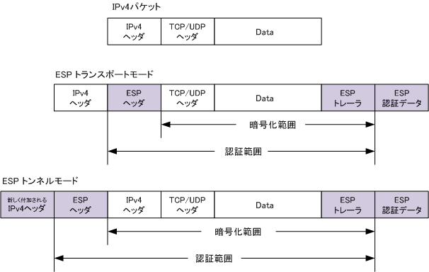


## SSL-VPN
セッション層でSSLを使ったVPN
- リバースプロキシ方式
    SSL-VPNサーバがリバースプロキシとなり、Webブラウザと間でSSL接続を行う。
    この場合は、Webアプリしか使えない。

    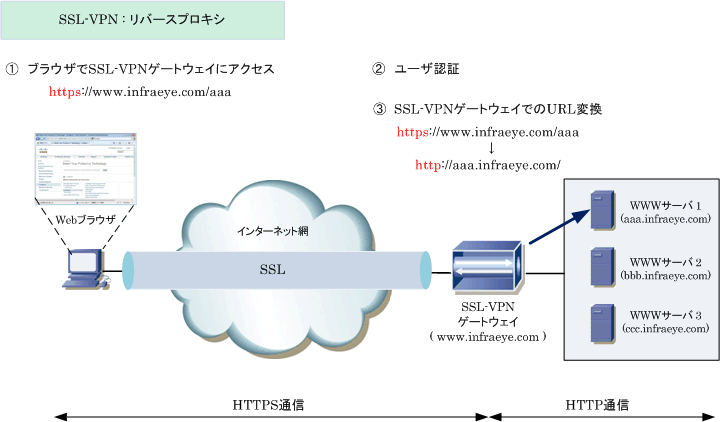

- ポートフォワーディング
    ブラウザ上のappletやactiveXとSSL-VPNサーバが、SSL接続を行う。
    しかし、動的にポート番号が変わるアプリケーションは使用することができない。

    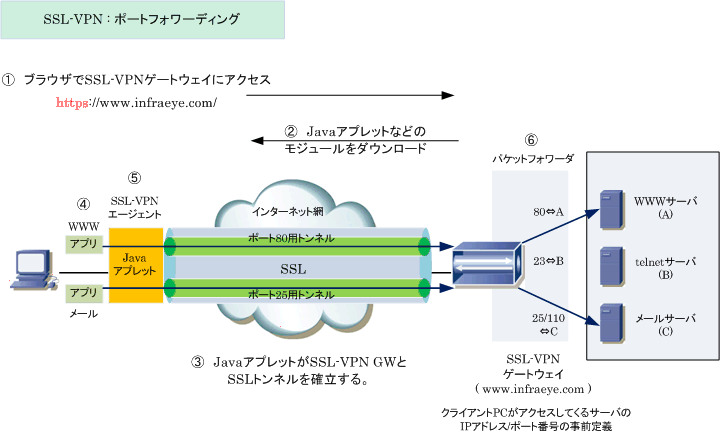

- L2フォワーディング
    専用のソフトでSSL接続を行う方法。
    Web以外のプロトコル（DDPも含めて）も全て使用することができる。

    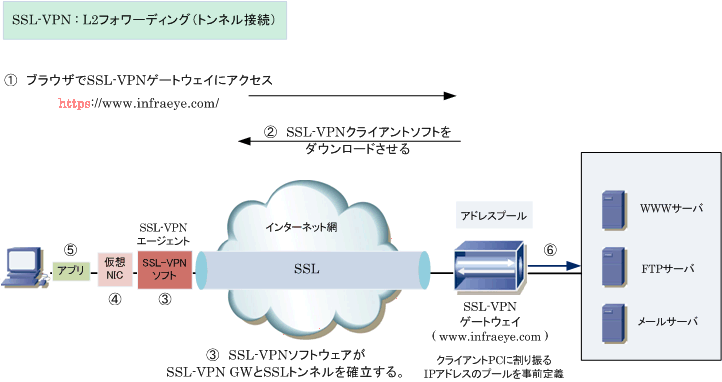

## [ロードバランサ](https://www.infraexpert.com/study/loadbalancer7.html)

### [ワンアーム構成](https://www.infraexpert.com/study/loadbalancer10.html)
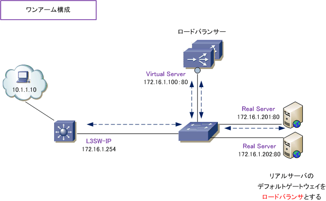

上図は、10.1.1.10 のクライアントPCが「172.16.1.100:80」に通信する時の行きのフローとなります。
VS「172.16.1.100：80」に着信したパケットは、LBで設定されたロードバランス方式に従ってパケット転送されます。そして、リアルサーバの**デフォルトゲートウェイ**がLBのIPアドレスを指定していることでパケットの行きと戻りが同じパスとなり正常に通信ができます。

リアルサーバのデフォルトゲートウェイにL3スイッチのIPアドレスを指定する必要がある場合には、ロードバランサからリアルサーバにパケットを送信する際、送信元アドレスをLBの I/F のアドレスにNAT変換することで回避できて、行きと戻りが同じ経路となります。

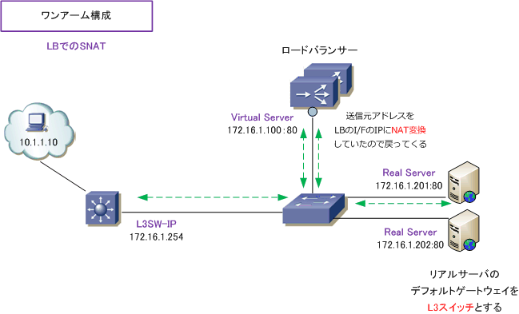


### [DSR（Direct Server Return）方式ロードバランサ](https://www.infraexpert.com/study/loadbalancer12.html)
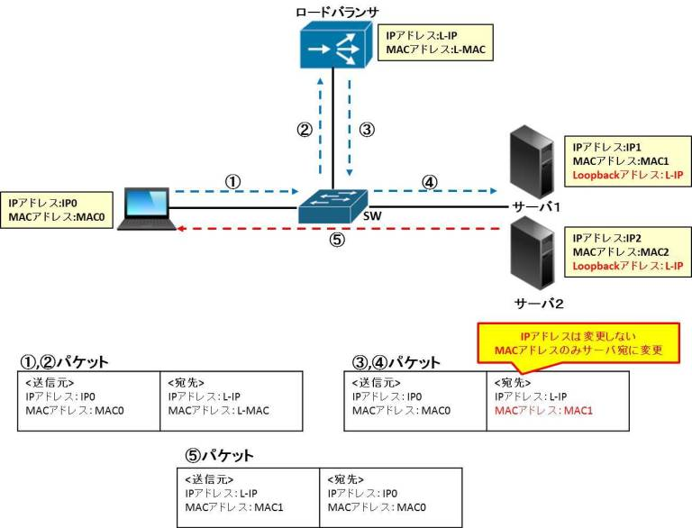

クライアントからのリクエストはロードバランサが受付、レスポンスはロードバランサが経由せず、直接サーバがクライアントに返す方式
サーバにはループバックインタフェースにロードバランサのIPアドレスを設定
ロードバランサは受信したパケット転送時にMACアドレスのみサーバのMACアドレスに変更する
行きのパケット：クライアント　=> ロードバランサ　=>　サーバ
返りのパケット：サーバ　=>　クライアント

メリット
- LBの処理が減少するので、システム全体のスループットが向上する

デメリット
DSRはL4でしか動作しないため、
- CookieなどのL7の情報をもとに負荷分散はできない
- **ロードバランサでSSL終端はできない**
- サーバにロードバランサのIPアドレスを設定が必要となる

※情報処理試験では、SYNパケットを受信した時点で、振り分け先を決めると書かれている。

### 透過モード（ロードバランサ）
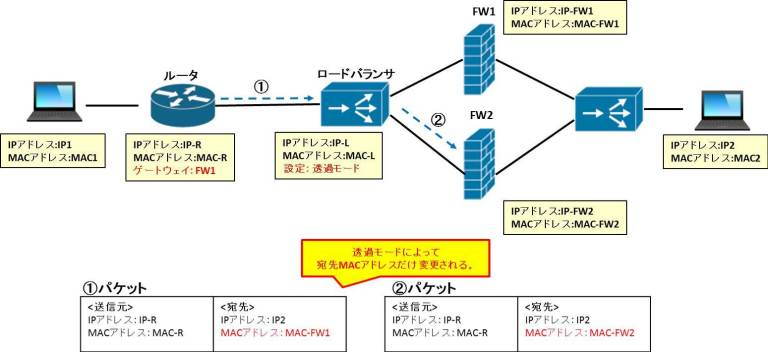

透過モードはルーティングの機能はOFFにしてレイヤ２のブリッジ機能のみ有効にするモード。
ブリッジモードとも呼ばれる。
レイヤ２のブリッジ機能となるため、IPアドレスやポートの変換は行われず、宛先MACアドレスのみ変換される。

透過モードを行えるのはルータやFW、LBなどがある。
ルータをルーティング機能をOFFにしてL2スイッチとして使うのと同じ。
利点としては、同一ネットワークになるため、VLANやマルチキャスト、ブロードキャストなどのパケットが転送することができる。

### [パーシステンス機能](https://milestone-of-se.nesuke.com/sv-advanced/appliance-server/load-balancer/)

L7で負荷分散を行い、セッションを持つサーバがある場合は、そのサーバに接続する様にする機能。

- Source address affinity persistence
    クライアントの送信元IPアドレスによりロードバランサが割り振るサーバを固定する

- Cookie persistence
    Cookie情報により割り振るサーバを固定する

### [SSLアクセラレータ](https://milestone-of-se.nesuke.com/sv-advanced/appliance-server/load-balancer/)
HTTPS通信の場合は、クッキー等の情報が暗号化されているため、L7で負荷分散を行うには復号化する必要がある。
このため、ロードバランサにTSLの復号化を行う専用のハードを搭載して、復号化処理を集中させる。
この場合、ロードバランサとWebサーバ間はHTTP通信になる。

### [DNSラウンドロビン](https://www.infraexpert.com/study/loadbalancer1.html)
DNSラウンドロビンとは、1つのドメイン名に複数のIPアドレスを割り当てて、クライアントPCなどからの問い合わせごとに順番に応答していく負荷分散技術です。このDNSラウンドロビンはECサイトなどの外部公開されている Web サーバの負荷分散に使用することが一般的であり、このDNSラウンドロビンの設定は外部公開しているDNSサーバ、あるいは、契約しているISP回線業者のDNSサーバで行うのが一般的です。

DNSラウンドロビンは「DNSサーバのゾーンファイルの設定のみで導入できる、ロードバランサ等の専用装置不要による低コストでの負荷分散の実現」のメリットがあります。一方、クライアントからのDNSリクエストにAレコードのIPアドレスを順番に返すだけなので「効率的な負荷分散ができない」、「接続毎に接続先が違うと通信の継続性が求めるHTTP通信の場合には問題が起きる」などのデメリットがあります。また、サーバ障害を検知をすることができなく、障害が発生しているサーバにもラウンドロビンにパケットを転送してしまいます。

- DNSラウンドロビンのメリット
    - DNSサーバのゾーンファイルの設定のみで容易に負荷分散を実現。
    - ロードバランサ等の高価な専用装置なしでも負荷分散を実現。
<br/>

- DNSラウンドロビンのデメリット
    - ロードバランサのように効率的な負荷分散は実現できない。
    - 同じクライアントからの通信を常に同じサーバに転送する、という通信の継続性を実現できない。
    - サーバの障害を検知できず、障害が起きているサーバにもパケットを転送してしまう。
    - DNSラウンドロビンを設定したDNSサーバ側で障害が発生したサーバのAレコードを削除する必要がある。

DNSラウンドロビンにはサーバ負荷分散でこのようないくつかのデメリットがありますが、インターネット上の公開サーバに対する負荷分散としてはとても有効な手段です。従って、例えばECサイトのWebサーバ等はDNSラウンドロビンの機能とロードバランサ導入の両方を行うことで、DNSラウンドロビンの問題点を解決。

### ロードバランシングの種類
- ラウンドロビン
    クライアントからのリクエストをサーバに均等に転送。
    サーバの負荷が均等に分散されるわけではない。

- リーストコネクション
    現在のコネクション数が最も小さいサーバに転送。


## FWの冗長化（VRRP）
ルータと同様にVRRPを使用できる。
つまり、ActiveとStandby構成になる。
VRRPによって仮想化されたIPアドレス、MACアドレスを持ち、外部との通信はこの仮想アドレスを使用する。

ActiveのFWは定期的にVRRP広告をStandbyのFWに送信し、StandbyのFWはそのVRRP広告を受信することでActive機器が正常に動いていることを把握する。
VRRP広告が来なくなったら、StandbyのFWがActiveとなる。
このとき、仮想IPアドレス、仮想MACアドレスをStandbyだったFWを引き継ぐ。
TCPセッションは張りなおす必要ががある。

また、ARPの応答はActiveのFWのみが応答する。


## ハッシュ

|ハッシュアルゴリズム|bit数|特徴|
|---|---|---|
|MD5|128|Message Digest Algorithm 5。公開暗号システムを開発したRonald  Rivestが開発したハッシュアルゴリズム。現在ではあまり推奨されていないが、ファイルの同一性チェックという用途ではまだ使われている|
|SHA-1|160|Secure Hash Algorithm 1。アメリカの標準暗号化規格として当初採用されたハッシュアルゴリズム。これも現在では非推奨だが、ファイルの同一性チェックという用途ではまだ使われている|
|SHA-256/SHA-512|256/512|SHA-2はSHA-1の改良系。SHA-2にはbit数の異なる複数の規格があり、256bitと512bitのものは特にSHA-256／SHA-512と呼ばれる|
|SHA-3|任意|SHA-3はSHA-2の後継規格。実際にはBLAKEというアルゴリズムが採用されている|


## 暗号方式

|暗号化アルゴリズム|種類|bit数|特徴|
|---|---|---|---|
|DES|ブロック暗号|56|DESは今では多くの用途において安全ではないと見なされている。これは主に56ビットという鍵長が短すぎることに起因する。|
|トリプルDES|ブロック暗号|56, 112, 168|DESと同じアルゴリズムで簡単に実装できることから、ICカードの共通仕様であるEMVなどをはじめ現在でも広く利用されている。|
|AES|ブロック暗号|128,192,256|DESに代わる新しい標準暗号となる共通鍵暗号アルゴリズムである。|
|RC4|ストリーム暗号|40–2048|SSLやWEPなどで広く使われているストリーム暗号である。|
